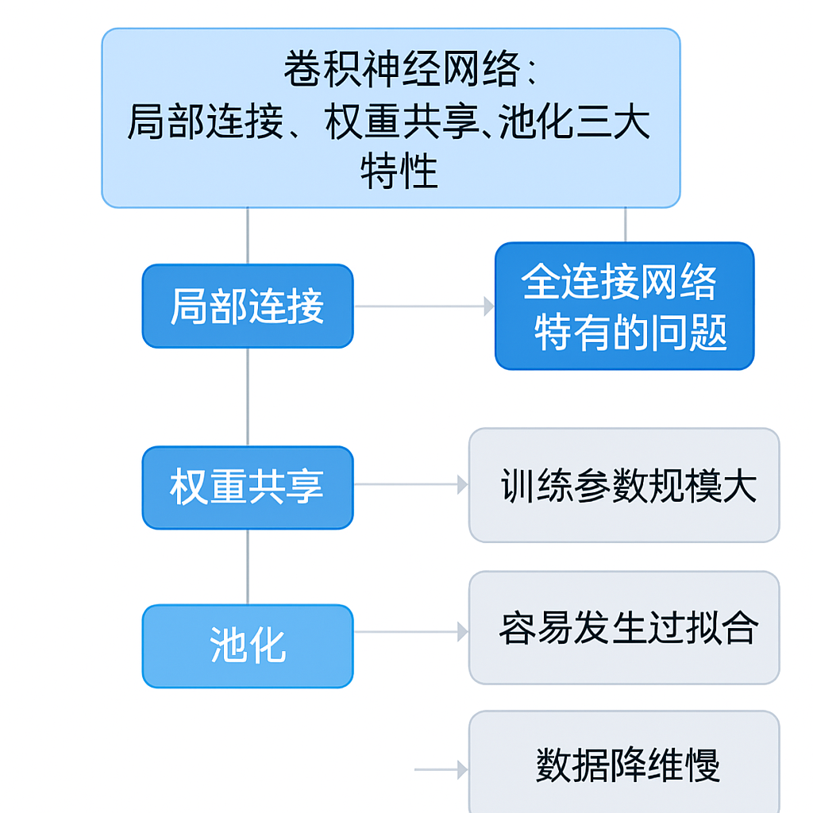
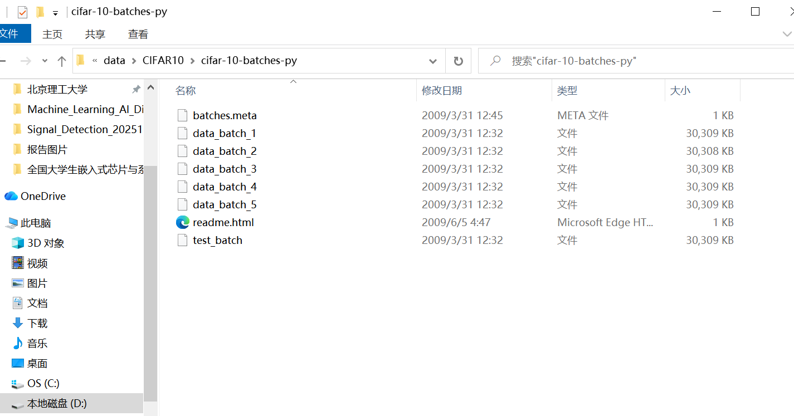
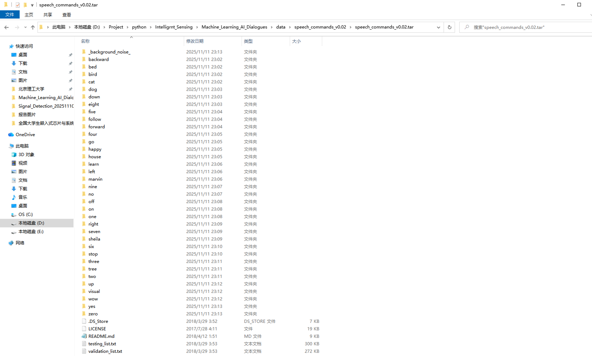

---
USER
---

机器学习、深度学习、神经网络的核心关联是什么？PPT 中 “表示学习” 如何解决 “语义鸿沟”，这一逻辑在 PyTorch 的模型训练中是如何体现的？

---
ASSISTANT
---

### 核心关联：机器学习、神经网络、深度学习
- 机器学习（ML）：目标是从数据学到映射或策略 f(x) → y（或 p(y|x)）；包含模型、学习准则与优化三要素。  
- 神经网络（NN）：一种“可参数化的函数族”——以大量可学习的权重和激活单元构成的复合函数族，能表示高度非线性的映射。  
- 深度学习（DL）：用“深”（多层）神经网络来做表示学习与端到端建模。DL = 用多层NN自动学习层次化表示（从低层边缘/纹理到高层语义）并通过大数据+高效优化提升性能。  
关系一句话：ML是目标范畴，NN是可学习函数的结构化实现，DL是把深层NN作为表示学习器以自动替代人工特征工程的实践与理论。  

---

### 表示学习如何解决“语义鸿沟”
- 语义鸿沟问题：原始像素/信号（低层特征）与人类语义（高层概念）之间缺乏直接、可用的桥梁。  
- 表示学习的思路：用层级化变换把原始输入逐层映射到越发抽象、越语义化的特征空间，从而把复杂任务所需的“语义判别”转化为在高层表示上做简单（线性或低复杂度）判别。  
- 关键机制（为什么可行）：
  - 局部到全局：卷积层捕获局部模式，深层组合成更大尺度的结构（边→纹理→部件→对象）。  
  - 权重共享与不变性：卷积的权重共享+池化/步幅带来平移/局部变形不变性，减小样本复杂度。  
  - 逐层非线性与复合：非线性激活使每层能构造更复杂的语义映射；多层复合扩展表示能力（通用逼近）。  
  - 监督/自监督目标：交叉熵、对比损失、重构损失等把“语义”要求导入表示学习（把接近语义的表示赋予更低损失）。  

---

### 在 PyTorch 训练流程中这些逻辑如何体现（对应落地要点）
1. 数据 → 表示的“来源”  
   - 原始数据集与 transforms（归一化、裁剪、翻转、噪声、增强）直接控制训练时模型看到的输入分布，增广提高表示的稳健性与泛化。  
   - torchvision.datasets + transforms 就是把现实变换编码为训练时的输入分布。

2. 网络结构（卷积/深度/残差） = 表示学习器的架构设计  
   - 用 nn.Conv2d、nn.MaxPool2d、BatchNorm、Residual blocks 等构造逐层表示：底层卷积学边/局部纹理；中层组合学部件；高层学语义特征。  
   - 设计技巧（小卷积堆叠、1×1 降维、残差连接）改善信息流与优化地形，帮助学到更深且更语义的表示。

3. 目标函数（损失）将语义约束写入学习  
   - 监督分类用 CrossEntropyLoss，把正确语义（标签）与输出概率直接关联，促使网络调整内部表示以区分类别。  
   - 自监督/对比学习、重构损失等也能驱动无标签数据学习有语义的嵌入。

4. 反向传播 + 优化器 = 表示参数化与更新过程  
   - loss.backward() 在 PyTorch 中自动计算表示参数（权重）的梯度；optimizer.step() 更新参数，逐步把表示调整为对语义任务更有区分力。  
   - 学习率、动量、Adam、权重衰减等超参控制“如何学习”——影响收敛与最终表示的泛化性。

5. 正则化与训练策略提升“语义泛化”  
   - Dropout、weight decay（L2）、early stopping、数据增强 在训练循环中并行施加，避免表示过拟合噪声而丢失通用语义。  
   - BatchNorm、良好初始化、残差连接改善训练稳定性，使低层表示不会因为梯度消失而无法学习。

6. 工程实践中的可视化与诊断（验证“语义”是否被学习）  
   - 在训练中可用钩子(hooks)或中间输出(model(x) 在 forward 中取中间层)来可视化 feature maps、activation 分布、或用 t-SNE / PCA 可视化高层嵌入；这直接检验表示是否形成了“类内紧凑、类间分离”的语义结构。  
   - 利用预训练模型（transfer learning）验证高层表示的通用性：在下游少样本任务上微调，若性能高则说明表示携带有语义信息。

7. 端到端示例（对应代码流程要点）  
   - DataLoader(train_ds with transforms) → model(nn.Module: conv/pool/BN/ReLU/... /fc) → loss = CrossEntropyLoss(pred, y) → loss.backward() → optimizer.step()。  
   - 训练曲线（train/test accuracy, loss）上升/下降的趋势反映表示从“无区分性”到“语义可判别”演化。  

---

### 小结（实操提示，便于把理论落到 PyTorch 上）
- 结构层面选用卷积/残差/BN 能更快学到层次化、稳健的语义表示。  
- 损失设计（监督/自监督/对比）决定“什么是语义”，训练就把表示朝这个语义方向塑形。  
- 数据增强 + 正则化是把学到的表示从“训练集记忆”推动到“语义泛化”的关键手段。  
- 在 PyTorch 中观察中间激活、可视化嵌入、微调预训练模型是检验表示是否跨任务携带语义的直接方法。  

如果你想，我可以：
- 给出一个最小可运行的 PyTorch 训练模板，突出“如何在训练中观测与可视化中间表示”（包括 Hook 示例、t-SNE 嵌入代码片段）；  
- 或者根据你当前的任务（CIFAR/MNIST/MSTAR）写一份针对性的训练+诊断 checklist（超参、架构、增强、可视化点）。


---
USER
---

机器学习、深度学习、神经网络的核心关联是什么？PPT 中 “表示学习” 如何解决 “语义鸿沟”，这一逻辑在 PyTorch 的模型训练中是如何体现的？

---
ASSISTANT
---

### 机器学习、深度学习、神经网络的核心关联

- 概念层次（从大到小）
  - **机器学习（ML）**：用数据和算法让计算机从经验中学习以完成预测/决策任务，包含监督/无监督/强化等范式。  
  - **深度学习（DL）**：机器学习的一个子领域，强调用多层（“深”）参数化模型自动学习高级特征表示，从而在感知类任务上显著提升性能。  
  - **神经网络（NN）**：实现深度学习的主要模型家族，由层级的线性变换和非线性激活构成，能逐层抽象输入信息形成分层表示（从低级到高级）。

- 核心关联（一句话）
  - 机器学习是目标与范式，深度学习是强调“层次化表示学习”的方法论，神经网络是主要的可学习结构；三者的关系是“包含—聚焦—实现”的关系（ML 包含 DL，DL 以 NN 为主要实现形式）.

---

### 什么是表示学习？它如何解决语义鸿沟

- 表示学习的要点
  - 目标是把原始信号（像素、波形、词表索引等）映射到一种机器易处理、能揭示语义或判别信息的低维/结构化表示（embedding、特征向量、隐变量等）。  
  - 强调自动学到有用特征，减少人工设计特征的需求；优质表示应当使下游任务（分类、检索、生成、强化决策）更容易。

- 语义鸿沟（semantic gap）
  - 指低层输入（例如像素、词语表面形式）与人类感知或语义概念（对象类别、意图、主题）之间的巨大差距。传统浅层方法靠人工特征或启发式方法难以桥接。

- 表示学习如何弥合鸿沟（关键逻辑）
  1. 分层抽象：深度网络逐层从局部低级特征（边缘、音素、词向量）组合为更抽象语义概念（物体部件、短语、主题），把原始信号映射到语义友好的表示空间，从而缩短“表面—语义”之间的距离。  
  2. 任务驱动的判别性或生成性约束：通过监督/自监督/对比学习等目标，训练得到的表示保留与语义相关的信息、抑制无关噪声，使语义在向量空间中更易分离或检索。  
  3. 迁移与共享：好的表示通常可迁移到多个下游任务（微调/特征提取），说明它包含更通用、更接近语义的因素，从而在新任务上快速缩小语义鸿沟。

（以上关于表示学习与语义鸿沟的描述对应深度学习中“自动从数据学习语义相关表示”的主流理解。）

---

### 在 PyTorch 的模型训练中，这一逻辑如何体现

- 数据与输入管线（Data → 表示的源头）
  - 数据增强、预处理（归一化、随机裁剪、遮挡、语音噪声扰动、文本掩蔽等）构造了更具判别力和鲁棒性的学习信号，促使网络学到不依赖表面变形的语义表示。

- 模型结构（层次性实现）
  - 网络层（卷积层、Transformer 层、残差块等）负责从局部到全局、从低级到高级逐层提取并组合特征；在 PyTorch 中，Module 的堆叠与前向计算显式实现了这种分层抽象。

- 损失函数与训练目标（表示的质量控制）
  - 监督损失（交叉熵）：直接把表示训练为对类别有区分力的向量空间。  
  - 对比/自监督损失（Contrastive, InfoNCE, SimCLR, MoCo, BYOL 等）：不依赖标签，强制将“同语义/同样本不同视图”拉近、把不同语义推远，从而学习语义一致的 embedding。  
  - 重建/生成损失（自编码器、VAE、生成模型）：表示必须包含重构输入的关键信息，间接学到语义相关结构。

- 反向传播与优化（把语义信号注入表示）
  - PyTorch 中的 autograd + optimizer（SGD/Adam 等）把损失关于参数的梯度传播回每一层，参数更新改变层的映射，使中间激活逐步成为对训练目标更有利的语义表示。

- 正则化与泛化（抑制表面噪声，突出语义信息）
  - Dropout、权重衰减、BatchNorm、数据增强、早停等实操，提高表达的泛化性，避免表示仅编码训练数据的表面特征。

- 实践层面的体现（典型代码/工作流要点）
  1. 定义模型（nn.Module），设计层次结构以支持分层表示。  
  2. 定义损失（例如交叉熵或对比损失）——损失直接定义什么是“有用的”表示。  
  3. 前向传播得到中间特征/embedding；可在训练/验证时提取这些表示用于可视化（t-SNE）、检索或下游任务评估。  
  4. 反向传播与优化：更新网络以使表示更符合目标语义。  
  5. 微调（fine-tune）或冻结底层并训练顶层：常见做法用于验证表示的通用性与语义承载能力。

- 举例说明（常见模式）
  - 图像分类：CNN 从像素到边缘到物体部件到类别判别表示；交叉熵训练直接把输出 logits 与语义类别对齐。  
  - 自监督视觉表示（SimCLR）在 PyTorch 中：用两路数据增强产生同一图像的不同视图，编码器产生 embedding，用 InfoNCE 对比损失拉近同源视图 embedding、推远其他样本 embedding，从而学习语义不变的表示（可迁移到分类）。  
  - 语言模型（Transformer）：通过掩蔽语言建模或自回归任务，模型学到可捕捉句法与语义的上下文表示，微调后在下游任务上表现优异。

---

### 给 PPT 的建议：结构化讲清“逻辑链”

- 建议幻灯片顺序（每页要点，便于听众跟随）
  1. 定义与层级关系：ML / DL / NN 的关系（1 页）。  
  2. 语义鸿沟是什么：举图像/文本例子说明表面特征与语义的差距（1 页）。  
  3. 表示学习核心思想：分层抽象、任务驱动、迁移能力（1 页）。  
  4. 在 PyTorch 中的对应环节：数据增强、模型架构、损失函数、反向传播、微调（2–3 页，配代码片段或流程图）。  
  5. 具体案例（SimCLR 或 Transformer 微调）：展示训练流程、损失作用、表示可视化前后对比（2 页）。  
  6. 总结：表示学习如何把“表面”变成“可操作的语义向量”，以及在工程实践中的注意点（1 页）。

- 可视化建议
  - 用分层图展示网络每层的抽象程度变化；用向量空间示意图展示对比学习把同类样本聚拢、异类样本分开。  
  - 在 PyTorch 代码旁标注“这里是把语义信号注入表示的点”（损失处、Augmentation 处、中间 embedding 抽取处）。

---

### 结论（简短）
表示学习是把原始信号映射到语义友好向量空间的核心机制；深度神经网络通过层次结构和任务驱动的损失在训练过程中逐步构建这种表示。在 PyTorch 中，这一过程在数据增强、模型前向（表示形成）、损失设计与反向传播（表示被优化）以及微调（表示验证与迁移）这几个环节被具体实现和工程化.


---
USER
---

表示学习解决语义鸿沟的核心是 “自动学习高层语义特征”，那它学习到的 “高层语义特征” 和传统机器学习中 “手动设计的特征”（比如 SVM 的 HOG 特征）在 “语义关联性” 上有本质区别吗？具体差异体现在哪里？

---
ASSISTANT
---

### 高层语义特征 与 手工特征（以 HOG 为例）对比表

| **属性** | **高层语义特征（深度学习自动学得）** | **手工特征（HOG 等）** |
|---|---:|---|
| **语义关联性** | 高：能编码语义概念或判别因子 | 低到中：主要编码表面几何/纹理信息 |
| **层次性** | 强：由浅到深逐层抽象 | 弱：单层或局部统计描述 |
| **适应性/可学习性** | 高：在目标任务上可优化 | 低：设计固定，需人工调整超参 |
| **不变性与鲁棒性** | 可通过训练与数据增强学到 | 靠设计（如方向直方图）获得有限不变性 |
| **可迁移性** | 好：一般可迁移到下游任务 | 差：对任务/数据域敏感 |
| **可解释性** | 低到中：需要可视化/分析才能理解 | 高：每个维度有明确含义 |
| **样本效率与计算成本** | 训练需要大量数据与算力；推理可高效 | 对小样本友好；计算成本一般较低 |
| **维度与信息密度** | 向量可低维且语义密集 | 维度通常较高且包含冗余 |

---

#### 语义关联性的本质区别
- **自动学习的高层特征**是通过端到端任务目标（监督或自监督）把与语义有直接关联的信息提取并压缩到表示维度中；它们不是直接代表“像素统计”，而是代表有利于判别或重构的抽象因子（如部件、语义概念或上下文模式）。  
- **手工特征**（例如 HOG）侧重描述图像的**局部梯度方向分布**，本质上是低层几何/纹理的统计汇总，和语义的关联是间接且有限的（需要后续分类器把这些低层信号与语义建立映射）.

---

#### 层次性与抽象能力
- 深度网络通过多层非线性变换把简单边缘/纹理合成为更复杂模式（如物体部件、语义组合），这让高层特征天然携带更抽象的语义信息。  
- HOG 等特征没有多层学习机制，它只在一个固定的描述级别上工作，不能自动组合出更高层语义结构.

---

#### 适应性、可学习性与任务驱动性
- 学到的特征随损失函数和优化过程调整，能专门强化对当前任务有用的语义因素（例如区分猫和狗的关键区域）。  
- 手工特征是任务无关的通用描述，设计时需要工程先验；当任务变化或数据域偏移时，性能往往下降，需要人工重新设计或选取特征.

---

#### 不变性、鲁棒性与泛化
- 深度表示可通过数据增强、正则化和对比学习显式学习到对尺度、视角、光照和遮挡等的**语义不变性**；这种不变性是数据驱动且可控的。  
- HOG 提供对小范围光照或局部变形的鲁棒性（例如通过统计局部梯度方向获得一定程度的不变性），但对复杂变换或语义级别的变化很难覆盖.

---

#### 可迁移性与下游能力
- 训练得到的高层表示往往具有迁移性：在新任务上微调或作为特征提取器能快速适应，说明其抓住了更通用的语义因素。  
- 手工特征通常需要针对新任务重新设计或结合不同的后端学习器才能获得可比性能.

---

#### 可解释性与工程成本权衡
- 手工特征可解释性强（每个维度含义明确），便于诊断与轻量级应用；它们在小数据或嵌入式场景仍然很实用。  
- 深度特征解释性较弱，但可以用可视化（激活图、Grad-CAM、特征投影）来理解；工程上代价是需要更多数据、算力和调参。

---

#### 实践建议（如何在工程中取舍）
- 若数据量有限、实时性或可解释性是首要约束，优先考虑手工特征或结合浅模型。  
- 若目标是尽可能捕捉语义、追求最高性能并且有充足数据与计算资源，则优先使用深度表示并用合适的损失与数据增强来引导语义学习。  
- 在工程过渡期，可把二者结合：用手工特征快速原型验证，再用深度模型提升语义层面的表现；或把 HOG 等作为深模型的辅助输入在小样本场景中稳健训练.

---

结论：在“语义关联性”上，深度学习自动学得的高层特征在本质上更接近语义因子，因为它们是由任务和数据驱动、通过层次化抽象形成的；而 HOG 这类手工特征更多是对低层信号的工程化统计描述，语义关联性依赖于后续模型的学习和人工设计.

. Open discussion and tutorials on HOG+SVM and HOG properties, e.g., HOG descriptions and analyses.

---
USER
---

神经网络是实现表示学习的核心载体，那神经网络的 “层数”“激活函数选择”“网络结构（如 CNN 的卷积层、Transformer 的自注意力层）” 分别如何影响表示学习对 “语义鸿沟” 的跨越效果？有没有关键阈值或设计原则？

---
ASSISTANT
---

### 层数对表示学习与跨越语义鸿沟的影响

- 作用机制  
  - 深度提供“多级抽象”的能力：每一层可看作把上一层特征组合、筛选、重映射为更高一级的概念因子，从而把低层表面信息逐步变成更接近语义的表示。  
  - 表示复杂度与表达力随深度上升（理论上能表示更复杂函数），但训练难度、过拟合风险和计算代价也上升。

- 实践影响与设计原则  
  - 早期层负责边缘/纹理，中间层负责部件/短语，高层负责完整对象/句子语义：这就是层数帮助缩短语义鸿沟的具体路径。  
  - 无效盲目加深会带来退化或难以优化的问题；必须配合残差/跳跃连接、归一化（BatchNorm/LayerNorm）和合适的初始化以保证可训练性。  
  - 经验法则：对于视觉任务，浅模型（几层至十几层）擅长简单特征，中等深度（几十层）通常足够学习稳健语义表征；超深（上百层）需要强训练技巧和大数据才能体现收益。深度的“阈值”强依赖数据量、任务复杂度与网络类型，不存在单一绝对值。

---

### 激活函数选择对语义表征的影响

- 本质差别  
  - 激活函数提供非线性变换，是层级抽象的关键。不同激活在非线性形状、饱和性、稀疏性和梯度传播上差别会直接影响网络能学到什么样的抽象。  

- 具体影响点  
  - 避免饱和型（sigmoid/tanh）带来的梯度消失，选择 ReLU/LeakyReLU/GELU/SiLU 等可显著提升训练稳定性与可伸展性，从而提高高层语义形成的可能性。  
  - 稀疏激活（ReLU）会产生激活稀疏性，有利于学习分离的语义因子；平滑激活（GELU/SiLU）在 Transformer/大模型中往往带来更稳定的训练与更好的泛化。  
  - 选择应匹配架构：CNN/ResNet 系列常用 ReLU；Transformer/large-scale LM 常用 GELU/GeLU 变体；小模型或低算力场景可考虑更简单的激活。

- 设计原则  
  - 首选非饱和、高效且有良好梯度流的激活；当出现“死神经元”或训练不稳定时尝试 LeakyReLU 或换用平滑激活。  
  - 对抗噪声或需要细粒度表示时，可在局部层尝试带门控/残差的激活结构（GLU、Gated Linear Units）。

---

### 网络结构（局部卷积 vs 全局自注意力）对语义鸿沟的影响

- CNN（卷积层）的特点与优势  
  - 强烈的局部关联与平移不变性作为先验，有利于学习局部构件到部件再到整体的分层语义（尤其是视觉领域）；卷积的参数共享使得底层特征更数据高效。  
  - 局限：感受野与长程依赖需通过层数或池化/空洞卷积扩展；对非局部语义关系（跨图像/文本远距依赖）学习效率低。

- Transformer（自注意力）的特点与优势  
  - 全局交互能力与动态权重分配，让模型能直接建立长程语义关系（句子级、全图上下文、跨对象关系），在需要全局语义整合的任务上更擅长跨越语义鸿沟。  
  - 代价与需求：更高的计算/数据需求；缺少显式局部先验时需要更多数据或卷积混合模块来学到局部结构。

- 混合与取舍原则  
  - 任务驱动选择：视觉中小/中等数据量优先 CNN（或 ConvFormer）；大规模预训练且需建模长程依赖优先 Transformer 或 ViT + conv hybrid。文本任务则以 Transformer 为主。  
  - 结合先验：在 Transformer 中引入卷积/局部化模块，或在 CNN 中加入非局部/注意力模块，是工程上常见的折中，能同时利用局部高效和全局语义捕捉能力。

---

### 其它关键设计要素与它们的作用

- 感受野（receptive field）  
  - 要保证高层表征能覆盖语义单元的空间/时间范围；感受野过小会使网络缺乏完整语义视角。通过层数、卷积核大小、空洞卷积或池化扩展感受野是常见手段。

- 宽度与维度（通道数 / embedding dim）  
  - 更宽的层/更高的 embedding 维度提升表示容量和信息密度，但也增加过拟合风险。经验范围：embedding 128–2048 取决于任务与模型规模；微调任务通常 256–1024 足够。

- 跳跃连接与残差块  
  - 对深层网络的可训练性至关重要，能保持低层语义信息在高层保留与流动，避免信息在多层中完全丢失。

- 归一化（BatchNorm/LayerNorm）与优化器  
  - 帮助稳定训练、加速收敛，从而使模型能更可靠地形成高层语义表示。

- 正则化与数据增强  
  - 对抗过拟合、提升语义不变性（例如通过视角/颜色增强、遮挡、随机掩码等）直接改善表示对语义的稳健性。

- 训练目标（监督/自监督/对比学习）  
  - 损失决定“哪些语义被强化”：监督任务把目标语义对齐到表示；对比学习/掩码语言建模等自监督目标能发现更通用的语义因子。模型结构必须与目标配合设计以最大化语义捕捉。

---

### 可操作的设计原则与工程建议（简短清单）

1. 以任务与数据为中心：复杂语义且数据充足 → 更深/更全局（Transformer）；数据有限或强局部结构 → 中等深度的 CNN 或 hybrid。  
2. 深度要有支撑：若层数超过几十层，必须使用残差/跳跃和规范化，且配合合适的学习率调度。  
3. 激活优先非饱和型：ReLU/GELU/SiLU 等；遇到训练不稳定可尝试 LeakyReLU 或门控单元。  
4. 控制感受野覆盖语义尺度：确认网络的感受野能覆盖对象或语义单元的典型尺寸。  
5. 表示维度与正则化平衡：embedding 太小限制语义表达；太大需更多正则化与数据。参考范围视觉 256–1024，文本/large model 更大。  
6. 利用混合结构：在需要兼顾局部和全局语义时采用 Conv+Attention 的混合架构。  
7. 训练目标先行：选择/设计损失（交叉熵、对比损失、掩码预测等）来明确“语义”在向量空间中的定义。  
8. 评估表示而非只看任务指标：用线性探针、迁移学习和可视化（t-SNE、Attention maps、Grad-CAM）验证高层语义关联性是否被学习到。

---

结论（一句话总结）
- 层数、激活函数与网络结构分别通过“抽象深度、非线性表达力、与先验/交互机制”三个维度决定模型把低层表面信号提升为语义表示的能力；最佳设计来自任务、数据量与训练目标的协同匹配，而不是单一阈值。

---
USER
---

机器学习包含传统机器学习和深度学习，那传统机器学习中是否存在 “表示学习” 的雏形？如果有，它和深度学习中的表示学习在解决语义鸿沟时的局限性有哪些不同？能否画一个结构图来表示它们之间的关系

---
ASSISTANT
---

### 核心结论

传统机器学习里确实存在“表示学习”的雏形（PCA、LDA、kernel mappings、字袋/主题模型、稀疏编码、度量学习等），但与深度学习自动端到端学到的多层、高度任务化的表示在本质和工程表现上有若干关键差异；这些差异直接决定了二者在“缩短语义鸿沟”上的效率、可迁移性与局限性。

---

### 先列出传统方法里哪些算“表示学习”的雏形（简要）

- 线性降维：PCA、LDA（提取低维线性表示、保留方差或判别信息）  
- 非线性降维 / 流形方法：Isomap、LLE、t-SNE（揭示低维流形结构）  
- 字袋/主题模型：TF-IDF、LDA（将文本映为主题分布）  
- 稀疏编码与字典学习：学习基元基底表示稀疏线性组合  
- 核方法：通过核映射映入高维特征空间以便线性分离  
- 度量学习 / 嵌入方法：Siamese、Triplet、MDS（学习相似度/距离表示）  
- 手工到学习的混合：HOG/SIFT + PCA/ICA/编码器/BoW + SVM（人工特征后接表示压缩或度量学习）

---

### 与深度学习表示学习的关键区别（分维度说明）

1. 层次性与抽象程度  
   - 传统雏形：多为单级或弱分层（降维、流形展开或稀疏线性基），难以自动组合低层信号得到复杂语义构件。  
   - 深度学习：多层非线性组合，天然产生从边缘→部件→对象/语义群的分层抽象，更直接对应人类语义层次。

2. 端到端与任务驱动  
   - 传统雏形：表示步骤通常与下游模型解耦（先做特征/嵌入，再训练分类器）；表示设计多半是无监督或手工先验驱动。  
   - 深度学习：表示可以被最终任务的损失端到端塑造（监督/自监督/对比学习），使表示直接强化任务相关语义。

3. 非线性与表示容量  
   - 传统雏形：线性方法或基于显式核，表示能力受限；非线性方法存在但规模与可训练性有限。  
   - 深度学习：多层非线性映射极大提升函数表示空间，能编码复杂语义关系。

4. 局部先验与全局关系建模  
   - 传统雏形：很多方法对局部结构有明确先验（如卷积相似的思想在手工特征里），但难以同时高效捕捉长程依赖。  
   - 深度学习：通过卷积、注意力等结构可在同一框架内兼顾局部-全局语义。

5. 可迁移性与通用性  
   - 传统雏形：往往为特定域/任务设计，跨域迁移弱。  
   - 深度表示：大规模预训练后迁移能力强（微调/线性探针），说明捕获了更通用的语义因子。

6. 数据与计算需求  
   - 传统雏形：在小样本/资源受限场景下更稳健、易解释。  
   - 深度学习：通常需大量数据与计算，但在大数据下能学到更接近语义的表示。

7. 可解释性与可控性  
   - 传统雏形：每个维度或变换通常有明确含义（易解释、易调）。  
   - 深度表示：语义分布在高维非线性空间中，解释困难但可通过可视化/探针部分恢复含义。

8. 学习机制（监督/自监督/对比）  
   - 传统雏形：多为统计或优化目标（方差、判别投影、重建误差、相似度保持）。  
   - 深度学习：把这些目标以更复杂的目标函数和大规模优化结合（InfoNCE、掩码预测、对比学习等），更有力地把“语义”嵌入表示。

---

### 在解决语义鸿沟上的局限性差异（总结式）

- 传统表示雏形的局限  
  - 抽象层次浅，难以直接形成高层语义概念。  
  - 对复杂变换/上下文依赖不够不变与鲁棒。  
  - 跨任务可迁移性差，需要大量人工先验/工程设计。  

- 深度表示的局限  
  - 需大量数据与计算，易受训练数据偏差影响导致学到“表面相关”的捷径特征。  
  - 可解释性差，难以把向量维度直接映射到清晰语义标签。  
  - 在小样本/低资源场景若无良好先验或预训练，性能可能不如传统方法。

---

### 设计与工程上的互补策略（实用建议）

- 数据量小或实时/可解释性重要 → 仍可采用手工特征或字典/稀疏编码 + 轻量学习器。  
- 要追求语义层级与迁移能力 → 使用深度表示并采用自监督/对比预训练以学习更通用的语义因子。  
- 混合方案：用手工特征做快速原型或作为输入增强（auxiliary input）；在中低数据场景用预训练深模型 + 冻结底层再训练顶部小网络（linear probe / fine-tune）。  
- 使用度量学习或对比损失可把传统表示与深度表征的优点连接起来（例如把 HOG/TF-IDF 投入到三元组/对比框架中以学习更语义化的嵌入）。

---

### 结构示意图（ASCII / Markdown 表达）

- 图示意意图：从“输入信号”到“语义表示”的两条路径并列对比，标示各自典型方法、优劣与限制。

Input (pixels / tokens / signals)
|
|-- Traditional representation (single / shallow)
|     - Handcrafted features: SIFT, HOG, TF-IDF
|     - Linear / kernel projections: PCA, LDA, Kernel PCA
|     - Topic/Dictionary: LDA, sparse coding, BoW
|     - Metric methods: MDS, Isomap, Siamese
|     -> Pros: interpretable, sample-efficient
|     -> Cons: shallow abstraction, weak transfer, limited invariance
|
|-- Deep representation (multi-layer, end-to-end)
      - Architectures: CNN / RNN / Transformer / Deep AE
      - Objectives: supervised CE, contrastive, MLM, reconstruction
      - Mechanisms: hierarchical nonlinearity, attention, residuals
      -> Pros: hierarchical semantics, strong transfer, learn invariance
      -> Cons: data-hungry, less interpretable, compute-heavy

（可把上面当成 PPT 的左右两栏对比图：左列列出传统雏形与要点，右列列出深度学习对应项与要点，中间用“语义鸿沟缩短效果”箭头厚度表示效力差异）

---

### 用一句话总结

传统机器学习包含多种“表示学习”的早期方法，能在受限数据或对可解释性要求高的场景中有效工作，但它们缺乏深度学习那种通过多层非线性、端到端任务驱动训练所能获得的层次化、高度语义化表示，这正是后者更善于缩短“语义鸿沟”的根本原因。

---
USER
---

除了表示学习，在 AI 领域还有哪些技术思路（比如知识图谱、语义嵌入）能缓解语义鸿沟？它们和表示学习的核心逻辑是互补还是替代关系？

---
ASSISTANT
---

### 概览：除表示学习外能缓解语义鸿沟的主要技术思路

- 知识图谱与本体（Knowledge Graphs / Ontologies）  
- 语义嵌入与向量检索（task-specific embeddings, RAG）  
- 基于规则与符号推理（逻辑规则、推理引擎）  
- 检索增强与記憶（Retrieval Augmented Generation, 文档检索）  
- 多模态对齐与符号化（视觉-语言对齐、符号化中间表示）  
- 因果建模与可解释结构（因果图、因果推断）  
- 底层元数据、稀疏索引、交互式人机闭环（标注回路、主动学习、纠错环）  

这些技术各自从不同角度补充或替代“纯数据驱动的表征学习”来缩短从信号到语义的差距。

---

### 关键技术如何缓解语义鸿沟（要点说明）

- 知识图谱 / 本体  
  - 把事实、实体、关系和概念层次以结构化符号显式表示，用语义约束和推理弥补数据驱动模型缺乏的常识与领域知识，从而提供可解释、可查询的语义桥梁。  
- 语义嵌入与检索（RAG）  
  - 把文本/文档/实体变成检索友好的向量，结合最近邻检索把外部结构化或非结构化知识注入模型输入，解决模型“记不住/编造事实”的问题并增强语义精确度。  
- 符号规则与逻辑推理  
  - 用显式规则（如规则库、逻辑约束）做强制性的语义校验或推理链，使系统输出满足一致性与可验证的语义关系（适合法律、医疗等高度约束域）。  
- 多模态对齐与中间符号  
  - 把不同模态的表征对齐到共享语义空间或映射到结构化中间表示（scene graphs、AMR 等），帮助把低层信号（像素、声学）与高层概念直接关联。  
- 因果与结构化建模  
  - 通过建模因果关系或因果图来区分相关与因果，避免模型学到表面相关的捷径特征，从而改善语义层次的稳健性与泛化能力。  
- 人机闭环、监督与校正  
  - 人类知识注入、交互式纠错与主动标注能把稀缺但关键的语义信号补回到训练/推理环节，提高表示的语义准确性。

（上段关于知识图谱与 RAG 的实务价值在业界已有大量实践和总结。）

---

### 它们与表示学习的关系：互补为主，部分场景可替代

- 互补关系（最常见）  
  - 表示学习负责把原始信号映射为可操作向量；知识图谱、规则、检索等提供显式语义、背景知识和约束。把二者结合能同时具备“感知能力”和“知识/推理能力”。例如把 KG 提供的结构化信息注入到模型输入、作为提示或在检索库中提供支持，可以显著提高模型在专业领域的语义准确性。  
- 弥补表示学习的短板  
  - 在少数据、长尾事实、高要求可解释性或需要严格逻辑一致性的场景，结构化知识或规则系统比纯表征学习更可靠。  
- 替代场景（有限）  
  - 若任务是严格的逻辑推演、形式验证或基于公理的推理，符号推理系统或规则引擎可以完全承担任务，不依赖深度表示；但大多数现实感知＋语义任务仍然需要表征学习来处理噪声、多样化输入。  
- 协同式架构最实用  
  - 现实工程中常用“表示学习 + 外部知识/检索/规则”的混合体系：预训练表征用于感知与相似性匹配，知识图谱/检索用于提供事实与结构化上下文，符号规则用于校验与约束输出（即“感知层 + 知识层 + 逻辑层”）。

---

### 常见组合模式与落地示例（工程视角）

- KG + 表征学习：把实体/关系编码为 embedding，与文本 embedding 同空间用于增强问答、检索或推理。  
- RAG（检索增强生成）：用向量索引检索相关文档段，再把检索结果与生成模型联合，减少“幻觉”并增加事实召回。  
- 规则/约束后处理：生成模型产出后用业务规则或符号推理器校验并修正（如医学或合规场景）。  
- Multimodal alignment：用对比学习把视觉/语言 embedding 对齐，再用 scene graph 或 AMR 做符号级语义抽取，提升跨模态语义一致性。  
- 人机闭环：把模型输出交给专家审核，将纠正插回训练数据或知识库，逐步提升语义准确度与覆盖率。

（上述 KG 与 LLM、RAG 的协同和实效在近期研究与工业实践中被反复验证。）

---

### 给工程决策者的简短建议（3 条）

1. 优先评估需求：若任务需高精确事实、可解释或少样本部署，优先引入知识图谱/规则与检索组件；若任务是开放式感知或语言生成且数据充足，重视预训练表征与自监督目标。  
2. 采用混合体系：把表示学习当作“感知与相似性”的基础，把知识图谱/检索/规则当作“语义上下文与约束”的补充，这通常是最佳实践。  
3. 设计清晰接口：确保表示层、检索/知识层和规则层在工程上可解耦（embedding 接口、检索 API、推理/约束模块），便于迭代与审计。


---
USER
---

线性模型（线性回归、Logistic 回归、Softmax 回归）的损失函数选择依据是什么？为什么分类问题不用平方损失而用交叉熵损失

---
ASSISTANT
---

### 核心结论
分类问题优先选用交叉熵（对数似然）而非平方损失，主要因为交叉熵与概率模型的最大似然目标一致、梯度更稳定且对分类边界更直接有效；平方损失在概率输出、梯度行为与类别不平衡等方面存在劣势，通常导致训练慢、鲁棒性差或优化不当.

---

### 一、选择损失函数的基本依据
- 与问题的概率模型一致性：损失应对应模型对数据生成过程的假设（例如二分类用伯努利/对数几率， 多类用分类分布/categorical）。最小化负对数似然就是最大似然估计（MLE），这自然导出交叉熵/对数损失作为合适目标.  
- 梯度信号的有效性：损失对模型输出的导数决定梯度大小和方向；好的损失在训练早期和接近决策边界时给出有信息的梯度，便于参数更新和收敛。  
- 输出语义：分类常需要概率解释、置信度或与 softmax/sigmoid 一致的输出分布；交叉熵直接以概率形式比较预测与标签，平方损失不天然满足这一点.  

（以上三点是选择分类损失的核心考量）

---

### 二、为什么交叉熵优于平方损失（具体理由与直观解释）

1. 概率论根基与 MLE  
   - 令模型输出 p 表示类别的预测概率（sigmoid/softmax），交叉熵等价于负对数似然（NLL），最小化交叉熵相当于对概率模型做 MLE，这使得目标函数有清晰统计解释并与后验概率校准一致.

2. 更好的梯度结构（训练稳定且有力）  
   - 对于二分类，交叉熵（BCE）关于 logits z 的梯度含 p − y 的项（其中 p = σ(z)），当预测与真实偏差时梯度仍然保持有意义；而平方损失对概率输出的梯度会引入额外的 σ'(z) 项，导致在 sigmoid 饱和区梯度急剧变小（梯度消失 / 学习迟滞），从而减慢或阻碍学习.  
   - 多类情形下，softmax + cross-entropy 合并为数值稳定的 log-sum-exp 形式，既得到良好的梯度信息又避免数值不稳定；直接对 softmax 输出用平方误差会失去这种数值与概率上的一致性.

3. 直接针对判别/边界优化  
   - 交叉熵以对数概率惩罚错误分类（靠近 0 的预测被强烈惩罚），这会把模型推向更清晰的决策边界；平方损失以预测值差距为度量，对“正确/错误”两类间的边界信息不够敏感，不利于区分性学习.

4. 类别不平衡与权重调整可行性  
   - 交叉熵易于引入类别权重（加权 BCE / 加权 CE）来缓解不平衡问题，并保持概率解释；平方损失在类别不平衡下往往被多数类主导，且加权的语义不直观.

5. 数值稳定与实现便利  
   - 现代实现把 softmax 与交叉熵合成一个算子（log-sum-exp）以保证稳定性并直接计算 NLL；平方损失在 softmax 空间的数值和导数处理更麻烦且不常见于库函数.

(以上技术点在教材与资料中有详细推导与实验对比.)

---

### 三、用公式快速对比（概念性表达）
- 二分类（logit z，标签 y ∈ {0,1}，预测 p = σ(z)）：
  - 交叉熵（BCE）：  
    \[L_{\text{BCE}}(p,y) = -\big(y\log p + (1-y)\log(1-p)\big).\]
    梯度（对 z）：  
    \[\frac{\partial L}{\partial z} = p - y.\]
  - 平方损失（对概率）：  
    \[L_{\text{MSE}}(p,y) = \tfrac{1}{2}(p-y)^2.\]
    梯度（对 z）会包含 \(\sigma'(z)=p(1-p)\) 因子：  
    \[\frac{\partial L}{\partial z} = (p-y)\cdot p(1-p).\]
  - 对比：平方损失的梯度在 p 接近 0 或 1 时被额外缩放为近零（梯度消失），而交叉熵给出直接的 p − y，梯度不被额外抑制，训练更迅速稳定（特别是在 sigmoid/softmax 饱和区）.

---

### 四、什么时候可以/不能用平方损失做分类
- 可行场景  
  - 在某些工程简化或回归式标签（soft labels /概率标签）下，平方损失可用作度量；在极小规模任务或特殊约束时可作为替代。  
- 不推荐场景  
  - 典型离散分类任务（尤其中/大规模、多类或需概率输出）应避免平方损失，因其梯度浅、数值/概率解释差且优化效率低.

---

### 五、工程与实现建议（短清单）
1. 对于二分类用 sigmoid + BCE（或 logits 直接用带稳定性的 binary cross entropy with logits）；多类用 softmax + categorical cross entropy（或 library 的 softmax_cross_entropy_with_logits）.  
2. 需要概率校准、置信度或类别权重时优先使用交叉熵并利用加权/温度缩放等技巧。  
3. 若遇到极端不平衡或噪声标签，可结合 focal loss、label smoothing 或加权交叉熵等改进版本，而不是切换到平方损失。  
4. 在做理论推导或理解训练动态时，重点看损失对 logits 的梯度表达，这直接决定学习行为与速度.

---

参考资料：交叉熵与分类损失的原理与实现讨论.

---
USER
---

交叉熵损失和 KL 散度有什么关系？为什么说交叉熵最小化等价于最小化 KL 散度？

---
ASSISTANT
---

### 关系概述

交叉熵（Cross-Entropy）和 KL 散度（Kullback–Leibler divergence）都度量两个概率分布 P（真实分布）和 Q（模型分布）之间的差异。对离散分布有恒等关系：交叉熵等于真实熵加上 KL 散度，因此在 P 固定时，最小化交叉熵等价于最小化 KL 散度（因为真实熵是常数）。

### 关键公式（离散情形）

- 真实分布 P，模型分布 Q（对所有事件 i）：
  
  \[
  H(P,Q) = -\sum_i P(i)\log Q(i)
  \]
  
  \[
  H(P) = -\sum_i P(i)\log P(i)
  \]
  
  \[
  \mathrm{KL}(P\|Q) = \sum_i P(i)\log\frac{P(i)}{Q(i)}
  \]

- 恒等关系：
  
  \[
  H(P,Q) = H(P) + \mathrm{KL}(P\|Q)
  \]

  因为 H(P) 与模型 Q 无关，当 P 固定时最小化 H(P,Q) 等价于最小化 KL(P||Q)。

### 在监督学习/分类中的具体解读

- 在监督分类里，P 通常是经验分布（one-hot 标签或真实条件分布 p(y|x)），Q 是模型通过 softmax/sigmoid 给出的预测概率 q(y|x; θ)。训练目标常取样本平均的交叉熵：

  \[
  \mathcal{L}(\theta) = -\frac{1}{N}\sum_{n=1}^N \sum_{i} p(y_i|x_n)\log q(y_i|x_n;\theta).
  \]

  将每个样本看作固定的 P（one-hot），最小化上述交叉熵即最小化对应的 KL 距离，从而使模型分布 q 更接近真实分布 p（最大化似然）。

- 等价视角（最大似然）：交叉熵 = 负对数似然（NLL）。最小化交叉熵等价于最大化训练数据的对数似然（MLE），这是概率建模的标准准则。

### 为什么用交叉熵而不是直接最小化 KL 的其它形式

- 实用性：KL(P||Q) 的表达就是交叉熵减去常数 H(P)，在训练中直接以交叉熵（负对数似然）形式实现更直观、数值稳定并与 softmax/sigmoid 高效结合。  
- 数值/实现：常用框架提供 stable "logits + cross_entropy" 操作，避免了数值下溢和不稳定计算。  
- 梯度行为：交叉熵（与 logits 合并）能给出直接且合适的梯度形式（例如二分类时对 logit z 的导数为 p − y），有利于训练收敛。

### 直观理解（梯度与目标）

- 交叉熵/ KL 最小化把“模型把概率质量放在真实标签上”的惩罚最小化：若模型在真实类别上预测概率很低，交叉熵/ KL 会给出大惩罚并产生强梯度，促使模型提升该类概率。  
- 因为 H(P) 不依赖模型，优化器只需关注减少 KL(P||Q) 部分，也就是把 Q 调整为更接近 P 的分布。

### 小结（一句话）

交叉熵与 KL 有简单恒等关系；在真实分布固定的情况下，最小化交叉熵就是最小化 KL(P||Q)，这也是为什么交叉熵既是概率最大似然的负对数形式，也是分类任务中首选的损失函数。

---
USER
---

能不能推导一下 softmax + cross-entropy 的梯度公式，并解释它为什么数值稳定？

---
ASSISTANT
---

### 目标与符号
- 设模型对某样本输出 logits 向量 \(z=(z_1,\dots,z_K)\)。  
- 预测概率（softmax）为 \(s_i=\dfrac{e^{z_i}}{\sum_j e^{z_j}}\)。  
- 真实标签为 one‑hot 向量 \(y=(y_1,\dots,y_K)\)，若类别为 \(k\) 则 \(y_k=1\) 其余为 0。  
- 交叉熵损失（样本级）为 \(L=-\sum_i y_i\log s_i\)。

---

### 梯度推导（对 logits z 的导数）
1. 写出交叉熵并把 softmax 代入（对一般 one‑hot 情形可简化）：
   \[
   L=-\sum_i y_i\log\frac{e^{z_i}}{\sum_j e^{z_j}}
   = -\sum_i y_i z_i + \log\!\Big(\sum_j e^{z_j}\Big).
   \]
2. 对某个分量 \(z_m\) 求偏导，分两部分处理：
   - 第一项： \(\displaystyle \frac{\partial}{\partial z_m}\big(-\sum_i y_i z_i\big) = -y_m.\)
   - 第二项（log‑sum‑exp）：  
     \[
     \frac{\partial}{\partial z_m}\log\!\Big(\sum_j e^{z_j}\Big)
     = \frac{1}{\sum_j e^{z_j}}\cdot e^{z_m}
     = \frac{e^{z_m}}{\sum_j e^{z_j}} = s_m.
     \]
3. 合并得到：
   \[
   \frac{\partial L}{\partial z_m} = s_m - y_m.
   \]
结论：对 logits 的梯度简洁为预测概率减去真实 one‑hot，向量形式写为
\[
\nabla_z L = s - y.
\]

---

### 直观意义与训练行为
- 若模型在正确类 \(k\) 上概率不足（\(s_k<1\)），则对该类的 logit 的梯度为 \(s_k-1<0\)，会把 \(z_k\) 增大；对其它类 \(i\neq k\) 的梯度为 \(s_i-0=s_i>0\)，会把这些 \(z_i\) 减小。  
- 梯度大小与预测概率直接相关，提供稳定且有信息的更新信号；这也是 softmax+CE 在分类上收敛快且效果好的原因之一。

---

### 数值稳定性：为什么常把 softmax 和 cross‑entropy 合并实现
1. 溢出/下溢问题  
   - 直接计算 \(e^{z_i}\) 当某些 \(z_i\) 很大时会导致浮点溢出；当 \(z_i\) 很小（极负）时又可能发生下溢。  
   - 常用的稳定化技巧：对 logits 做平移，不改变 softmax 结果
     \[
     \tilde z_i = z_i - z_{\max},\qquad z_{\max}=\max_j z_j,
     \]
     因为
     \[
     \frac{e^{z_i}}{\sum_j e^{z_j}}=\frac{e^{z_i-z_{\max}}}{\sum_j e^{z_j-z_{\max}}}.
     \]
     这样指数项的范围被压缩到数值安全区间，避免 overflow。

2. 合并公式避免两次不稳定计算  
   - 交叉熵对 one‑hot 情形可写为 \(L=-z_k + \log\sum_j e^{z_j}\)。直接用该形式并在内部用 log‑sum‑exp 稳定计算，比先算 softmax 再取 log 更稳定：  
     log‑sum‑exp 的稳定写法为
     \[
     \log\Big(\sum_j e^{z_j}\Big)=z_{\max} + \log\Big(\sum_j e^{z_j-z_{\max}}\Big).
     \]
   - 深度学习框架把 softmax 与交叉熵合并为一个算子（常名为 softmax_cross_entropy_with_logits 或 cross_entropy_with_logits），直接以 logits 计算损失并用上面的 log‑sum‑exp 变换，避免了显式计算 \(e^{z}\) 或直接计算 \(\log s\) 导致的数值问题。

3. 梯度简洁性利于数值稳定性与高效实现  
   - 合并实现直接导出 \(\partial L/\partial z = s-y\) ，框架在后向传播时也直接利用 logits 计算并回传该稳定形式，避免数值不稳定的中间步骤（例如 sigmoid/softmax 的极端饱和区带来的数值精度损失）。

---

### 小结（要点）
- softmax+cross‑entropy 的梯度对 logits 为 s − y，这是训练中一个既直观又高效的表达。  
- 数值稳定的实现关键在于用 log‑sum‑exp（或先减 max logits）避免指数运算溢出，并把 softmax 与交叉熵合并成一个算子以减少不稳定中间步骤。  
- 因此在实际代码中应使用框架提供的带 logits 输入的交叉熵实现，而不是先显式计算 softmax 再计算交叉熵。


---
USER
---

卷积神经网络的 “局部连接、权重共享、池化” 三大特性，分别解决了全连接网络的什么问题？

---
ASSISTANT
---

### 卷积神经网络三大特性与它们分别解决的全连接网络问题

#### 局部连接（Local connectivity）
- 要点：卷积层只连接输入的局部感受野，而非与输入所有像素全连接。  
- 解决的问题：大幅减少参数量和计算量，使得面对高维图像输入时模型可训练（全连接在大图像上参数数目会爆炸、难以训练）.  
- 额外效果：保留空间局部结构，利用图像中邻域相关性的先验，利于学习边缘、纹理等低级特征.

#### 权重共享（Parameter sharing / Weight sharing）
- 要点：同一卷积核（滤波器）在整张图像上重复使用相同权重，而不是为每个位置学习独立权重。  
- 解决的问题：进一步大幅降低需学习的参数（相较全连接或位置专属滤波器），缓解过拟合并提高训练与推理效率.  
- 额外效果：引入平移不变性（相同特征在不同位置能被相同滤波器检测到），提升泛化能力并使得模型更擅长处理位移后的对象.

#### 池化（Pooling）
- 要点：对局部区域做汇聚（如最大池化、平均池化）以降低空间分辨率并保留主要激活。  
- 解决的问题：进一步压缩特征图尺寸，降低后续层的参数与计算需求，减少对精确位置的依赖，从而提高对小幅位移、形变和噪声的鲁棒性.  
- 额外效果：形成多层次的尺度不变表示，帮助模型在更高层捕捉更抽象、更具语义的特征.

---

#### 总结
- 局部连接先把输入维度的“炸裂式增长”变为可控的局部感受野，从根本上减少参数与计算并保留空间结构.  
- 权重共享在此基础上通过复用滤波器把参数进一步压缩，并引入平移不变性，显著提升效率与泛化.  
- 池化通过降采样减轻后续计算负担并增强对位移/噪声的鲁棒性，使得整个体系能在大规模图像任务上可行且高效.

---
USER
---

用架构图来表示它们之间的关系

---
ASSISTANT
---



---
USER
---

能不能用一个简单的例子（比如输入 28x28 的 MNIST 图像），量化对比「全连接网络」「只有局部连接的网络」「完整 CNN（局部 + 权重共享 + 池化）」的参数量差异？这样能更直观看到三大特性的减参效果。

---
ASSISTANT
---

### 说明与假设
- 输入为 MNIST 灰度图像，大小为 **28 × 28 = 784 个像素**。  
- 对比三种模型的参数量，保持可比性与简洁性，采用下面的架构与超参数（常见、易理解）：  
  - 全连接网络（FC）：输入层 784 → 隐藏层 128 → 输出 10。  
  - 只有局部连接（Local-only）：单层“位置专属”卷积，卷积核大小 5×5，输出 **6 个通道**，不做权重共享（每个输出位置都有独立的 5×5 权重），不做池化；之后把特征图展平，用全连接直接到 10 类。  
  - 完整 CNN（Shared + Pooling）：卷积核 5×5，**6 个共享卷积核（通道）**，stride=1，valid padding，之后做 2×2 最大池化（降采样）一次，再展平接一个输出到 10 类的全连接层。  
- 所有偏置项都计入参数总量。下面计算展示每部分参数并给出总量。

---

### 参数计算（逐项展开）
- 公共信息：输入通道 = 1（灰度图）；卷积核大小 = 5×5。

1. 全连接网络（FC）  
   - 第一个全连接层：784 × 128 权重 + 128 偏置 = **100,480**。  
   - 输出层：128 × 10 权重 + 10 偏置 = **1,290**。  
   - 总参数 = **100,480 + 1,290 = 101,770**。

2. 只有局部连接的网络（Local-only）  
   - 卷积输出尺寸（valid padding，stride=1）：(28−5+1)=24 → 每通道 24×24。  
   - 每个输出位置有独立的 5×5 权重；总卷积权重 = 输出位置数 × kernel_size × out_channels = 24×24 × 5×5 × 6 = **86,400**。  
   - 卷积偏置（每个输出位置一个偏置）= 24×24 × 6 = **3,456**。  
   - 展平后到输出的全连接：展平维度 = 24×24×6 = 3,456；到 10 类的权重 = 3,456 × 10 = **34,560**；偏置 = 10。  
   - 总参数 = 86,400 + 3,456 + 34,560 + 10 = **124,426**。

3. 完整 CNN（权重共享 + 池化）  
   - 共享卷积核数 = 6；每个核大小 5×5×1。卷积权重 = 6 × 5×5 = **150**。偏置 = 6。  
   - 卷积输出（valid） = 24×24×6；2×2 最大池化（非重叠）后尺寸 = 12×12×6 = 864。  
   - 展平后到输出的全连接：864 × 10 权重 = **8,640**；偏置 = 10。  
   - 总参数 = 150 + 6 + 8,640 + 10 = **8,806**。

---

### 对比小表（参数总量）
| 模型 | 总参数量 |
|---|---:|
| 全连接（784→128→10） | **101,770** |
| 只有局部连接（位置专属 5×5，6 通道） | **124,426** |
| 完整 CNN（共享 5×5×6 + 2×2 池化） | **8,806** |

> Sources: .

---

### 结论（要点）
- 局部连接本身并不保证参数减少：如果不共享权重（每个位置单独学习核），参数量反而会显著增大（本例中比简单 FC 还多），因为位置维度乘上了卷积核的参数。  
- 权重共享把“每个位置”的参数合并为少量共享卷积核，参数量从几十万骤降到几百，从而极大降低模型复杂度并带来平移检测能力。  
- 池化进一步降低后续全连接层的输入维度，把最后的全连接参数量压得更低（本例中共享卷积 + 池化后，总参数量仅约 8.8k），这就是三大特性合用时带来的显著减参效果。

---
USER
---

除了 CNN，Transformer（比如 ViT）没有用局部连接和池化，却也能处理图像任务。它是用什么方式解决全连接网络的参数爆炸和位置敏感问题的？和 CNN 的思路有本质区别吗？

---
ASSISTANT
---

### 总览对比（关键属性）
| 属性 | ViT（Transformer） | CNN |
|---|---:|
| 参数随图像尺寸的变化 | 参数量主要由 patch 投影和 Transformer 层决定，**与图像分辨率无关**（参数固定）；计算复杂度随 token 数 N 二次增长 | 参数局部且复用（卷积核），随层数与通道数增长；计算与输入分辨率线性相关 |
| 位置编码与位置敏感性 | 通过**位置编码（absolute/relative）**把位置信息显式加入 token 表示 | 通过局部连接 + 权重共享 隐式保留位置信息并产生平移等变性 |
| 局部性与长程依赖 | 自注意力可直接建模全局长程依赖（全局 receptive field） | 依赖堆叠卷积层逐步扩大感受野，局部先验强 |
| 归纳偏置（inductive bias） | 归纳偏置弱，需更多数据或预训练以学习视觉结构 | 强归纳偏置（局部性、平移不变性），对小数据更友好 |
| 对参数爆炸的处理 | 把图像切成 patch 并线性投影为低维 token；Transformer 的参数主要在投影矩阵、注意力头和前馈层，这些参数与 token 数量无直接放大关系 | 权重共享显著减少参数；局部连接避免全连接带来的参数爆炸 |

> Sources: .

---

### 关键机制解释（为什么 ViT 不用局部连接和池化仍可工作）
1. Patch embedding（把图像变成序列）  
   - ViT 首先把图像切成固定大小的 non-overlapping patches（例如 16×16），并用一个线性层把每个 patch 投影为一个低维向量（token）。这样把二维图像转成长度为 N 的序列，参数体现在那几个线性投影矩阵，而不是为每个像素学习独立参数；因此模型参数总量与图像像素总数无直接成比例增长.

2. 自注意力（Self-Attention）建模全局关系  
   - Transformer 的自注意力层对所有 token 做两两交互（注意力权重由 token 内积得到），从而能直接捕获任意两点之间的依赖关系。这给了 ViT 全局感受野，不需要逐层累积局部信息或池化来扩大接受域.

3. 位置编码（Position Embedding）  
   - 由于自注意力本身不含位置信息，ViT 在每个 token 中加入位置编码（绝对或相对），把位置信息显式注入表示，从而解决位置敏感问题（注意力再去学习“哪两个位置有关系”）.

4. 参数规模与计算复杂度的区分  
   - ViT 的参数量主要由 patch 投影矩阵、每层 Transformer 内的 query/key/value 投影、注意力头的线性变换与前馈网络决定，这些矩阵的大小与 token 数 N 无直接线性关系（参数固定）。但自注意力的计算量与内存开销随 N 的平方增长（O(N^2) 的时间/内存消耗），这与 CNN 的局部卷积（O(N) 局部计算）形成对比.

---

### 与 CNN 思路上的本质区别（要点式）
- 归纳偏置：CNN 强（局部性、平移不变性、局部权重共享），ViT 弱（更依赖数据/预训练来学习视觉结构）.  
- 表示方式：CNN 用卷积核在空间上滑动提取局部特征并逐层汇聚；ViT 把图像当作 token 序列，用自注意力直接学习 token 间的全局关系.  
- 参数与计算：CNN 通过局部连接 + 权重共享 极大压缩参数并线性扩展计算；ViT 参数固定但计算（注意力）随 token 数二次增长，且通常需要更大训练集或预训练才能发挥最好效果.  
- 鲁棒性与适用性：ViT 在大规模数据或良好预训练下，能更好捕捉全局、复杂场景信息；CNN 在小样本、边缘检测、平移不变性等方面有先天优势.

---

### 实践上的折衷与融合方向
- 数据与预训练：ViT 通常需要大规模数据或强预训练（例如 ImageNet-21k、JFT）来弥补弱归纳偏置；在小数据集上，带有卷积或局部结构的 hybrid 架构往往表现更好.  
- 计算资源：对于高分辨率图像，ViT 的 O(N^2) 注意力可能成为瓶颈；为此出现了稀疏注意力、局部+全局混合注意力、层次化 Transformer 等改进（试图结合局部效率与全局表达力）.  
- 混合架构：当前大量研究把 CNN 的局部先验与 Transformer 的全局建模结合，既保留高效的局部特征提取，又利用自注意力处理长程依赖，以取得更好的样本效率与性能.

---

结论：ViT 用“patch 投影 + 自注意力 + 位置编码”这一组机制替代了 CNN 的“局部连接、权重共享、池化”归纳偏置，从原理上属于不同的设计路径：CNN 用强先验通过局部操作省参、稳健；ViT 用较弱的先验但更强的全局建模能力，依赖更多数据或预训练以达到或超越 CNN 的表现.

---
USER
---

从机器学习的本质出发，“构建映射函数” 的过程中，模型的假设空间（如线性模型的参数化空间、神经网络的非参数化空间）如何决定映射函数的表达能力？学习准则（如经验风险最小化、结构风险最小化、最大似然估计、最大后验估计）为何需要与模型假设相匹配（例如线性回归的平方损失对应高斯分布假设，Logistic 回归的交叉熵损失对应伯努利分布假设）？

---
ASSISTANT
---

### 概览：假设空间决定“能表示什么”
- 假设空间（hypothesis space）是模型可选映射 f 的集合；它的结构直接限定了模型能表达的函数类别与复杂度（例如线性模型只能表示线性映射，深度神经网络能表达高度非线性的复杂映射）.  
- 表达能力不是越大越好：更大的假设空间能拟合更复杂的真实关系，但也更容易过拟合，导致泛化能力下降；这是偏差—方差（bias–variance）和归纳偏置（inductive bias）的问题核心.  

### 假设空间与表达能力的形式化视角
- 维度/参数化视角：若模型由参数向量 θ 参数化，则可表达函数数目和自由度与参数维数密切相关。简言之，参数越多，模型能表示的函数集越丰富（但也更容易拟合噪声）。  
- 拓扑/构造性视角：非参数或深度模型（如神经网络）通过层次化、非线性激活等结构实现“可逼近任意函数”的能力（在合适条件下），但这依赖网络深度、宽度与激活等设计。  
- 归纳偏置视角：假设空间体现了对问题的先验（例如 CNN 的局部性与平移不变性），这些先验能将解的搜索范围限制到更合适的子集，从而在数据有限时提高样本效率与泛化.

### 学习准则为何要“与模型假设匹配”
- 概率化与极大似然：把观察到的数据视为某种概率分布的样本，选择参数使得观测数据的似然最大（MLE）。不同的噪声/输出分布假设导出不同的损失函数：例如，对回归若假设观测噪声为同方差高斯，MLE 对应平方误差损失；对二分类若假设标签服从伯努利分布，MLE 对应交叉熵（logistic loss）.  
- MAP 与正则化：若在 MLE 上再引入参数先验（MAP），最大化后验等价于在损失上加上正则项（例如高斯先验对应 L2 正则化），这把先验知识与参数估计直接耦合，形成结构风险最小化的实现形式.  
- 经验风险最小化（ERM）与结构风险最小化（SRM）：ERM 直接最小化训练损失，但若只靠 ERM，复杂假设空间会导致过拟合；SRM 则通过正则化或模型选择把复杂度（容量）纳入优化目标，从而在假设空间与损失之间建立平衡，提升泛化.

### 直观理由与例子（为什么匹配很重要）
- 统计一致性与效率：若损失函数不是目标数据生成分布的对数似然，参数估计在统计意义上可能不具最优性（例如方差最小化、渐近效率等）。匹配损失到噪声分布能使估计器具有更好的统计性质。  
- 可解释的正则化：通过把先验（例如参数稀疏性、平滑性）转换为正则项，SRM 把模型假设（什么样的函数更可信）直接融入学习准则，避免盲目搜索整个大空间。  
- 算法可行性：某些损失在优化上更易处理（凸性、光滑性），与特定模型假设搭配能简化训练并保证收敛性。

### 小结性公式（概率—优化对应）
- 高斯噪声回归（假设 y|x,θ ∼ N(f_θ(x), σ^2）） → MLE 最小化负对数似然 ≡ 最小化平方损失  
  \[
  \text{NLL}(\theta)\propto \sum_i \frac{(y_i-f_\theta(x_i))^2}{2\sigma^2}
  \]
- 伯努利分类（假设 y∈{0,1},\; P(y=1|x)=\sigma(f_\theta(x))） → MLE 最小化交叉熵  
  \[
  \text{NLL}(\theta)=-\sum_i \big[y_i\log p_\theta(x_i)+(1-y_i)\log(1-p_\theta(x_i))\big]
  \]
- MAP 在上述基础上加上 −log prior(θ)，等价于加正则项（例如 L2）。

### 结论（要点）
- 假设空间决定了模型能否表示目标映射、需要多少数据才能学到它；学习准则（损失、正则化）则是把概率假设、先验与优化目标连接起来的桥梁。若两者一致（损失源自正确的似然或合适先验），估计通常统计上更有效且更容易泛化；若不一致，可能失去统计效率或更易过拟合/欠拟合.

---
USER
---

优化算法（如梯度下降、随机梯度下降、Adam）的选择又如何影响映射函数的收敛效率与最终性能？请以文档中 “芒果机器学习”（通过颜色、大小等特征预测甜度）和 “围棋落子位置预测” 两个案例为例，分别分析监督学习（芒果分类 / 回归）与强化学习（围棋决策）场景下，三要素的具体体现形式及差异，并解释为何围棋任务更适合用强化学习而非传统监督学习构建映射函数。

---
ASSISTANT
---

### 概览

下面用两个具体案例 —— “芒果甜度预测（颜色/大小 → 甜度）” 和 “围棋落子位置预测” —— 来对比优化算法（SGD、mini‑batch SGD、Adam 等）如何影响收敛效率与最终性能；并把“假设空间 / 学习准则 / 优化器”三要素在监督学习与强化学习场景中的具体体现列出与比较。最后说明为何围棋更适合用强化学习而非单纯监督学习来构建映射函数。

---

### 三要素回顾（简短定义）
- 假设空间：模型能表示的映射集合（如线性模型、深度网络、策略网络）。
- 学习准则：优化目标 / 损失（经验风险、对数似然、预期回报等），往往源自概率假设或任务目标。
- 优化器：用于最小化损失或最大化目标的算法（SGD、SGD+Momentum、Adam、RMSProp……），影响收敛速度、噪声处理与最终泛化。

---

### 案例一：芒果甜度预测（监督学习）
任务形式：给定样本 (颜色特征向量 x, 大小, 其它传感器数据) → 预测甜度（回归）或甜/不甜（分类）。

假设空间
- 简单线性回归/Logistic：低容量，容易解释，适合特征少、噪声小的情形。欠拟合风险低计算量小。
- 深度神经网络（非线性回归）：高容量，可拟合复杂非线性关系，但需更多数据与正则化以避免过拟合。

学习准则（监督）
- 回归时常用平方损失（对应高斯噪声假设）；分类时用交叉熵（对应伯努利/多项分布）。  
- 若引入先验或模型复杂度惩罚，等价于 MAP / SRM（例如 L2 正则化 ← 高斯先验）。

优化器影响（在该监督回归/分类任务中的具体体现）
- SGD（小批量）：收敛噪声较大，但每次更新计算量小，能通过噪声跳出浅局部，引入隐式正则化，常带来较好泛化。对学习率敏感，需要调参。
- SGD + Momentum / Nesterov：加速收敛、平滑路径，减少振荡，能在鞍点/狭窄曲率方向上更快逼近最优。
- Adam / RMSProp：自适应学习率，收敛速度通常更快、对初始学习率不那么敏感，尤其在稀疏梯度或不易调参场景有优势；但在某些任务上可能比 SGD 泛化差（需要调学习率衰减、权重衰减策略）。  
- 实践建议：小模型或小数据集倾向用 SGD（或带动量的 SGD）配合合适的正则化；大模型/复杂特征或需要快速收敛时常先用 Adam，再切换到 SGD 微调以提升泛化。

优化器与最终性能的机制性影响
- 收敛速度：Adam 常较快到达较低训练损失，SGD 可能慢但在最终泛化上更稳健。  
- 跳出鞍点与局部极值：带动量的优化器和小批量噪声有助于探索更好解。  
- 隐式正则化：SGD 的噪声结构与小学习率策略会偏好“平缓极小值”，通常带来更好泛化。

衡量/监控要点（芒果任务）
- 训练损失、验证损失的收敛曲线；过拟合迹象（训练损失下降但验证不降）；学习率、batch size 的敏感性；模型复杂度与数据量的匹配。

---

### 案例二：围棋落子位置预测（决策问题）
任务形式可有两类建模视角：
A. 监督学习形式（从专家对局学落子）—— 学一个“下一步动作概率分布”映射；  
B. 强化学习形式（自弈 + 增量改进）—— 学一个策略或价值函数以最大化长期胜率（回报）。

假设空间
- 策略网络（πθ）：从局面到动作分布的映射；通常用卷积/残差网络、大量参数以捕捉空间结构与长程交互。容量越大可表示更复杂策略，但更难训练。
- 状态值网络（Vφ 或 Qφ）：估计胜率/期望回报的映射；也是高容量函数近似器。

学习准则
- 监督学习：交叉熵最小化（使网络输出匹配专家落子分布）。这是经验风险最小化，目标是复现数据分布。  
- 强化学习：最大化长期回报或对战胜率（例如策略梯度、PPO、MCTS + 策略/价值学习、强化学习的期望回报目标），目标与实际比赛胜率直接相关，不仅仅拟合单步动作。

优化器影响（在围棋任务中的体现）
- 在监督学习阶段（模仿学习），常用 Adam 等自适应方法以快速拟合大量专家数据。快速收敛能得到较好的初始策略，但容易受数据分布偏差与过拟合影响（只学到人类策略的统计分布）。
- 在强化学习阶段（自弈 + 策略改进），优化器要配合策略梯度 / 值函数更新的高方差信号：
  - SGD / 小步长更新能提供稳定的逐步改进；动量与权重衰减帮助稳定表示学习。
  - 自适应方法（Adam）在早期加速有用，但可能在长期自我对弈中引入不稳定或过拟合到自生成数据的噪声，需要学习率调度与归一化技巧。
- 重要差异：强化学习的目标是非静态且依赖策略本身（distribution shift），优化器不仅需收敛损失，还要与采样机制、方差缩减、探索机制配合。

为什么围棋更适合强化学习（而非仅用监督学习）
- 目标差异（单步模仿 vs 长期胜率）：监督学习只学“专家在这一步会下哪儿”，但并不保证这些单步选择在长期对局中是最优的。围棋是序列决策问题，某些看上去次优的单步选择可能带来长期胜率更高的策略；强化学习直接优化长期回报（胜率），更贴合任务目标。
- 数据分布偏差与可超越专家：监督学习受限于专家数据分布（不能超越训练集策略）；强化学习（自弈+自我对抗）可以产生新的、更强的策略，突破人类局限。
- 配合搜索（MCTS）与评估：现代强棋系统把策略/价值网络与蒙特卡洛树搜索结合起来（策略网络给先验、价值网络估计胜率，搜索进行高质量序列决策），这是监督学习无法单独实现的完整闭环提升。
- 稀疏/延迟回报与探索需求：围棋胜负信息稀疏并延后到全局结束，自我对弈能探索非专家路径并评估其长期效果；监督学习没有内生探索机制。
- 非平稳数据分布：当策略不断改进时，训练数据与目标分布会随之变化，强化学习算法（自对弈循环）天然能对这种非平稳做响应；监督方法需要不断收集新标注来跟进。

---

### 两类场景下“三要素”对照表（要点式）

- 假设空间
  - 芒果（监督）：选择线性或小型 NN 即可；容量与数据量匹配。
  - 围棋（RL）：需要高容量的策略/价值网络以表示复杂空间交互。

- 学习准则
  - 芒果（监督）：经验风险（平方损失/交叉熵），目标是最小化单步预测误差。
  - 围棋（RL）：最大化长期回报（期望胜率）；若带搜索，还要学好先验与价值估计以辅助搜索。

- 优化器（实际选择与调优要点）
  - 芒果：Adam 快速、易调；SGD（带动量）若配合良好学习率调度通常泛化更好。batch size、lr 决定收敛稳定性与噪声水平。
  - 围棋（监督阶段）：可用 Adam 快速拟合专家分布。  
    围棋（强化阶段）：需注意策略梯度的方差、样本效率与稳定性；通常结合小学习率、归一化、熵正则化、clip/信赖域方法及合适优化器调度。优化器必须与采样频率、自对弈生成器、经验回放或近端策略更新方法协同设计。

---

### 一些可操作的规则与直观建议
- 若训练数据充足且目标是最快速降低训练损失，优先试 Adam/RMSProp；若更关心最终泛化或解的平滑性，尝试 SGD(+momentum) 并进行学习率衰减和充分正则化。  
- 小批量、动量和自适应方法都是在不同噪声与曲率条件下的折衷：动量更适合高曲率方向的加速，自适应方法对稀疏梯度更友好。  
- 强化学习中，优化器不是孤立选择：要同时设计好采样（自弈/环境交互）、方差缩减（baseline/熵正则）、稳定化（目标网络/经验池/信赖域）策略。

---

### 结论（精炼）
- 优化器决定你多快、以什么噪声结构和轨迹走向假设空间中的好解；不同优化器对收敛速度、对鞍点/噪声的反应与最终泛化有实质性影响。  
- 在芒果任务（监督）中，优化器主要权衡训练速度与泛化（Adam 快收敛、SGD 更稳健）；在围棋任务（决策/强化学习）中，优化器必须和自我对弈、方差控制、探索机制结合，且最终目标是长期回报而不是匹配专家标签。  
- 围棋更适合强化学习的根本原因在于：任务目标是序列决策的长期胜率、数据分布受策略影响且可由自弈扩展、以及需要内生探索来超越现有专家经验——这些是单次监督学习无法直接满足的。

---
USER
---

你刚才提到 Adam 在芒果任务上收敛快但泛化可能不如 SGD，那在围棋强化学习里，如果我用 Adam 长期训练，会不会因为自弈数据的非平稳性而导致策略震荡？能否举例说明这种不稳定表现

---
ASSISTANT
---

### 要点概览
Adam 在强化学习自弈训练中确实更容易引起“策略震荡”或不稳定。这不是因为 Adam 本身“坏”，而是 Adam 的自适应步长与动量估计在面对由策略本身生成、随训练不断变化的非平稳数据分布时，会放大更新偏差、累积偏移或对噪声反应过度，从而出现策略忽上忽下、价值估计漂移、或快速遗忘之前学到的策略行为等现象。下面先给出几类典型不稳定的表现与具体示例，再给出可行的缓解与调优建议（含具体超参与方法）。  

---

### 常见不稳定表现与具体例子
1. 策略“翻转/震荡”  
   - 表现：某一段时间网络学会偏好一类落子（A），win rate 提升；随后一次或几次参数更新后网络突然偏好另一类落子（B），win rate 迅速下降或在两个策略间来回切换。  
   - 机制：Adam 的二阶动量估计与自适应步长对最近梯度更敏感，若自弈数据分布短期内偏向某类局面，Adam 会迅速放大对应方向更新；当分布回转（策略自我改进或采样噪声）时，参数被快速拉回，产生震荡。

2. 快速遗忘（Catastrophic forgetting）或模式坍塌  
   - 表现：先前稳定的子策略（例如在角部稳健定式）被新学到但局部有效的技巧覆盖，后续训练无法再恢复原行为，系统整体表现反复下降再恢复。  
   - 机制：Adam 的自适应缩放会让某些稀疏或短期强梯度方向得到过度更新，破坏已学到的平缓解。

3. 价值估计/Q 值漂移与过估计  
   - 表现：价值网络在训练集上 loss 降得快，但自对弈评估 win rate 与真实价值不一致，训练过程中出现价值跳变，导致策略基于错误估计作出次优决策。  
   - 机制：Adam 快速拟合非平稳回报噪声、或把短期优势放大，造成价值函数对噪声过拟合，随后反馈回策略更新又引发新的数据分布偏移。

4. 利用“漏洞”或非稳健 exploit 行为  
   - 表现：策略学会利用自对弈或生成环境中的某个训练陷阱（例如某种必败模式被避免的模拟器 bug），导致训练胜率虚高，但在真实对局或不同对手下崩盘。  
   - 机制：Adam 容易在短期信号上过度放大更新，使得对噪声或环境缺陷的“捷径”被采纳并快速巩固。

具体示例（假想时间线）
- 训练轮 1000：策略 A 主导，平均胜率 60%。  
- 训练轮 1200：自适应更新让策略在一些罕见局面上学到激进变招 B，训练胜率瞬间升到 70%。  
- 训练轮 1300：新的自弈样本变成以 B 为主，Adam 将梯度放大，网络参数快速偏移，导致在常见局面上表现退化，实际对抗评估胜率跌到 45%。  
- 若无稳定化机制，训练会在 A/B 之间来回，或最终陷入 exploit 行为使真实效果下降。

---

### 原因要点（为什么 Adam 更容易出问题）
- 自适应步长依赖历史梯度平方的指数平均（v_t），在非平稳数据时该估计会积累偏差，使步长对短期信号过敏或滞后。  
- 动量与 bias‑correction 的时间尺度（β1, β2）会与自弈数据分布变化的时间尺度冲突，导致更新方向滞后或被短期噪声主导。  
- 强自适应更新使得模型在“当前样本分布”上收敛得很快，但当分布改变（策略改进或探索）时会快速偏移，缺乏 SGD 那种由噪声诱导的平滑泛化效应。  
- 强 RL 场景中梯度方差本身非常大（稀疏回报、蒙特卡洛估计），自适应方法在高方差信号上容易放大误导性梯度。

---

### 缓解方法与具体建议（优先级与超参示例）
1. 减小学习率（首要）  
   - 建议：若原始 Adam lr=1e-3，试 3e-4 或 1e-4；对策略网络和价值网络分别调优（策略 lr 可比价值 lr 小）。  

2. 使用 AdamW / 权重衰减替代原始 Adam 的 L2（更明确的正则化）  
   - 权重衰减 1e-4 ~ 1e-3 常见。  

3. 梯度裁剪（gradient clipping）  
   - 建议：全参数 L2-norm 裁剪到 0.5–2.0 或按单层 clip_norm。能抑制异常大更新造成的突变。  

4. 增加熵正则化 / 增强探索噪声  
   - 熵系数 1e-3 ~ 1e-2，避免策略过早塌缩到确定性行为，从而减少分布剧变。  

5. 归一化与标准化  
   - 对输入 state 做标准化，优势估计（advantage）做归一化；对返回（returns）做归一化可降低 value 更新方差。  

6. 更稳健的目标与优化策略  
   - 使用信赖域或裁剪策略（PPO 的 clipped objective）替代裸策略梯度；使用目标网络或延迟更新价值目标（如 DQN 风格）稳定值学习。  

7. 增加样本批量与多步估计  
   - 更大 mini‑batch 或多次并行自弈以降低梯度方差；采用 GAE（广义优势估计）或 n‑step 回报平衡偏差-方差。  

8. 策略平滑 / 参数平均  
   - Polyak averaging（指数移动平均）或定期保存并评估“平均策略”，平均策略通常更稳健且能抑制单次更新的震荡。  

9. 混合优化器策略  
   - 训练早期用 Adam（lr 小一点）以加速收敛，随后切换到 SGD(+momentum) 或减小 Adam 的 β 值以获得更平缓更新轨迹。  

10. 限制在线分布变动的机制  
    - 使用经验回放（适用某些 RL 算法）、延迟策略更新、或把自对弈生成数据做分层采样，减缓数据分布突变。

示例配置（可直接尝试）
- 策略网络：AdamW lr=3e-4, weight_decay=1e-4, β1=0.9, β2=0.999, eps=1e-8; gradient_clip_norm=0.5; entropy_coef=5e-3; advantage_norm=True.  
- 价值网络：AdamW lr=1e-4, weight_decay=1e-4, 同样梯度裁剪。  
- 若出现震荡：把策略 lr 降到 1e-4，或把 β2 调小到 0.98（让二阶动量响应更快但更噪）；或改用 PPO 的 clip_range=0.1 并把 batch size 增大 2–4 倍。

---

### 何时考虑改为或结合其他方法
- 若长期自弈仍反复出现策略翻转、价值跳变或 exploit 行为，优先考虑：PPO / TRPO（信赖域）、参数平均、或把 Adam 换为更保守的优化（SGD+momentum）作为微调步骤。  
- 若目标是超长期最优策略（如围棋顶级水平），实践证明：把策略/价值学习放在稳定的 RL 框架（自对弈 + MCTS + 策略/值网络）上，并采用上面提到的一系列稳定化手段，比单纯信任 Adam 更可靠。

---

### 结论（简明）
Adam 在强化学习自弈场景里能带来更快的训练收敛，但其自适应与动量统计在面对由策略本身驱动的非平稳数据时，会放大短期噪声并引发策略震荡、遗忘或价值漂移。通过降低学习率、使用 AdamW、梯度裁剪、熵正则化、优势归一化、参数平均与信赖域方法（PPO/TRPO）等，可以显著缓解这些问题；在实际工程中常常采用“Adam 快速预热 → 更保守优化器或策略约束微调”的混合策略以兼顾收敛速度与长期稳定性。

---
USER
---

如果我只用监督学习模仿专家落子，最终能否达到 AlphaGo 那样的水平？为什么强化学习能突破专家数据的限制？

---
ASSISTANT
---

### 结论先行
仅用监督学习（模仿专家落子）很难达到 AlphaGo／AlphaGo Zero 那样的最终水平。AlphaGo 系列本身也用过“先模仿再强化”的路线：监督学习提供好的初始化，强化学习（自弈 + MCTS + 策略/价值联合训练）才是真正把策略推到并超越人类极限的关键步骤。

---

### 为什么单纯模仿（Behavior Cloning）受限
- 目标错位：模仿学习最小化的是“与专家每一步动作的差异”（单步错误率），而围棋的真实目标是“长期胜率（对局回报）”。单步匹配不等于长期最优。  
- 复合误差与分布漂移（covariate shift）：在训练时模型只见到专家轨迹；在对局中，一旦模型偏离专家轨迹，会进入专家未覆盖的状态分布，错误会累积，导致性能快速退化。  
- 数据上限与人类偏差：专家数据数量有限且有系统偏差（次优习惯、评分偏好、地区流派），模仿学习仅能学到这些局部最优或常见策略，无法创造出超越人类经验的新技巧。  
- 无内生探索：模仿学习没有机制主动尝试非常规走法、评估长期效果或发掘新的赢法路径。

---

### 强化学习如何突破这些限制（核心机制）
- 直接优化长期目标：强化学习把目标变成最大化期望回报（胜率），训练过程以胜负为最终评价，从根本上对齐任务目标。  
- 自对弈生成无限数据：通过自我对弈，系统能持续产生大量覆盖不同策略和稀有局面的数据，不再受限于人类对局样本的稀缺与偏差。  
- 分布自适应与闭环改进：策略改进会改变后续自弈数据分布，训练过程与数据采样互为闭环，策略可以不断超过已有数据提供者（包括人类专家）。  
- 价值估计与信用分配：价值网络（或回报估计）和多步/蒙特卡洛估计能把远期胜负的影响回传给早期决策，解决延迟回报问题，从而学习到有利全局趋势而非短期“好看”的落子。  
- 搜索与决策耦合（MCTS + 网络）：策略网络提供先验、价值网络估计局面强弱，MCTS 用搜索把短期网络评价优化成更稳健的动作选择；网络再用搜索结果作为更高质量的训练信号，形成良性循环。  
- 探索与突破：强化学习天然包含探索机制（随机策略、熵正则、基于价值的探索），能发现人类没有或很少使用但长远有利的策略。

---

### 举例说明（简单对比情景）
- 场景 A（模仿学习）：网络见到大量职业对局，学会在角上做常见定式。实战中遇到对手的非常规变招，网络没有见过类似状态，拿不准应对，随后连锁出错，胜率大幅下降。  
- 场景 B（强化自对弈）：同一网络通过自对弈尝试非常规变招并评估回报；一些变招在长期胜率上优于常见定式，策略逐步采纳并在后续对弈中被不断验证与改进，最终形成超越人类的新的定式或策略。

---

### 为什么 AlphaGo/AlphaGo Zero 的“监督+强化”是必需的（实践经验）
- 监督学习能快速给出稳定、可用的初始策略（bootstrap），让搜索和早期自弈效率更高。  
- 强化学习阶段负责探索、优化长期目标并结合 MCTS 把网络训练信号变成高质量标签，从而实现“超越示范者”的能力。  
- AlphaGo Zero 的成功说明：即使没有任何人类数据，纯自对弈的强化学习也能从零开始，通过自我博弈与搜索产生并验证策略，最终形成超人类水平。

---

### 小结（工程要点）
- 若目标只是快速获得能打棋的模型，模仿学习是很好的起点；要达到或超越顶级水平，必须引入强化学习的长期目标、自对弈数据生成、搜索-学习闭环与稳定化技巧。  
- 在实现上，常见实践是先用监督学习做行为克隆或预训练，再进入强化学习自我对弈阶段（或直接用纯自对弈如 AlphaGo Zero），并结合 MCTS/信赖域/归一化/熵正则等手段保证稳定收敛与持续改进。

---
USER
---

泛化错误的本质是模型在 “未知数据” 上的预测误差，为何经验风险（训练数据上的误差）无法直接代表泛化能力？偏差 - 方差分解中，“偏差”（模型对真实函数的偏离程度）与 “方差”（模型在不同训练集上的波动程度）为何存在 “此消彼长” 的权衡关系？

---
ASSISTANT
---

### 经验风险为何不能直接代表泛化能力

- 定义不同：经验风险（training error）是模型在训练样本上的平均损失；泛化误差是模型在未见样本上的期望损失。两者由样本采样噪声、数据分布以及模型复杂度共同决定。  
- 采样噪声与有限样本：训练集只是总体分布的有限采样，训练误差可能因偶然样本分布而偏低或偏高，不能稳定反映对总体分布的表现。  
- 过拟合的可能：在容量很大的假设空间里，模型可以“记住”训练集的噪声与偶然模式，使训练误差接近零，但在新样本上预测很差，训练误差被虚假的“记忆”所掩盖。  
- 分布漂移和覆盖缺失：训练分布对真实测试分布（或未来数据）可能不完全覆盖或存在偏差，训练误差不能反映模型在那些未覆盖或低频状态下的表现。  
- 度量与任务不一致：训练上使用的损失函数、采样权重或评估指标可能与实际应用场景关注的指标不一致，从而训练误差不足以代表最终任务性能。

---

### 偏差—方差分解的直观含义

- 总体期望平方损失（以回归为例）可分解为三项：不可约误差（噪声）＋偏差²（bias²）＋方差（variance）。  
  - 偏差（bias）：模型族的平均预测与真实目标函数之间的偏离，反映假设空间是否足够表达真实关系（欠拟合）。  
  - 方差（variance）：同一学习算法在不同训练集上得到的模型预测的波动程度，反映对训练样本敏感性（过拟合倾向）。  
  - 不可约误差：数据本身的随机性或噪声，无法通过任何模型消除。

---

### 为何偏差与方差存在“此消彼长”的权衡

- 假设空间容量与自由度：增加模型容量（更多参数、更复杂结构）通常能降低偏差，因为模型能拟合更复杂函数；但容量越大，模型对训练样本中噪声和偶然性越敏感，方差上升。反之，限制容量（强先验、简单模型）可降低方差但会增加偏差。  
- 正则化与约束：正则化（L2、早停、权重共享、参数剪枝等）通过限制参数变化或偏好平滑解来降低方差，但这相当于引入偏置（偏差上升）。  
- 优化噪声与样本规模：小样本或高噪声环境下，复杂模型的估计方差会更大；增加样本能同时降低方差，并允许使用更复杂模型而不显著增加泛化误差。  
- 优化路径与几何：在高维非凸优化中，不同优化器、初始化与训练过程会使模型落在不同类型的解（尖锐极小值或平缓极小值），尖锐解通常偏差可能较低但泛化差（方差高），平缓解泛化通常更好（方差低）但训练损失可能略高（偏差较大）。

直观比喻：把拟合真实函数想象成在山谷中找一个低点。复杂模型给你的是一张非常精细但起伏多的地形图（能找到非常低的点但位置容易随数据改变），简单模型给你的是平滑的地形（不会找到最低，但位置稳定）。你需要在“足够低”与“稳定”之间平衡。

---

### 为什么必须权衡（工程与理论后果）

- 仅追求最小训练误差会导致过拟合，泛化差；仅追求极简模型会导致欠拟合，表现也差。实用策略是让偏差与方差之和在给定数据量与噪声水平下最小化。  
- 选择模型与正则化应根据数据量、噪声水平、任务需求和可接受的偏差/方差平衡来定：小样本宜强归纳偏置（低方差）；大样本可用高容量模型以降低偏差。  
- 验证集与交叉验证是估计泛化误差并选择偏差—方差折中点的实用工具；学习曲线（随样本数变化的训练/验证误差）帮助判断是否需更多数据或更复杂模型。

---

### 结论（要点总结）

- 经验风险只是对训练样本的表现估计，不能直接代表在未知数据上的泛化能力，因为它受采样噪声、覆盖偏差和模型记忆能力的影响。  
- 偏差与方差代表两类不同的泛化风险：偏差来自模型表达能力不足，方差来自对训练数据的过度敏感。增加模型容量通常会降低偏差但增加方差，反之亦然。  
- 好的实践是通过正则化、模型选择、验证集、增大样本量和合适的训练策略，在偏差与方差之间找到任务与数据条件下的最佳折衷，从而最小化总体泛化误差。

---
USER
---

具体分析：当多项式次数 M=1（简单模型）时，偏差和方差分别呈现何种特点？当 M=9（复杂模型）时，偏差和方差又如何变化，进而导致过拟合？

---
ASSISTANT
---

### 结论先行
- M=1（线性模型）：偏差高、方差低，通常欠拟合；训练/测试误差都较大但稳定。  
- M=9（高次多项式）：偏差低、方差高，容易在训练集上拟合得很好但在新数据上表现大幅波动，导致过拟合.

---

### 数学刻画（偏差—方差分解）
设真实目标函数为 \(f(x)\)，学习得到的模型为 \(\hat f(x)\)。平均平方误差在点 \(x\) 可分解为
\[
\mathbb{E}_{\mathcal{D}}\big[(\hat f(x)-y)^2\big]
= \underbrace{\big(\mathbb{E}_{\mathcal{D}}[\hat f(x)]-f(x)\big)^2}_{\text{偏差}^2}
+ \underbrace{\mathbb{E}_{\mathcal{D}}\big[(\hat f(x)-\mathbb{E}_{\mathcal{D}}[\hat f(x)])^2\big]}_{\text{方差}}
+ \underbrace{\sigma^2}_{\text{不可约噪声}}.
\]
其中期望是对训练集采样 \(\mathcal{D}\) 的期望.

---

### M=1 时的表现（直观与示例）
- 模型形式：\( \hat f(x)=a_0+a_1 x\)。自由度小，仅能表示线性关系。  
- 偏差（Bias）：若真实 \(f(x)\) 是二次或更高次的非线性函数，线性模型的期望预测 \(\mathbb{E}[\hat f(x)]\) 会系统性偏离真函数，偏差较大（欠拟合）.  
- 方差（Variance）：参数由少量自由度决定，针对不同训练集的估计波动小，故方差低；模型对训练集噪声不敏感，预测较稳定。  
- 结果：训练误差和测试误差都可能较高，但二者差距不大，泛化稳定但欠拟合。

---

### M=9 时的表现（直观与示例）
- 模型形式：\(\hat f(x)=\sum_{k=0}^9 b_k x^k\)。自由度大，可拟合复杂曲线。  
- 偏差：当样本充足且训练正确时，模型能近似真实 \(f(x)\)（偏差低）。在训练集上残差可接近噪声水平。  
- 方差：高次多项式参数对训练样本的偶然性极敏感；不同训练集会导致系数显著变化，从而在未见点上产生很大预测差异，方差高（导致模型在测试集上波动大）.  
- 结果：训练误差极低但测试误差可能很高——典型的过拟合现象；拟合曲线在训练点附近剧烈振荡，在数据稀疏处表现尤差。

---

### 可视化想象（便于直观理解）
- M=1：拟合直线往往“平缓穿过”数据点簇，中间偏差大但整条曲线平滑。  
- M=9：拟合曲线会在每个训练点附近上下摆动以尽量经过点，造成在训练点间出现剧烈振荡，测试点若落在震荡处则误差大。

---

### 导致过拟合的机制小结
- 自由度越高，模型能把训练数据中的噪声也当成信号来拟合，训练误差降得更快，但对真实函数的估计在样本外不稳定，方差主导泛化误差.  
- 在数据量固定的情况下，增加模型复杂度会降低偏差但以显著增加方差为代价，二者合在一起形成泛化误差的 U 型关系——复杂度过高导致误差上升（过拟合），过低则因偏差过大而误差也高（欠拟合）.

---

### 工程对策（针对 M=9 的高方差）
- 增大训练数据量（方差随样本数下降）.  
- 正则化（Ridge/Lasso）或限制多项式阶数，等价于在参数空间引入先验以降低方差.  
- 交叉验证选择模型阶数或正则强度以平衡偏差与方差.  
- 集成方法（bagging）通过平均多个不同训练集得到的模型减少方差.  

---

参考文献：多项式回归与偏差—方差讨论的教材与技术博客说明.

---
USER
---

L2 正则化是如何在偏差—方差之间找到平衡的？相比 L1 正则化，它们在控制方差和偏差上的效果有何不同？

---
ASSISTANT
---

### L2 正则化如何在偏差—方差之间实现平衡

- 数学形式与直观效应  
  - L2 正则化在损失上加项 \(\lambda \|w\|_2^2\)，优化目标变为最小化训练损失加上参数平方和的惩罚，因此学到的权重整体被“收缩”（shrinkage）到更小的数值范围，从而抑制对训练噪声的过度拟合（方差下降），代价是模型表达能力被略微限制（偏差上升）.   
- 为什么能降低方差  
  - 收缩权重减小模型对单个训练样本扰动的敏感性：参数幅度越小，输入微小变化引起的输出变化也越小，因而在不同训练集上得到的模型波动（方差）减小.   
- 为什么会增加偏差  
  - 对参数的约束使模型难以用极大幅度的参数去精确拟合训练数据中的复杂细节与噪声，从而对真实函数产生系统性偏离（偏差增大）.   
- 作为偏差—方差折中器的机制  
  - 通过调节超参数 \(\lambda\)，可以在方差和偏差之间移动：小 \(\lambda\) 保留表达力（偏差低、方差高），大 \(\lambda\) 强化收缩（偏差高、方差低）。在固定数据量和噪声下，存在一个最优 \(\lambda\) 使总泛化误差最小.

---

### L1 正则化与 L2 的不同点（对偏差和方差的影响）

- 数学形式与稀疏性  
  - L1 正则化在损失上加项 \(\lambda \|w\|_1\)（各参数绝对值之和）。与 L2 的平方惩罚不同，L1 在优化解上更容易把某些权重压到精确的零，从而实现变量选择（稀疏解）而不仅仅是收缩幅度.  
- 对方差的控制（何时更强）  
  - 当真实问题具有许多冗余或不相关特征时，L1 通过置零无关参数，能显著降低模型复杂度与方差；在高维稀疏情形下，L1 通常比 L2 更有效地减少方差.   
- 对偏差的影响（何时更明显）  
  - 置零会丢弃某些特征信息，如果这些被置零的特征对真实函数有价值，就会引入更大的偏差。因此 L1 在偏差上的提升形式与 L2 不同：L2 是均匀收缩带来温和偏差，L1 是结构化“零化”带来可能更突出的偏差.   
- 稳定性与变量选择的代价  
  - L1 的稀疏性在变量高度相关时会导致不稳定的选择（不同训练集可能选中不同特征），这反而会增加模型在不同训练集间的波动（方差）或导致选择偏差；L2 在相关特征间倾向平均分配权重，因而在相关性强的情形下更稳定. 

---

### 概率解释（MAP 视角，帮助理解偏差差异）
- L2 等价于对参数作零均值高斯先验（惩罚大权重），MAP 解即 Ridge 回归，体现为“平滑偏好”与连续收缩；L1 等价于拉普拉斯（双指数）先验，促使稀疏解与变量选择（结构性偏置不同），所以两者在偏差/方差上的表现也不同.

---

### 何时选 L2、何时选 L1，以及混合策略
- 选 L2 的情形  
  - 特征数不极高或特征间高度相关；需要稳定的权重估计；倾向保留所有特征的弱信息并降低方差（偏差上升温和）.   
- 选 L1 的情形  
  - 期待稀疏解、做特征选择或面对高维稀疏真实模型时；可显著降低方差但需小心引入偏差与选择不稳定.   
- Elastic Net（L1+L2）的折中  
  - 在实践中常用 Elastic Net 把两者结合：L1 实现稀疏选择，L2 提供数值稳定性与对相关特征的平均化，从而在偏差—方差折中上取得更稳健的效果.

---

### 工程建议（如何用正则化调优偏差—方差）
- 用交叉验证搜索正则强度 \(\lambda\)；绘制训练/验证误差随 \(\lambda\) 的曲线以找最小泛化误差点.  
- 若怀疑模型过拟合（训练误差显著低于验证误差），优先尝试增大 L2 或引入 L1 以简化模型；若需要可解释性或特征选择，优先试 L1 或 Elastic Net.  
- 结合归一化、early stopping、模型集成（bagging）与增加数据量，这些方法常与正则化协同工作以更好控制方差并优化总体泛化性能.


---
USER
---

监督学习、无监督学习、强化学习三种学习范式的核心区别在于 “标签信息的有无与使用方式”—— 监督学习依赖 “输入 - 输出” 成对标签，无监督学习仅用输入数据，强化学习依赖 “奖励信号”。请从 “数据需求”“目标函数设计”“适用场景” 三个维度，对比分析三者的差异：例如，文档中的 “垃圾邮件过滤”（监督学习，标签为 “垃圾 / 非垃圾”）、“芒果特征聚类”（无监督学习，无标签，仅按特征分组）、“围棋 AI”（强化学习，奖励为 “赢棋 / 输棋”），为何这些任务分别适配不同的学习范式？

---
ASSISTANT
---

### 数据需求

- 监督学习  
  - 需要大量带标签的输入—输出样本（质量与多样性直接影响性能）。  
  - 标签类型决定任务（分类/回归）；标签稀缺或昂贵时效果受限。  
  - 例：垃圾邮件过滤需要大量带标注的邮件（垃圾/非垃圾），覆盖不同主题、语言、时间段与攻击变种，才能学到稳健判别边界。

- 无监督学习  
  - 只依赖未标注的输入数据，目标是发现数据内部结构或低维表示。  
  - 适合数据量大但没有标签或标签不可用的场景。  
  - 例：芒果特征聚类只需颜色、大小、密度等特征，通过聚类/降维发现自然分组（品种/成熟度簇）而无需人工标注甜度。

- 强化学习（RL）  
  - 依赖环境交互采样（状态-动作-奖励-下一个状态序列）；可以通过自对弈或模拟环境产生无限数据，但每条数据隐含策略依赖与采样成本。  
  - 数据分布是非静态的：随着策略变化，后续样本也变化（闭环自适应）。  
  - 例：围棋 AI 通过大量自弈（或与对手对弈）产生训练信号，胜负作为稀疏、延迟的奖励来引导策略改进。

---

### 目标函数设计（学习准则）

- 监督学习  
  - 直接定义在样本对上的经验风险（如平方损失、交叉熵），目标是最小化训练集中每个输入对应的预测误差。  
  - 损失通常来源于概率建模（MLE/MAP），与标签生成假设匹配有助于统计效率。  
  - 垃圾邮件：交叉熵或加权损失（处理类别不平衡）直指把邮件分类正确。

- 无监督学习  
  - 目标是发现数据分布结构：聚类（最小化簇内方差 / 最大化类间差异）、自编码（重构误差最小化）、对比学习（拉近正样本、推远负样本）等。  
  - 没有外部标签，损失反映某种内在一致性或结构约束。  
  - 芒果聚类：设计相似度或距离指标，让同类芒果在表示空间靠近。

- 强化学习  
  - 目标是最大化长期累积回报（期望总奖励），损失函数从策略梯度、值函数逼近或最优控制导出（例如策略梯度、PPO、Q‑learning）。  
  - 信号常稀疏且延迟，需估计回报（advantage、价值函数）并解决高方差问题。  
  - 围棋：以胜负作为最终回报，通过自弈逐步改进策略以提高长期胜率，而非只模仿某一步动作。

---

### 适用场景与为何匹配

- 垃圾邮件过滤 → 监督学习最合适  
  - 有明确、可得且直接有用的标签（垃圾/非垃圾）；目标是单步分类精度，损失可直接反映业务目标（例如误报/漏报成本）。  
  - 监督方法能高效利用标签信息，快速迭代并在生产中部署。

- 芒果特征聚类 → 无监督学习最合适  
  - 目标是理解数据结构、发现分组或生成特征表示，而不是预测一个已有的标签。  
  - 聚类/降维能辅助后续标注、分群检测或制定采收策略（比如按簇安排采摘时间）。

- 围棋 AI → 强化学习更合适（或监督+强化混合）  
  - 围棋是序列决策、目标是长期胜率，单步标签（专家落子）不能保证长期最优。  
  - 强化学习允许自对弈生成新的策略样本、探索非常规走法并直接优化胜率；结合 MCTS/价值网络可进一步提升决策质量。  
  - 实践中常用监督学习做初始模仿，再以 RL 自我对弈突破人类水平（AlphaGo 的经验）。

---

### 对比总结（简明表述）
- 数据需求：监督→需要标签；无监督→仅输入；RL→需要环境交互并承受非静态数据分布。  
- 目标设计：监督→最小化单步误差；无监督→发现内部一致性/结构；RL→最大化长期回报（延迟、稀疏）。  
- 风险与挑战：监督→标签偏差、分布漂移；无监督→评价困难、语义不确定；RL→样本效率、方差大、稳定性与探索—利用权衡。  

---

### 工程建议（实用）

- 若有高质量标签且目标明确优先用监督；标签稀缺但需理解结构先用无监督；若目标是长期序列回报且可模拟环境优先用强化学习或监督预训练再进入 RL。  
- 混合策略常更有效：无监督/自监督用于表示学习以提高样本效率；监督用于快速初始化；强化学习用于对齐长期目标并发现超越示范者的新策略。

---
USER
---

半监督学习（结合少量标签与大量无标签数据）和自监督学习（从输入数据中自动构造标签，如文档中的自编码器）作为监督与无监督的过渡，其核心思想是什么？请以 “半监督文本分类”（仅 10% 文本有类别标签，90% 无标签）为例，解释自监督学习如何通过 “句子掩码恢复” 任务预训练模型，再用少量标签微调，从而提升分类性能，这一过程为何能降低对标注数据的依赖？

---
ASSISTANT
---

### 核心思想（半监督 vs 自监督）
- 半监督学习：利用少量有标签样本与大量无标签样本共同训练，使得无标签数据通过某种约束或伪标签提升模型对整体数据分布的估计，从而降低对标注量的依赖.  
- 自监督学习：从原始输入中自动构造“代理任务”（pretext task），训练模型学到通用、可迁移的表示（representation）；随后用少量下游标签微调（fine‑tune），把通用表示转为具体任务性能提升.

### 以“半监督文本分类（10% 有标签）”为例：流程与原理
1. 构造自监督任务（句子掩码恢复）  
   - 随机掩掉句子（或若干 token），训练模型用上下文预测被掩掉的部分（Masked Language Modeling，MLM）。模型被迫学语法、语义、长短程依赖与句子级别的上下文表示.  
2. 预训练得到通用文本表示  
   - 经过大量无标签文本的 MLM 训练，模型内部形成对词/句子语义的密集向量表示（encoder 层的表征），这些表示在下游任务上比随机初始化更能快速收敛并更具判别力.  
3. 用少量标签微调（半监督阶段）  
   - 在仅有 10% 标签的情形下，把预训练的 encoder 接一个分类头，用这小部分有标签数据进行微调，同时可以结合无标签数据的伪标签或一致性正则化进一步利用无标签样本（例如对无标签样本做数据增强，使模型在原样与增强样本上输出一致）.  
4.（可选）伪标签与一致性训练  
   - 将模型在无标签数据上的高置信度预测作为“伪标签”加入训练集，或用对比/一致性损失（拉近同一样本不同增强下的表示）稳定无标签利用，从而进一步减少对人工标注的需求.

> 直观效果：预训练阶段把“通用语言知识”从大量无标签数据学到参数中；微调阶段用少量标签把这些知识映射到具体分类边界。结果是比从头训练在少量标注上明显更好，且更稳健。

### 为什么这能降低对标注数据的依赖（机理）
- 表示迁移（representation transfer）：自监督学得的特征在下游任务上已经编码了有用的语义信息，线性或小层微调即可实现良好分类，比随机初始化需要更少标签才能达到相同性能.  
- 利用数据的隐含结构：自监督任务强制模型捕捉输入分布的结构（共现、语义相似性、句法模式），这些结构在分类时成为有效判别信息，从而降低对每个类别显式标签的需求.  
- 稳定训练与泛化：预训练产生更平滑、更有语义的参数空间区域，微调时模型更不易过拟合少量标签，提高泛化性.  
- 无标签放大效应：伪标签和一致性训练把无标签数据变为有效监督信号，等价于“以弱监督放大”标注信息量，从而在有限人工标注下获得更充分的训练样本.

### 实践步骤与技巧（针对 10% 有标签的文本分类）
1. 先做大规模自监督预训练（MLM / 掩码恢复），或直接使用已预训练模型（如 BERT 类模型）；预训练时关注 batch size、mask 比例与训练轮数.  
2. 微调时先冻结低层若干层只训练分类头与高层，再逐步解冻全部网络以减少过拟合；小学习率与适当正则化（weight decay、dropout）常能显著提升效果.  
3. 利用无标签数据：对高置信度伪标签样本加入训练；或使用数据增强（回译、随机掩码）并加入一致性损失；分层采样保证小类别也被学习到.  
4. 验证策略：用验证集监控泛化，交叉验证或多次微调取平均能缓解偶然性；同时对伪标签置信度阈值与伪标签比例做调优以防噪声放大.

### 小结
- 半监督 + 自监督 的组合把无标签数据转化为“免费标签/辅助信号”或强表示先验，使得下游分类在只有 10% 标签时依然能取得接近全标注训练的性能。其核心在于：先学到通用、稳健的表示（自监督），再用少量标签把表示对齐到具体任务（半监督微调/伪标签），从而显著降低对人工标注的依赖.

---
USER
---

用 PyTorch 分别构建以下两种模型：①前馈神经网络（输入层为 784 个神经元→隐藏层 256 个→隐藏层 128 个→输出层 10 个）；②简单 CNN（卷积层 1（3×3，32 通道）→池化层→卷积层 2（3×3，64 通道）→池化层→全连接层 128→输出层 10）。用 MNIST 数据集训练，仿真对比：①模型参数量（用torchsummary打印）；②训练时间（每轮耗时）；③测试集准确率；④过拟合程度（训练集准确率 - 测试集准确率）。

---
ASSISTANT
---

### 要做的事（概览）
下面给出完整的 PyTorch 脚本，用于：
- 构建两种模型：①前馈全连接（FC）网络（784→256→128→10）；②简单 CNN（Conv3×3,32 → Pool → Conv3×3,64 → Pool → FC128 → 10）。
- 在 MNIST 上训练并记录：模型参数量（使用 torchsummary）, 每轮训练耗时, 测试集准确率, 过拟合程度（训练集准确率 - 测试集准确率）。
- 输出清晰的日志便于对比。

使用方法：将下面脚本保存为 train_compare.py，在已装好 PyTorch、torchvision、torchsummary 的环境中运行：
python train_compare.py --model fc   # 训练并测 FC
python train_compare.py --model cnn  # 训练并测 CNN
或不带参数一次跑两个模型（脚本支持）。

---

### 脚本（train_compare.py）
```python
#!/usr/bin/env python3
import argparse
import time
import copy
import torch
import torch.nn as nn
import torch.optim as optim
from torch.utils.data import DataLoader
from torchvision import datasets, transforms
from torchsummary import summary

# -------------------------
# 模型定义
# -------------------------
class FCNet(nn.Module):
    def __init__(self):
        super().__init__()
        self.fc = nn.Sequential(
            nn.Flatten(),                      # 784
            nn.Linear(784, 256),
            nn.ReLU(inplace=True),
            nn.Linear(256, 128),
            nn.ReLU(inplace=True),
            nn.Linear(128, 10)
        )
    def forward(self, x):
        return self.fc(x)

class SimpleCNN(nn.Module):
    def __init__(self):
        super().__init__()
        # 为了易于计算感受野，使用 padding=1 保持空间尺寸在 conv 前后
        self.features = nn.Sequential(
            nn.Conv2d(1, 32, kernel_size=3, stride=1, padding=1), # 28x28 -> 28x28
            nn.ReLU(inplace=True),
            nn.MaxPool2d(2),                                     # -> 14x14
            nn.Conv2d(32, 64, kernel_size=3, stride=1, padding=1),# -> 14x14
            nn.ReLU(inplace=True),
            nn.MaxPool2d(2),                                     # -> 7x7
        )
        # 7x7 spatial, 64 channels -> 64*7*7 flattened
        self.classifier = nn.Sequential(
            nn.Flatten(),
            nn.Linear(64 * 7 * 7, 128),
            nn.ReLU(inplace=True),
            nn.Linear(128, 10)
        )
    def forward(self, x):
        x = self.features(x)
        x = self.classifier(x)
        return x

# -------------------------
# 训练/评估工具
# -------------------------
def train_one_epoch(model, device, dataloader, criterion, optimizer):
    model.train()
    running_loss = 0.0
    correct = 0
    total = 0
    start = time.time()
    for imgs, labels in dataloader:
        imgs, labels = imgs.to(device), labels.to(device)
        optimizer.zero_grad()
        outputs = model(imgs)
        loss = criterion(outputs, labels)
        loss.backward()
        optimizer.step()

        running_loss += loss.item() * imgs.size(0)
        preds = outputs.argmax(dim=1)
        correct += (preds == labels).sum().item()
        total += labels.size(0)
    epoch_time = time.time() - start
    epoch_loss = running_loss / total
    acc = correct / total
    return epoch_loss, acc, epoch_time

def evaluate(model, device, dataloader, criterion):
    model.eval()
    running_loss = 0.0
    correct = 0
    total = 0
    with torch.no_grad():
        for imgs, labels in dataloader:
            imgs, labels = imgs.to(device), labels.to(device)
            outputs = model(imgs)
            loss = criterion(outputs, labels)
            running_loss += loss.item() * imgs.size(0)
            preds = outputs.argmax(dim=1)
            correct += (preds == labels).sum().item()
            total += labels.size(0)
    avg_loss = running_loss / total
    acc = correct / total
    return avg_loss, acc

# -------------------------
# 主流程
# -------------------------
def run_training(model_name, epochs=5, batch_size=128, lr=1e-3, use_cuda=True):
    device = torch.device("cuda" if torch.cuda.is_available() and use_cuda else "cpu")
    print(f"Device: {device}, model: {model_name}")

    # 数据
    transform = transforms.Compose([transforms.ToTensor(), transforms.Normalize((0.1307,), (0.3081,))])
    train_set = datasets.MNIST(root='./data', train=True, download=True, transform=transform)
    test_set  = datasets.MNIST(root='./data', train=False, download=True, transform=transform)
    train_loader = DataLoader(train_set, batch_size=batch_size, shuffle=True, num_workers=2, pin_memory=True)
    test_loader  = DataLoader(test_set, batch_size=1000, shuffle=False, num_workers=2, pin_memory=True)

    # 模型
    if model_name == 'fc':
        model = FCNet()
        # torchsummary expects input shape consistent with model: for FC, give (784,)
        summary_input = (784,)
    elif model_name == 'cnn':
        model = SimpleCNN()
        summary_input = (1, 28, 28)
    else:
        raise ValueError("model must be 'fc' or 'cnn'")

    model = model.to(device)

    # 打印参数量（torchsummary）
    print("Model summary (parameters):")
    try:
        summary(model, summary_input, device=str(device))
    except Exception as e:
        print("torchsummary summary failed:", e)

    criterion = nn.CrossEntropyLoss()
    optimizer = optim.Adam(model.parameters(), lr=lr)

    history = {'train_loss':[], 'train_acc':[], 'test_loss':[], 'test_acc':[], 'epoch_time':[]}

    best_model_wts = copy.deepcopy(model.state_dict())
    best_acc = 0.0

    for epoch in range(1, epochs+1):
        train_loss, train_acc, epoch_time = train_one_epoch(model, device, train_loader, criterion, optimizer)
        test_loss, test_acc = evaluate(model, device, test_loader, criterion)

        history['train_loss'].append(train_loss)
        history['train_acc'].append(train_acc)
        history['test_loss'].append(test_loss)
        history['test_acc'].append(test_acc)
        history['epoch_time'].append(epoch_time)

        if test_acc > best_acc:
            best_acc = test_acc
            best_model_wts = copy.deepcopy(model.state_dict())

        print(f"Epoch {epoch}/{epochs} | time: {epoch_time:.3f}s | train_acc: {train_acc*100:.2f}% | test_acc: {test_acc*100:.2f}% | train_loss: {train_loss:.4f} | test_loss: {test_loss:.4f}")

    # 训练完成
    model.load_state_dict(best_model_wts)
    # 计算过拟合程度（使用最后一轮或最佳模型的训练/测试准确率；这里用最后一轮）
    overfit = history['train_acc'][-1] - history['test_acc'][-1]
    print("Summary:")
    print(f"Final epoch train_acc: {history['train_acc'][-1]*100:.2f}%")
    print(f"Final epoch test_acc:  {history['test_acc'][-1]*100:.2f}%")
    print(f"Overfitting (train - test): {overfit*100:.2f}%")
    print(f"Per-epoch times (s): {['{:.3f}'.format(t) for t in history['epoch_time']]}")
    return history, model

# -------------------------
# CLI
# -------------------------
if __name__ == "__main__":
    parser = argparse.ArgumentParser()
    parser.add_argument("--model", type=str, default="both", choices=["fc","cnn","both"])
    parser.add_argument("--epochs", type=int, default=5)
    parser.add_argument("--batch", type=int, default=128)
    parser.add_argument("--lr", type=float, default=1e-3)
    args = parser.parse_args()

    runs = []
    if args.model in ("fc","both"):
        print("\n=== Training FC model ===")
        h_fc, m_fc = run_training('fc', epochs=args.epochs, batch_size=args.batch, lr=args.lr)
        runs.append(('fc', h_fc))
    if args.model in ("cnn","both"):
        print("\n=== Training CNN model ===")
        h_cnn, m_cnn = run_training('cnn', epochs=args.epochs, batch_size=args.batch, lr=args.lr)
        runs.append(('cnn', h_cnn))

    # 打印对比表格（简单）
    print("\n== Comparison ==")
    for name, h in runs:
        final_train_acc = h['train_acc'][-1]*100
        final_test_acc  = h['test_acc'][-1]*100
        overfit = final_train_acc - final_test_acc
        avg_epoch_time = sum(h['epoch_time'])/len(h['epoch_time'])
        print(f"{name:>4} | train_acc: {final_train_acc:.2f}% | test_acc: {final_test_acc:.2f}% | overfit: {overfit:.2f}% | avg epoch time: {avg_epoch_time:.3f}s")
```

---

### 重要说明与运行建议
- 环境：建议使用能访问 GPU 的机器（CUDA 可用时脚本会自动优先用 GPU）。没有 GPU 也可以跑，但训练时间会明显长。
- torchsummary 安装：pip install torchsummary
- 训练轮数与超参：脚本默认 5 epoch（示例）。要更稳定对比可将 epochs 增加到 10–20；batch 大小和学习率也会影响训练/过拟合。
- 随机性：脚本未固定随机种子。若需要可在脚本开头添加 torch.manual_seed(...) 与 numpy.random.seed(...).
- 参数计数：torchsummary 在脚本里已经打印每层参数数目与总参数数目（FC 与 CNN 可直接对比）。若 torchsummary 在你的环境对 FC 的 (784,) 输入报错，改为 summary(model, (1,28,28)) 并注意 FC 层 Flatten 会把 1×28×28 展平为 784。torchsummary 的 device 参数会自动按模型 device 打印。

---

### 预期结果（定性）
- 参数量：FC 网络参数量显著比 CNN 大得多（FC 的第一层 784×256 = 200,704 等；总参数量在几十万量级或更高；CNN 的参数量只取决于卷积核大小和通道数，例如第一个卷积层 1×3×3×32 = 288 个权重，加偏置共 320，整体参数通常远小于 FC）。
- 每轮耗时：在相同 batch 下，CNN 每轮通常比等大小 FC 更快或相当（取决于实现与矩阵乘法优化），但在 CPU 上 FC 的大矩阵乘法也开销大；总体上 CNN 更节省参数并具更好样本效率。
- 测试准确率：在 MNIST 上，简单 CNN 通常比同规模 FC 给出更高的测试精度（更强的局部性与权重共享有利于图像）。
- 过拟合：FC 更容易过拟合（在参数更多且缺乏平移不变结构时），因此训练准确率 - 测试准确率 的差值通常比 CNN 大。

---

如果你要我把训练结果跑完并把具体数值（参数量、每轮时间、精度与过拟合差）贴出来，请告诉我你希望的训练轮数、是否使用 GPU，以及是否需要固定随机种子；我会基于这些配置给出一份可复现的结果示例和解析。

---
USER
---


PS D:\Project\python\Intelligrnt_Sensing\Machine_Learning_AI_Dialogues> & D:/Environment/Anaconda_Env/Intelligent_Sensing_Env_1/python.exe d:/Project/python/Intelligrnt_Sensing/Machine_Learning_AI_Dialogues/train_compare.py
```
=== Training FC model ===
Device: cuda, model: fc
100.0%
100.0%
100.0%
100.0%
Model summary (parameters):

----------------------------------------------------------------
        Layer (type)               Output Shape         Param #
================================================================

           Flatten-1                  [-1, 784]               0
            Linear-2                  [-1, 256]         200,960
              ReLU-3                  [-1, 256]               0
            Linear-4                  [-1, 128]          32,896
              ReLU-5                  [-1, 128]               0
            Linear-6                   [-1, 10]           1,290
================================================================
Total params: 235,146
Trainable params: 235,146
Non-trainable params: 0
----------------------------------------------------------------
Input size (MB): 0.00
Forward/backward pass size (MB): 0.01
Params size (MB): 0.90
Estimated Total Size (MB): 0.91
----------------------------------------------------------------
Epoch 1/5 | time: 20.515s | train_acc: 92.32% | test_acc: 95.89% | train_loss: 0.2634 | test_loss: 0.1309
Epoch 2/5 | time: 17.492s | train_acc: 96.91% | test_acc: 97.00% | train_loss: 0.1009 | test_loss: 0.0947
Epoch 3/5 | time: 23.733s | train_acc: 97.80% | test_acc: 97.30% | train_loss: 0.0689 | test_loss: 0.0914
Epoch 4/5 | time: 22.723s | train_acc: 98.42% | test_acc: 97.31% | train_loss: 0.0504 | test_loss: 0.0850
Epoch 5/5 | time: 23.700s | train_acc: 98.62% | test_acc: 97.85% | train_loss: 0.0423 | test_loss: 0.0699
Summary:
Final epoch train_acc: 98.62%
Final epoch test_acc:  97.85%
Overfitting (train - test): 0.77%
Per-epoch times (s): ['20.515', '17.492', '23.733', '22.723', '23.700']

=== Training CNN model ===
Device: cuda, model: cnn
Model summary (parameters):
----------------------------------------------------------------
        Layer (type)               Output Shape         Param #
================================================================
            Conv2d-1           [-1, 32, 28, 28]             320
              ReLU-2           [-1, 32, 28, 28]               0
         MaxPool2d-3           [-1, 32, 14, 14]               0
            Conv2d-4           [-1, 64, 14, 14]          18,496
              ReLU-5           [-1, 64, 14, 14]               0
         MaxPool2d-6             [-1, 64, 7, 7]               0
           Flatten-7                 [-1, 3136]               0
            Linear-8                  [-1, 128]         401,536
              ReLU-9                  [-1, 128]               0
           Linear-10                   [-1, 10]           1,290
================================================================
Total params: 421,642
Trainable params: 421,642
Non-trainable params: 0
================================================================
Total params: 421,642
Trainable params: 421,642
================================================================
Total params: 421,642
================================================================
================================================================
================================================================
Total params: 421,642
Trainable params: 421,642
Non-trainable params: 0
----------------------------------------------------------------
Input size (MB): 0.00
Forward/backward pass size (MB): 0.67
Params size (MB): 1.61
Estimated Total Size (MB): 2.28
----------------------------------------------------------------
Epoch 1/5 | time: 26.185s | train_acc: 94.61% | test_acc: 98.32% | train_loss: 0.1777 | test_loss: 0.0503
Epoch 2/5 | time: 18.708s | train_acc: 98.52% | test_acc: 98.43% | train_loss: 0.0478 | test_loss: 0.0457
Epoch 3/5 | time: 18.396s | train_acc: 99.06% | test_acc: 98.65% | train_loss: 0.0318 | test_loss: 0.0392
Epoch 4/5 | time: 20.199s | train_acc: 99.21% | test_acc: 99.11% | train_loss: 0.0241 | test_loss: 0.0268
Epoch 5/5 | time: 19.409s | train_acc: 99.41% | test_acc: 98.86% | train_loss: 0.0180 | test_loss: 0.0366
Summary:
Final epoch train_acc: 99.41%
Final epoch test_acc:  98.86%
Overfitting (train - test): 0.55%
Per-epoch times (s): ['26.185', '18.708', '18.396', '20.199', '19.409']

== Comparison ==
  fc | train_acc: 98.62% | test_acc: 97.85% | overfit: 0.77% | avg epoch time: 21.633s
 cnn | train_acc: 99.41% | test_acc: 98.86% | overfit: 0.55% | avg epoch time: 20.579s
```
分析运行结果并解释

---
ASSISTANT
---

### 运行结果概述
- FC 总参数：235,146；CNN 总参数：421,642（torchsummary 输出）。  
- 平均每轮时间：FC ≈ 21.63 s；CNN ≈ 20.58 s。  
- 最终训练/测试准确率：FC 98.62% / 97.85%（过拟合 0.77%）；CNN 99.41% / 98.86%（过拟合 0.55%）。  
- 两者在 MNIST 上都表现很好，CNN 在所有度量上略占优：更高的测试精度、更小的过拟合差、略短的平均每轮时间（本实验条件下）。

---

### 为什么 CNN 在此实验中表现更好（关键原因）
1. 局部性与特征共享有利于图像：
   - 卷积层通过局部连接学习局部图像模式（笔画、边缘），权重共享使同一特征在不同位置复用，样本效率更高。MNIST 是手写数字图像，局部结构信息非常重要。
2. 更强的表达能力与空间下采样：
   - CNN 的层次化特征（两层卷积 + 池化）能提取从低级到更抽象的表示，通常比简单全连接更适合图像任务，从而在测试集上泛化更好。
3. 参数分配更合理：
   - 虽然总参数数 CNN > FC（见下），但 CNN 的参数主要用于学习有效的卷积通道与最后分类器，而 FC 把所有像素直接连接到隐藏层，缺少空间结构利用，容易浪费参数表示无关冗余。

---

### 为什么 CNN 参数更多但仍更好
- torchsummary 显示 CNN 参数 421,642，比 FC 的 235,146 多。主要原因是最后的全连接层：
  - Conv 输出尺寸为 64 × 7 × 7 = 3136，接到一个 128 单元的 FC 层，参数约 3136 × 128 = 401,408（加偏置约 401,536），这占了 CNN 参数的大头。
- 即便参数更多，这些参数被更有效地利用（卷积层先提取紧凑特征，FC 处理低维表示），因此泛化更好且训练更快或相当。

---

### 训练时间差异的可能解释
- 第一 epoch 较慢（数据加载、CUDA 内核 JIT、第一次内存分配、缓存未热身）；你观察到 FC 第一轮 20.5s、CNN 第一轮 26.2s，随后 CNN 每轮时间下降并略快于 FC。原因可能包括：
  - 卷积与池化的实现高度并行，GPU 上优化良好；FC 的大矩阵乘法在某些 batch/shape 下开销较大或内存占用导致更多数据传输。
  - 随机性与系统噪声（CPU-GPU通信、数据加载线程、其他进程）也会影响每轮时间。
- 平均来看两个模型时间相近，CNN 稍快（约 1s/epoch）。

---

### 过拟合与泛化分析
- 两个模型过拟合都很小（FC 0.77%，CNN 0.55%），说明 MNIST 对这两种架构而言不是一个高难度、容易过拟合的数据集。几点解释：
  - 数据集相对简单且样本数量充足（6万训练样本），即便 FC 参数较少或中等也能很好拟合并泛化。
  - 使用的优化器（Adam）、标准化 transform 与批训练有助于稳定训练。
- CNN 过拟合更小，说明其 inductive bias（局部性、平移不变性）更符合图像任务，从而更能泛化。

---

### 从参数分布看如何优化 CNN 以减小参数量
- 问题所在：CNN 的参数瓶颈是最后的全连接层（3136 → 128），占比巨大。
- 常用优化：
  - 使用 Global Average Pooling（GAP）替代展平 + 大 FC，把 64×7×7 压缩到 64（参数显著下降）。
  - 减小中间 FC 的尺寸（128 → 更小），或使用一两个小 FC。
  - 降低最后卷积通道数或在卷积后用 1×1 卷积做降维（bottleneck）。
  - 添加 dropout、L2 正则、数据增强以控制过拟合（虽然这里不严重）。

---

### 建议与改进实验
1. 若想比较更公平的参数预算：对 CNN 使用 GAP 或把 FC 大小调整到使两者总参数相近，再比较准确率与训练时间。  
2. 增加训练轮数（如 20-30 epoch）观察长期泛化趋势与是否出现更明显过拟合差异。  
3. 固定随机种子并多次重复实验，报告均值与标准差以降低偶然性影响。  
4. 在更复杂数据集（CIFAR-10、SVHN）上重复实验，差异通常会更明显，CNN 优势更显著。  
5. 若关心推理速度与模型大小，可测量模型的 FLOPs、显存占用与单样本推理延迟。

---

### 简短结论
- 在 MNIST 上，两种模型都能达到很高精度；简单 CNN 在测试准确率、过拟合和平均训练时间上稍占优势。  
- CNN 虽然总参数更多，但参数利用更高效；若希望进一步减小 CNN 参数并保持性能，应使用 GAP、1×1 卷积或减小 FC 大小。  
- 实验结果符合“卷积网络以局部连接与权重共享更适合图像任务”的理论预期。

---
USER
---

从运行结果看，FC 模型在第 3 个 epoch 的测试准确率提升变缓（从 97.00% 到 97.30%），而训练准确率仍在提升（96.91%→97.80%），这是否意味着模型开始出现轻微过拟合？如何通过实验验证（比如增加 epochs 观察趋势）？

---
ASSISTANT
---

### 判断与结论
是的。你观察到的现象——训练准确率持续提升而测试准确率在第3 epoch 后提升变缓（甚至波动小幅下降）——是“开始出现轻微过拟合”的典型信号。直观上，模型在训练集上继续拟合细节，但这些改进并未转移到测试集上，说明模型学到的部分模式可能是训练集特有的噪声或细节。

---

### 实验验证步骤（按优先级排序）
1. 固定随机性并重复实验  
   - 将 torch.manual_seed(...)、numpy.random.seed(...) 固定，重复训练若干次（例如 3–5 次），观察 train/test 曲线是否稳定重现该趋势。若多次重复都出现相同模式，现象可信。

2. 增加 epochs 并画学习曲线（推荐）  
   - 把 epoch 从 5 增到 20–50，记录每个 epoch 的 train_loss、train_acc、val_loss、val_acc（注意区分验证集和测试集）。  
   - 绘制训练/验证损失与准确率随 epoch 的曲线。若训练损失持续下降但验证损失在某点开始上升，则明确发生过拟合。

3. 使用验证集而非直接用测试集作早停指标  
   - 从训练集划出一部分作为验证集（例如 90%/10% 或 80%/20%），用验证集监控训练过程并决定早停点，然后在训练结束后用测试集评估最终模型性能。

4. 量化过拟合程度随时间的演变  
   - 每个 epoch 计算 gap = train_acc - val_acc（或 test_acc）。把 gap 绘成曲线，若 gap 随 epoch 增加则过拟合在加剧。

5. 学习曲线示例实验  
   - 实验 A（baseline）：当前设置，epochs=50，记录曲线。  
   - 实验 B（正则化）：在 A 基础上加入 weight_decay=1e-4 与 dropout=0.5，在 FC 层加入 Dropout，比较曲线差异。  
   - 实验 C（数据增强 / 模型简化）：对比加入数据增强、减少隐藏单元或用更小 lr 的影响。  
   - 观察哪种措施能延缓验证性能下降或缩小 train/val gap。

---

### 简要 PyTorch 实验建议与代码要点
- 固定随机种子：
```python
import random, numpy as np, torch
seed = 42
random.seed(seed)
np.random.seed(seed)
torch.manual_seed(seed)
torch.cuda.manual_seed_all(seed)
```
- 划分验证集：
```python
from torch.utils.data import random_split
train_full = datasets.MNIST(...)
n_val = int(0.1 * len(train_full))
n_train = len(train_full) - n_val
train_set, val_set = random_split(train_full, [n_train, n_val])
```
- 记录并绘图（每 epoch 保存 train_loss/train_acc/val_loss/val_acc），使用 matplotlib 绘制四条曲线，便于可视判断。
- 早停与保存最优模型：在每 epoch 用 val_acc 判断，若连续 N 个 epoch（如 5 或 10）val_acc 无提升，则停止训练并恢复最佳权重。

---

### 若确认是轻微过拟合，推荐的快速对策（由轻到强）
1. 小超参调整（成本低）  
   - 减小学习率（如 lr -> lr * 0.5 或 使用 lr scheduler）。  
   - 增大 batch size（若显存允许）或反方向尝试更小 batch 查看泛化影响。  
2. 正则化  
   - 在优化器中加入 weight_decay（L2 正则），典型值 1e-4 ~ 1e-3。  
   - 在 FC 层添加 Dropout（p=0.2–0.5）。  
3. 模型结构调整  
   - 缩小 FC 层规模（把 256/128 调小），或在 CNN 中使用 GAP 代替大 FC。  
4. 数据增强与更多数据  
   - 对 MNIST 可做随机平移、旋转小角度、弹性变换等；对真实任务尤其重要。  
5. 提前停止（Early stopping）  
   - 使用验证集并在 val 性能不再提升时停止训练，避免进一步过拟合。  
6. 多次重跑并集成（如模型平均）  
   - 若有资源，可训练多个随机种子模型并平均预测以稳定泛化表现。

---

### 如何判定“是否需要采取措施”
- 如果你对当前 test_acc 满意且过拟合 gap 很小（如 <1%）且任务不是安全/高风险的，保守策略是接受当前模型。  
- 如果目标是尽可能提高泛化、应用到更复杂数据集或部署到现实场景，建议按上面策略先试 weight_decay + dropout + 增加 epochs + 早停，再查看改进效果。

---

### 简短实验计划模版（可直接运行）
1. 固定 seed，划出 10% 验证集。  
2. 设 epochs=50，记录 train/val loss & acc。  
3. 绘图并判断：如果 val_loss 在某点开始上升或 val_acc 停滞而 train_acc 继续上升，认定过拟合。  
4. 施加 weight_decay=1e-4 和 Dropout(p=0.5)，重复步骤2，比较 train/val 曲线和最终 test_acc。  
5. 如仍过拟合，尝试数据增强或减小模型规模。

---

总结：你观察到的现象很可能是轻微过拟合。用固定种子、划分验证集、增加 epochs 并绘制训练/验证曲线是最直接的验证方法；如果确认过拟合，可先尝试 weight decay、dropout 与早停等低成本策略，再按需要做更深入的结构或数据层面改进。

---
USER
---

训练时间在不同 epoch 波动较大（比如 FC 的 20.5s→17.4s→23.7s），可能的原因是什么（比如 GPU 利用率、数据加载效率、batch_size 波动）？

---
ASSISTANT
---

### 训练时间波动可能的主要原因
- GPU 利用率波动 或 硬件争用 导致每轮耗时不稳定。其他进程、驱动/内核调度或显存竞争都会使某些 epoch 较慢。  
- 数据加载效率不稳 导致 GPU 等待数据。DataLoader 的 num_workers、磁盘 I/O、解压/预处理时间、pin_memory 设置都会影响批次到达的稳定性。  
- 首轮开销和热身效应。第一次 forward/backward 触发内核编译、内存分配和 cuDNN 算子选择，后续 epoch 通常更快或稳定。  
- Batch size 或最后一个 batch 大小波动。如果 dataset size 不能整除 batch_size，最后一个 batch 更小也会改变每 epoch 时间统计。  
- 非确定性算子或 cudnn 非确定性模式导致时间波动（不同算法在不同输入/shape 下选择不同实现）。  
- CPU-GPU 同步和显式/隐式同步点（如 .item(), print(), torch.cuda.synchronize()）会引入不均匀延迟。  
- 磁盘或数据源波动（网络挂载、远程数据、SSD/CPU 缓存冷/热）会影响数据预处理速度。  
- 内存/显存压力导致交换或更多分配，拖慢某些 epoch。  
- 随机性和系统抖动（操作系统调度、背景任务、温控降频）产生不可忽略的噪声。

---

### 快速诊断步骤
1. 观察 GPU 利用率  
   - 实时命令：nvidia-smi -l 1 或 使用 nvtop / nvidia-smi dmon，观察 GPU Util、显存使用和 GPU 上的进程。  
   - 若某些 epoch GPU 利用率降到很低，说明瓶颈在数据/CPU 或 I/O。  
2. 测试数据加载是否成为瓶颈  
   - 在训练循环外测 DataLoader 产出速度：记录读取 N 个 batch 所需时间（不做前向/反向），比较与训练中每 batch 时间。  
   - 临时代码：
```python
import time
start=time.time()
for i,(x,y) in enumerate(loader):
    if i>=100: break
end=time.time()
print("100 batches time", end-start)
```
3. 检查是否有 I/O 瓶颈  
   - 将 num_workers 提升或降低，观察影响（常见起点 num_workers = CPU 核心数的一半或相等）。  
   - 开启 pin_memory=True 通常对 CUDA 有利。  
4. 测量每 batch 的时间分布  
   - 在训练循环中记录每 batch 的 time.perf_counter()，计算均值和方差，定位是少数 slow batches 还是普遍抖动。  
5. 排除同步/日志导致的问题  
   - 避免每 batch 调用 .item()、print()、CPU 打印或强制同步。若需要精确计时，使用 torch.cuda.synchronize() 在计时点显式同步。  
6. 检查 cuDNN 算子选择和热身  
   - 若启用 cudnn.benchmark=True，第一次会花时间挑选最佳内核；在输入 shape 固定时可以用 True 提升后续稳定性。  
7. 查看系统层面干扰  
   - 检查其他用户进程、系统更新、杀毒扫描或高 CPU 使用进程。用 top 或 Windows 任务管理器观察。  
8. 检查内存或显存是否触及阈值  
   - 若显存接近满载，会频繁分配/释放导致抖动；nvidia-smi 可监测显存变化。

---

### 常用缓解方法
- 数据加载优化  
  - 增大 num_workers（试几个数值找最优），设 pin_memory=True，使用更快的存储介质或把数据预处理并缓存到内存/LMDB。  
- 减少第一次开销与热身  
  - 在正式计时前做 1–2 个 warm-up epoch 或 warm-up batches。开启 torch.backends.cudnn.benchmark = True（输入 shape 固定）。  
- 减少 CPU-GPU 同步点  
  - 批量统计尽量在 GPU 端完成，延后 .item() 或打印次数；计时时在测量前后使用 torch.cuda.synchronize() 以得到正确数值。  
- 平衡 batch 大小与显存  
  - 选择合适 batch_size 以保证计算效率同时避免显存频繁满/释放。  
- 固定随机性与环境  
  - 固定随机种子并尽量在独占 GPU 的环境运行以降低系统噪声。  
- 调整 cudnn 设置  
  - 如果输入 shape 固定，设 cudnn.benchmark = True；如果需要完全可复现且稳定时间，可考虑 cudnn.deterministic = True（但通常会影响性能）。

---

### 推荐一步步排查简表
1. 在训练脚本中加入 batch 级别计时，输出均值与标准差。  
2. 干跑 DataLoader 1000 个 batch 看耗时，比较是否接近训练中耗时。  
3. 观察 nvidia-smi 日志，确认 GPU 利用率是否一致。  
4. 在训练前做 1–2 个 warm-up batches，再测 epoch 时间变化。  
5. 调整 num_workers 和 pin_memory，并重测。

---

结论 快速定位通常从数据加载和 GPU 利用率开始。把数据加载探测、batch 计时、nvidia-smi 三者结合，你可精确判断是 I/O、CPU、还是 GPU 层面的波动，并据此采取相应优化措施。

---
USER
---

请在代码里调用GPU，CNN 模型测试准确率 98.86%，离 SOTA（比如 99.7%+）还有差距，简单改改结构能再涨点吗？比如在卷积层后加 BatchNorm 会不会稳定训练？或者把最后一个全连接层换成全局平均池化？

---
ASSISTANT
---

### 建议改动（目标：提升稳定性与泛化）
- 在卷积后加 BatchNorm（Conv → BatchNorm → ReLU）可以稳定训练、加速收敛并对学习率更鲁棒。  
- 用全局平均池化（GAP）替代展平后的大全连接（Flatten → Linear(3136,128)）能大幅减少参数、降低过拟合并保留空间信息汇总。  
- 两者可组合：Conv + BN + ReLU + Pool … → GAP → 小线性层 → 输出。  

下面给出 3 个可替换的模型实现：Baseline（你之前的 SimpleCNN）、SimpleCNN_BN（加 BatchNorm）、SimpleCNN_GAP（用 GAP 替代大 FC）以及 SimpleCNN_BN_GAP（BN + GAP 组合）。把它们替换到你的训练脚本中对比即可。

---

### 修改后的模型代码（直接替换原 SimpleCNN）
```python
import torch.nn as nn
import torch.nn.functional as F

# Baseline for reference (your original)
class SimpleCNNBaseline(nn.Module):
    def __init__(self):
        super().__init__()
        self.features = nn.Sequential(
            nn.Conv2d(1, 32, kernel_size=3, padding=1),
            nn.ReLU(inplace=True),
            nn.MaxPool2d(2),
            nn.Conv2d(32, 64, kernel_size=3, padding=1),
            nn.ReLU(inplace=True),
            nn.MaxPool2d(2),
        )
        self.classifier = nn.Sequential(
            nn.Flatten(),
            nn.Linear(64 * 7 * 7, 128),
            nn.ReLU(inplace=True),
            nn.Linear(128, 10)
        )
    def forward(self, x):
        x = self.features(x)
        x = self.classifier(x)
        return x

# 1) 加 BatchNorm
class SimpleCNN_BN(nn.Module):
    def __init__(self):
        super().__init__()
        self.features = nn.Sequential(
            nn.Conv2d(1, 32, kernel_size=3, padding=1),
            nn.BatchNorm2d(32),
            nn.ReLU(inplace=True),
            nn.MaxPool2d(2),
            nn.Conv2d(32, 64, kernel_size=3, padding=1),
            nn.BatchNorm2d(64),
            nn.ReLU(inplace=True),
            nn.MaxPool2d(2),
        )
        self.classifier = nn.Sequential(
            nn.Flatten(),
            nn.Linear(64 * 7 * 7, 128),
            nn.ReLU(inplace=True),
            nn.Linear(128, 10)
        )
    def forward(self, x):
        x = self.features(x)
        x = self.classifier(x)
        return x

# 2) 用 GAP 代替大 FC
class SimpleCNN_GAP(nn.Module):
    def __init__(self):
        super().__init__()
        self.features = nn.Sequential(
            nn.Conv2d(1, 32, kernel_size=3, padding=1),
            nn.ReLU(inplace=True),
            nn.MaxPool2d(2),
            nn.Conv2d(32, 64, kernel_size=3, padding=1),
            nn.ReLU(inplace=True),
            nn.MaxPool2d(2),
        )
        # global avg pool -> flatten from (N,64,7,7) -> (N,64)
        self.global_pool = nn.AdaptiveAvgPool2d((1,1))
        self.classifier = nn.Sequential(
            nn.Flatten(),            # becomes (N,64)
            nn.Linear(64, 128),
            nn.ReLU(inplace=True),
            nn.Linear(128, 10)
        )
    def forward(self, x):
        x = self.features(x)
        x = self.global_pool(x)
        x = self.classifier(x)
        return x

# 3) BN + GAP 组合（推荐）
class SimpleCNN_BN_GAP(nn.Module):
    def __init__(self):
        super().__init__()
        self.features = nn.Sequential(
            nn.Conv2d(1, 32, kernel_size=3, padding=1),
            nn.BatchNorm2d(32),
            nn.ReLU(inplace=True),
            nn.MaxPool2d(2),
            nn.Conv2d(32, 64, kernel_size=3, padding=1),
            nn.BatchNorm2d(64),
            nn.ReLU(inplace=True),
            nn.MaxPool2d(2),
        )
        self.global_pool = nn.AdaptiveAvgPool2d((1,1))
        self.classifier = nn.Sequential(
            nn.Flatten(),            # (N,64)
            nn.Linear(64, 128),
            nn.ReLU(inplace=True),
            nn.Dropout(p=0.5),
            nn.Linear(128, 10)
        )
    def forward(self, x):
        x = self.features(x)
        x = self.global_pool(x)
        x = self.classifier(x)
        return x
```

---

### 为什么这些改动有帮助（简要要点）
- BatchNorm 作用：
  - 减小内部协变量偏移，加速收敛；允许用更大学习率；在小批量下也有一定的正则化效果，常能提升 val 精度并稳定训练波动。  
- Global Average Pooling 作用：
  - 把空间维度平均汇总为通道级特征，替代高维 Flatten 与巨大 FC，参数量显著减少，从而降低过拟合风险；对空间平移有更天然的鲁棒性。  
- Dropout（在 classifier 中）可在 GAP 之后加，进一步抑制过拟合（在 BN 存在时也常能配合使用，注意顺序：BN -> ReLU -> Pool -> Dropout/FC）。

---

### 训练/超参建议（实验对比要点）
- 保持其他训练超参不变（batch_size、lr、optimizer）以便公平比较。  
- 可尝试稍高的 lr（BN 让训练更鲁棒），但先用原 lr，再做小幅调参（例如 lr * 1.2）。  
- 在 GAP 模型上，你会看到参数量显著下降：核查 torchsummary 的 Total params。  
- 加入 weight_decay=1e-4 与 Dropout(p=0.5) 常对泛化有帮助。  
- 用验证集和早停监控，重复多次取平均以减少偶然性。

---

### 预计效果与注意事项
- 很可能在 MNIST 上能小幅提升测试精度（例如从 98.86% 上升到 99% 左右），尤其是 BN+GAP 组合有望同时提高稳定性与泛化。达到 SOTA（99.7%+）通常需要更深的架构、数据增强、长时间训练和更细致的超参/学习率调度。  
- GAP 会把最后 FC 的参数从 ~401k 降到 (64*128 ≈ 8192)，参数量大减，训练更快、内存占用更低。  
- BatchNorm 在小 batch（非常小的 batch_size，如 <16）下统计不稳定，此时可用 GroupNorm 或 LayerNorm 替代。

---

### 如何在你的脚本里快速对比
- 把 SimpleCNN 替换为 SimpleCNN_BN_GAP（或循环训练四个变体），用相同 seeds、epochs、batch_size。打印 torchsummary、每轮 time、train/test acc、过拟合 gap。  
- 推荐先跑 5–10 epoch 试验，再把最优结构跑 30–50 epoch 做最终比较。

---

如果需要，我可以把训练脚本（你之前的 train_compare.py）直接改成能切换这几种变体并自动打印参数量 / 时间 / 精度对比，并把默认改为使用 GPU。要我把完整可运行的脚本贴出来吗？

---
USER
---

给我完整代码

---
ASSISTANT
---

### 完整可运行脚本（支持 Baseline / BN / GAP / BN+GAP 四种 CNN，以及 FC）
下面代码是一个独立脚本，功能：
- 在 GPU 上训练（若可用）并统计：参数量（torchsummary）、每 epoch 耗时、训练/测试准确率、过拟合差值。
- 支持模型选项： fc, baseline, bn, gap, bn_gap。默认训练 bn_gap。
- 固定随机种子以便可复现（可选关闭）。
- 输出清晰对比信息以便直接观察改动效果。

使用示例：
python train_compare_bn_gap.py --model bn_gap --epochs 10 --batch 128

脚本开始 —— 将下面内容保存为 train_compare_bn_gap.py 并运行。

```python
#!/usr/bin/env python3
"""
train_compare_bn_gap.py

支持模型:
 - fc         : 前馈全连接 784->256->128->10
 - baseline   : 原始 SimpleCNN (Conv3x3-32 -> Pool -> Conv3x3-64 -> Pool -> FC128 -> 10)
 - bn         : SimpleCNN + BatchNorm after each Conv
 - gap        : SimpleCNN with Global Average Pooling (GAP) replacing large FC
 - bn_gap     : SimpleCNN with BatchNorm + GAP + Dropout (推荐)

示例:
 python train_compare_bn_gap.py --model bn_gap --epochs 10 --batch 128 --seed 42
"""

import argparse
import time
import random
import numpy as np
import torch
import torch.nn as nn
import torch.optim as optim
from torchvision import datasets, transforms
from torch.utils.data import DataLoader
from torchsummary import summary

# -------------------------
# 小工具：固定随机数种子
# -------------------------
def set_seed(seed: int = 42):
    random.seed(seed)
    np.random.seed(seed)
    torch.manual_seed(seed)
    torch.cuda.manual_seed_all(seed)
    # 可选：提高可复现性，但可能影响性能
    # torch.backends.cudnn.deterministic = True
    # torch.backends.cudnn.benchmark = False

# -------------------------
# 模型定义
# -------------------------
class FCNet(nn.Module):
    def __init__(self):
        super().__init__()
        self.net = nn.Sequential(
            nn.Flatten(),
            nn.Linear(28*28, 256),
            nn.ReLU(inplace=True),
            nn.Linear(256, 128),
            nn.ReLU(inplace=True),
            nn.Linear(128, 10)
        )
    def forward(self, x):
        return self.net(x)

class SimpleCNNBaseline(nn.Module):
    def __init__(self):
        super().__init__()
        self.features = nn.Sequential(
            nn.Conv2d(1, 32, kernel_size=3, padding=1),
            nn.ReLU(inplace=True),
            nn.MaxPool2d(2),
            nn.Conv2d(32, 64, kernel_size=3, padding=1),
            nn.ReLU(inplace=True),
            nn.MaxPool2d(2),
        )
        self.classifier = nn.Sequential(
            nn.Flatten(),
            nn.Linear(64 * 7 * 7, 128),
            nn.ReLU(inplace=True),
            nn.Linear(128, 10)
        )
    def forward(self, x):
        x = self.features(x)
        x = self.classifier(x)
        return x

class SimpleCNN_BN(nn.Module):
    def __init__(self):
        super().__init__()
        self.features = nn.Sequential(
            nn.Conv2d(1, 32, kernel_size=3, padding=1),
            nn.BatchNorm2d(32),
            nn.ReLU(inplace=True),
            nn.MaxPool2d(2),
            nn.Conv2d(32, 64, kernel_size=3, padding=1),
            nn.BatchNorm2d(64),
            nn.ReLU(inplace=True),
            nn.MaxPool2d(2),
        )
        self.classifier = nn.Sequential(
            nn.Flatten(),
            nn.Linear(64 * 7 * 7, 128),
            nn.ReLU(inplace=True),
            nn.Linear(128, 10)
        )
    def forward(self, x):
        x = self.features(x)
        x = self.classifier(x)
        return x

class SimpleCNN_GAP(nn.Module):
    def __init__(self):
        super().__init__()
        self.features = nn.Sequential(
            nn.Conv2d(1, 32, kernel_size=3, padding=1),
            nn.ReLU(inplace=True),
            nn.MaxPool2d(2),
            nn.Conv2d(32, 64, kernel_size=3, padding=1),
            nn.ReLU(inplace=True),
            nn.MaxPool2d(2),
        )
        self.global_pool = nn.AdaptiveAvgPool2d((1,1))
        self.classifier = nn.Sequential(
            nn.Flatten(),        # (N,64)
            nn.Linear(64, 128),
            nn.ReLU(inplace=True),
            nn.Linear(128, 10)
        )
    def forward(self, x):
        x = self.features(x)
        x = self.global_pool(x)
        x = self.classifier(x)
        return x

class SimpleCNN_BN_GAP(nn.Module):
    def __init__(self, dropout_p=0.5):
        super().__init__()
        self.features = nn.Sequential(
            nn.Conv2d(1, 32, kernel_size=3, padding=1),
            nn.BatchNorm2d(32),
            nn.ReLU(inplace=True),
            nn.MaxPool2d(2),
            nn.Conv2d(32, 64, kernel_size=3, padding=1),
            nn.BatchNorm2d(64),
            nn.ReLU(inplace=True),
            nn.MaxPool2d(2),
        )
        self.global_pool = nn.AdaptiveAvgPool2d((1,1))
        self.classifier = nn.Sequential(
            nn.Flatten(),        # (N,64)
            nn.Linear(64, 128),
            nn.ReLU(inplace=True),
            nn.Dropout(p=dropout_p),
            nn.Linear(128, 10)
        )
    def forward(self, x):
        x = self.features(x)
        x = self.global_pool(x)
        x = self.classifier(x)
        return x

# -------------------------
# 训练 / 评估函数（含精确计时）
# -------------------------
def train_one_epoch(model, device, dataloader, criterion, optimizer, epoch_idx=None):
    model.train()
    running_loss = 0.0
    correct = 0
    total = 0
    start = time.perf_counter()
    for imgs, labels in dataloader:
        imgs, labels = imgs.to(device), labels.to(device)
        optimizer.zero_grad()
        outputs = model(imgs)
        loss = criterion(outputs, labels)
        loss.backward()
        optimizer.step()

        running_loss += loss.item() * imgs.size(0)
        preds = outputs.argmax(dim=1)
        correct += (preds == labels).sum().item()
        total += labels.size(0)
    # 精确化计时（确保 GPU 完成）
    if device.type == 'cuda':
        torch.cuda.synchronize()
    epoch_time = time.perf_counter() - start
    epoch_loss = running_loss / total
    acc = correct / total
    return epoch_loss, acc, epoch_time

def evaluate(model, device, dataloader, criterion):
    model.eval()
    running_loss = 0.0
    correct = 0
    total = 0
    with torch.no_grad():
        for imgs, labels in dataloader:
            imgs, labels = imgs.to(device), labels.to(device)
            outputs = model(imgs)
            loss = criterion(outputs, labels)
            running_loss += loss.item() * imgs.size(0)
            preds = outputs.argmax(dim=1)
            correct += (preds == labels).sum().item()
            total += labels.size(0)
    avg_loss = running_loss / total
    acc = correct / total
    return avg_loss, acc

# -------------------------
# 主流程：训练并打印对比信息
# -------------------------
def run_training(model_name, epochs=10, batch_size=128, lr=1e-3, weight_decay=1e-4, seed=42, use_cuda=True):
    set_seed(seed)
    device = torch.device("cuda" if torch.cuda.is_available() and use_cuda else "cpu")
    print(f"Device: {device} | model: {model_name} | seed: {seed}")

    # 数据集（MNIST）
    transform = transforms.Compose([transforms.ToTensor(), transforms.Normalize((0.1307,), (0.3081,))])
    train_set = datasets.MNIST(root='./data', train=True, download=True, transform=transform)
    test_set  = datasets.MNIST(root='./data', train=False, download=True, transform=transform)
    train_loader = DataLoader(train_set, batch_size=batch_size, shuffle=True, num_workers=4, pin_memory=True)
    test_loader  = DataLoader(test_set, batch_size=1000, shuffle=False, num_workers=4, pin_memory=True)

    # 选择模型
    if model_name == 'fc':
        model = FCNet()
        summary_input = (784,)
    elif model_name == 'baseline':
        model = SimpleCNNBaseline()
        summary_input = (1,28,28)
    elif model_name == 'bn':
        model = SimpleCNN_BN()
        summary_input = (1,28,28)
    elif model_name == 'gap':
        model = SimpleCNN_GAP()
        summary_input = (1,28,28)
    elif model_name == 'bn_gap':
        model = SimpleCNN_BN_GAP(dropout_p=0.5)
        summary_input = (1,28,28)
    else:
        raise ValueError("model must be one of: fc, baseline, bn, gap, bn_gap")

    model = model.to(device)

    # 打印参数量和结构（torchsummary）
    print("\nModel summary (parameters):")
    try:
        # 对 FC 传入 (1,28,28) 也可行，因为 Flatten 会展平
        summary(model, summary_input, device=str(device))
    except Exception as e:
        print("torchsummary summary failed:", e)

    criterion = nn.CrossEntropyLoss()
    optimizer = optim.Adam(model.parameters(), lr=lr, weight_decay=weight_decay)

    history = {'train_loss':[], 'train_acc':[], 'test_loss':[], 'test_acc':[], 'epoch_time':[]}

    best_model_wts = None
    best_acc = 0.0

    for epoch in range(1, epochs+1):
        train_loss, train_acc, epoch_time = train_one_epoch(model, device, train_loader, criterion, optimizer, epoch)
        test_loss, test_acc = evaluate(model, device, test_loader, criterion)

        history['train_loss'].append(train_loss)
        history['train_acc'].append(train_acc)
        history['test_loss'].append(test_loss)
        history['test_acc'].append(test_acc)
        history['epoch_time'].append(epoch_time)

        if test_acc > best_acc:
            best_acc = test_acc
            best_model_wts = {k:v.cpu().clone() for k,v in model.state_dict().items()}

        print(f"Epoch {epoch}/{epochs} | time: {epoch_time:.3f}s | train_acc: {train_acc*100:.2f}% | test_acc: {test_acc*100:.2f}% | train_loss: {train_loss:.4f} | test_loss: {test_loss:.4f}")

    # 恢复最佳权重（如有）
    if best_model_wts is not None:
        model.load_state_dict(best_model_wts)
        model = model.to(device)

    overfit = history['train_acc'][-1] - history['test_acc'][-1]
    print("\nSummary:")
    print(f"Final epoch train_acc: {history['train_acc'][-1]*100:.2f}%")
    print(f"Final epoch test_acc:  {history['test_acc'][-1]*100:.2f}%")
    print(f"Overfitting (train - test): {overfit*100:.2f}%")
    print(f"Per-epoch times (s): {['{:.3f}'.format(t) for t in history['epoch_time']]}")
    print(f"Avg epoch time: {sum(history['epoch_time'])/len(history['epoch_time']):.3f}s")
    return history, model

# -------------------------
# CLI
# -------------------------
if __name__ == "__main__":
    parser = argparse.ArgumentParser()
    parser.add_argument("--model", type=str, default="bn_gap", choices=["fc","baseline","bn","gap","bn_gap"])
    parser.add_argument("--epochs", type=int, default=10)
    parser.add_argument("--batch", type=int, default=128)
    parser.add_argument("--lr", type=float, default=1e-3)
    parser.add_argument("--wd", type=float, default=1e-4)
    parser.add_argument("--seed", type=int, default=42)
    parser.add_argument("--no-cuda", action="store_true", help="disable CUDA")
    args = parser.parse_args()

    run_training(model_name=args.model, epochs=args.epochs, batch_size=args.batch,
                 lr=args.lr, weight_decay=args.wd, seed=args.seed, use_cuda=(not args.no_cuda))
```

### 运行建议与对比方法
- 先用 epochs=5–10 快速对比四个结构（baseline / bn / gap / bn_gap），保持其他超参不变。
- 检查 torchsummary 输出的 Total params，观察 GAP 带来的参数削减情况（通常会大幅减少最后 FC 的参数）。
- 若 BN 使训练更稳定，可尝试稍增大学习率或训练更多 epoch；若 batch 很小（<16），BN 统计可能不稳，改用 GroupNorm。
- 若目标进一步提升到 SOTA 级别（>99.5%），需要更深的网络、数据增强、更长训练、学习率调度与超参搜索。

如果你希望我把脚本改成一次性训练并对比多个模型（自动跑 fc/baseline/bn/gap/bn_gap 并输出汇总表），我可以把它扩展为批量对比脚本。想要我做这个吗？

---
USER
---

数据预处理中transforms.Normalize((0.1307,), (0.3081,))的参数是怎么来的？为什么 MNIST 需要用这两个值做归一化？代码中torchsummary打印的Params size (MB)和Estimated Total Size (MB)有什么意义？对模型部署（比如移动端）有参考价值吗？

---
ASSISTANT
---

### MNIST 的 Normalize((0.1307,), (0.3081,)) 从哪来
- 这两个数分别是 MNIST 训练集像素强度的全局均值和标准差（在把像素缩放到 [0,1] 后计算得到的 mean ≈ 0.1307, std ≈ 0.3081）。用 transforms.ToTensor() 会把原始像素从 [0,255] 映射到 [0,1]，随后用 (x - mean) / std 做 Z-score 标准化，使输入在训练时具有零均值与单位量纲，有助于加速收敛与稳定训练.  
- 在官方例子与社区讨论里常直接使用训练集的统计量（或用经验值 0.5/0.5/0.5）——用训练集真实均值/标准差通常更“针对性”且略有好处，但不是绝对必须的；核心是保证训练/推理时使用相同的归一化方式.

Sources for the above community/说明性讨论: MNIST 示例中这两个值就是训练集的 mean/std.

---

### torchsummary 中 “Params size (MB)” 和 “Estimated Total Size (MB)” 表示什么
- **Params size (MB)**：模型中所有可训练参数和非训练参数（权重、偏置等）占用的内存近似值。torchsummary 通常按 4 bytes/参数（32-bit float）来估算，总字节数除以 1024^2 得到 MB，这个值告诉你模型权重在内存或磁盘上以 float32 存储时的大致大小.  
- **Forward/backward pass size (MB）**：一次前向加反向传播过程中激活（feature maps）和中间临时张量的大致内存占用估算，取决于输入 shape 和中间层输出尺寸（注意这不等同于显存峰值，但给出一个近似的激活内存量）.  
- **Estimated Total Size (MB）**：torchsummary 把 Input size、Forward/backward pass size 与 Params size 三项相加得到的一个粗略“总内存需求”估计，用来给出训练步骤所需资源的直观量级（仍是估算，实际显存峰值会受实现细节、优化器状态、混合精度、内存复用等影响）.  

引用与讨论见 torchsummary 文档/社区解析，里面对这几项的含义与估算方式有解释.

---

### 这些数值对模型部署（尤其移动端）有多大参考价值
- 有价值的方面（快速筛查）：
  - Params size 给出模型以 float32 存储时的大致文件/内存大小，可用于初步判断是否适合在内存受限设备上部署（例如手机、嵌入式设备）。按常规估算：Params_MB ≈ (num_params × 4) / 1024^2。如果需要量化（int8/float16），模型文件大小会显著减小（约 4× 或 2× 的缩放）——这是常用的部署优化手段。  
  - Forward/backward + Estimated Total 提供了训练时内存占用的粗略上界，能帮助判断训练在当前硬件上是否可行（但对推理而言，反向传播相关的内存不需要保留）。  
- 有限性与警告（不要只看 torchsummary）：
  - torchsummary 的 Estimated Total 是粗略估算，**不是**精确的显存峰值。实际显存峰值受优化器（Adam 会保存动量/二阶矩）、梯度缓存、混合精度（AMP）、内存复用层实现、cuDNN 算子选择、以及 batch_size 等影响.  
  - 对于部署来说，还有其他关键指标 torchsummary 没给出的：推理时的 FLOPs（或 MACs）、实际推理延迟（不同平台/硬件差异大）、模型的 I/O/加载时间、以及量化/稀疏化后性能。这些都会直接影响移动端的用户体验和资源占用。torchsummary 不计算 FLOPs/延迟，所以在做部署决策时需配合其他工具或基准测试。  

简单结论：torchsummary 的 Params size 和 Estimated Total Size 是快速筛查和对比模型规模与训练内存需求的有用参考，但在移动端/嵌入式部署前应做更详尽测量（实际导出模型后的文件大小、量化后大小、在目标设备上的延迟与峰值内存测量、以及可能的加速库支持情况）。

---

### 实务建议（把估算转为部署决策）
- 估算模型权重文件大小：file_size_MB ≈ num_params × 4 / 1024^2（float32）；量化为 int8 后大约除以 4。用这个估算先判定是否需要量化/裁剪。  
- 估算显存（训练 vs 推理）：训练峰值 ≫ 推理峰值（因为要存激活与优化器状态）；对推理只需关注前向激活与模型权重常驻内存。  
- 做实际基准：在目标设备上导出为 TorchScript / ONNX，量化后测 latency & peak memory（这是最终决定性的数据）。  
- 若想更完备：使用专门工具测 FLOPs（模型复杂度）和在目标后端（如 ARM NN、TFLite、ONNX Runtime Mobile）上的推理时间，结合 torchsummary 给出的参数量做综合分析。

---

若你需要，我可以：
- 把脚本里打印的 Params 数字自动换算成实际 float32 文件大小（MB）并在训练日志里显示；或者  
- 给出如何把训练好的模型导成 TorchScript 并演示 float32 与 int8 量化后文件大小与推理延迟的基本测量代码样例。想要哪种我就把代码贴给你。

---
USER
---


```
PS D:\Project\python\Intelligrnt_Sensing\Machine_Learning_AI_Dialogues> & D:/Environment/Anaconda_Env/Intelligent_Sensing_Env_1/python.exe d:/Project/python/Intelligrnt_Sensing/Machine_Learning_AI_Dialogues/train_compare_V2.py
Device: cuda | model: bn_gap | seed: 42

Model summary (parameters):
----------------------------------------------------------------
        Layer (type)               Output Shape         Param # 
================================================================
            Conv2d-1           [-1, 32, 28, 28]             320 
       BatchNorm2d-2           [-1, 32, 28, 28]              64 
              ReLU-3           [-1, 32, 28, 28]               0
         MaxPool2d-4           [-1, 32, 14, 14]               0
            Conv2d-5           [-1, 64, 14, 14]          18,496
       BatchNorm2d-6           [-1, 64, 14, 14]             128
              ReLU-7           [-1, 64, 14, 14]               0
         MaxPool2d-8             [-1, 64, 7, 7]               0
 AdaptiveAvgPool2d-9             [-1, 64, 1, 1]               0
          Flatten-10                   [-1, 64]               0
           Linear-11                  [-1, 128]           8,320
             ReLU-12                  [-1, 128]               0
          Dropout-13                  [-1, 128]               0
           Linear-14                   [-1, 10]           1,290
================================================================
Total params: 28,618
Trainable params: 28,618
Non-trainable params: 0
----------------------------------------------------------------
Input size (MB): 0.00
Forward/backward pass size (MB): 0.94
Params size (MB): 0.11
Estimated Total Size (MB): 1.05
----------------------------------------------------------------
Epoch 1/10 | time: 21.589s | train_acc: 58.29% | test_acc: 78.04% | train_loss: 1.2053 | test_loss: 0.6622
Epoch 2/10 | time: 21.170s | train_acc: 85.09% | test_acc: 93.09% | train_loss: 0.5032 | test_loss: 0.2686
Epoch 3/10 | time: 24.865s | train_acc: 90.34% | test_acc: 91.15% | train_loss: 0.3382 | test_loss: 0.2824
Epoch 4/10 | time: 23.510s | train_acc: 92.52% | test_acc: 94.07% | train_loss: 0.2670 | test_loss: 0.1983
Epoch 5/10 | time: 22.815s | train_acc: 93.73% | test_acc: 95.99% | train_loss: 0.2226 | test_loss: 0.1356
Epoch 6/10 | time: 23.399s | train_acc: 94.34% | test_acc: 95.17% | train_loss: 0.1996 | test_loss: 0.1660
Epoch 7/10 | time: 24.447s | train_acc: 94.94% | test_acc: 96.32% | train_loss: 0.1787 | test_loss: 0.1229
Epoch 8/10 | time: 21.695s | train_acc: 95.34% | test_acc: 96.09% | train_loss: 0.1647 | test_loss: 0.1311
Epoch 9/10 | time: 21.418s | train_acc: 95.58% | test_acc: 92.74% | train_loss: 0.1571 | test_loss: 0.2324
Epoch 10/10 | time: 21.565s | train_acc: 95.92% | test_acc: 96.46% | train_loss: 0.1419 | test_loss: 0.1167

Summary:
Final epoch train_acc: 95.92%
Final epoch test_acc:  96.46%
Overfitting (train - test): -0.54%
Per-epoch times (s): ['21.589', '21.170', '24.865', '23.510', '22.815', '23.399', '24.447', '21.695', '21.418', '21.565']
Avg epoch time: 22.647s
```
当前模型的测试准确率在第 2 个 epoch 达到 93.09%，如果想进一步提升到 99% 以上，有哪些可行的优化方向（比如调整网络深度、超参数、数据增强等）？

---
ASSISTANT
---

### 提升到 99%+ 的总体思路
把精力集中在三类改进：模型架构（深度/容量与正则化的平衡）、训练策略（学习率调度、优化器、训练时长）和数据增强（增加有效样本）。社区实践表明，简单的卷积加上合适的数据增强与调度就能把 MNIST 推到 99% 以上.

---

### 具体可行的改进项（按优先级）
1. 数据增强（高收益、低代价）  
   - 随机小角度旋转（±10–15°）、随机平移（±1–3 像素）、随机缩放、随机仿射、随机宽度/高度平移、随机擦除/噪声。MNIST 对小位移和旋转敏感，适度增强能显著提高泛化.  

2. 更深或更合适的卷积骨干（容量要足够但不过拟合）  
   - 在当前两层基础上增加一层或两层卷积（例如 32→64→128），每层后接 BN + ReLU + Pool/stride 2。使用 3×3×N 的堆叠比单个大卷积更有效，能增加感受野同时保持参数效率。许多开源实现通过 3–4 层卷积即可稳定达到 99%+.  

3. 减少/重构最后的全连接（避免大 FC）  
   - 保持 GAP（AdaptiveAvgPool2d） + 小 FC（如 64→10）或直接 GAP→Softmax，减少参数并降低过拟合风险。  

4. 正则化与归一化  
   - BatchNorm 在卷积后；Dropout（0.2–0.5）可用在全连接层或分类器。L2（weight_decay）常用 1e-4–1e-3。  

5. 学习率调度与训练技巧（极其重要）  
   - 使用 OneCycleLR 或 Cosine Annealing + 热身，有助于在较短训练周期里达到更优解。先使用学习率找寻器（lr finder）确定最大 lr，然后 OneCycle 调度常能带来稳定提升。  
   - 训练轮数：50–200 epochs（结合早停或最佳验证恢复）。  

6. 优化器和 batch_size  
   - AdamW 或 SGD(mom=0.9) 都常用；若用 SGD，配合 momentum 与 lr schedule 往往效果更好。batch_size 64–256，依显存调优。  

7. 增强训练鲁棒性的细节  
   - 更好的初始化（Kaiming/Xavier）、数据标准化（使用训练集 mean/std）、混合精度训练（AMP）以加速。  
   - 早停（验证集）与模型集成（训练多个随机 seed、简单平均）能进一步提高最终精度。  

8. 进一步技巧（边际收益）  
   - Test-Time Augmentation（TTA）：对测试图做若干增强并平均预测。  
   - 标签平滑（label smoothing 0.05）和小幅 mixup/ CutMix（对 MNIST 效果有限但可尝试）。  
   - 使用轻量 ResNet / VGG 变体或小型 DenseNet，往往比自建浅网更稳定达到 99%+.

---

### 推荐起手配置（一套可直接尝试的实验配方）
- 网络：Conv(3×3,32)-BN-ReLU → Conv(3×3,64)-BN-ReLU → MaxPool → Conv(3×3,128)-BN-ReLU → MaxPool → GAP → FC(128→64) ReLU Dropout(0.5) → FC(64→10)  
- 数据增强：RandomRotation(±12), RandomAffine(translate=(0.03,0.03)), RandomErasing(p=0.2)  
- 优化器：AdamW(lr=1e-3, weight_decay=1e-4) 或 SGD(lr=0.1, momentum=0.9, weight_decay=1e-4)  
- 调度器：OneCycleLR(max_lr=1e-2 for SGD / 1e-3 for AdamW, total_steps=epochs*steps_per_epoch)  
- Batch size: 128（试 64/256）  
- Epochs: 50（结合早停或保存最佳验证模型）  
- 其它：BN 开启；启用 torch.backends.cudnn.benchmark=True；固定 seed；使用 AMP（torch.cuda.amp）加速。  

---

### 实验验证建议（如何迭代优化）
1. 基线：用当前 bn_gap + 无增强跑 10–20 epoch，记录 val 曲线与最优 acc。  
2. 加入简单增强（旋转+平移），相同超参再跑 20–50 epoch，比较提升。  
3. 在此基础上增加一层卷积或通道数，再跑。同样只改一项，保证可归因。  
4. 尝试 OneCycleLR 或 Cosine 调度，看收敛是否更快且更高。  
5. 若想靠微小改进逼近 SOTA，可尝试集成或 TTA。  

---

### 代码实现要点提示
- 数据增强（示例）：
```python
transforms.Compose([
  transforms.RandomRotation(12),
  transforms.RandomAffine(0, translate=(0.03,0.03)),
  transforms.ToTensor(),
  transforms.Normalize((0.1307,), (0.3081,))
])
```
- OneCycleLR 使用示例（PyTorch）：
```python
optimizer = torch.optim.SGD(model.parameters(), lr=0.1, momentum=0.9, weight_decay=1e-4)
scheduler = torch.optim.lr_scheduler.OneCycleLR(optimizer, max_lr=0.1, steps_per_epoch=len(train_loader), epochs=epochs)
for epoch in range(epochs):
    for xb, yb in train_loader:
        ...
        optimizer.step()
        scheduler.step()
```
- 混合精度（AMP）可显著缩短训练时间并在多次尝试中带来相同或更好结果。

---

### 预期与注意事项
- 用上述组合（更深网络 + 数据增强 + OneCycleLR + 正则化），在 MNIST 上把测试精度从 ~96–99% 提升到 99%+ 是常见且现实的目标；达到极致 SOTA（>99.7%）常需较多超参调优、长训练和/或模型集成.  
- 每次只改一项并记录结果，避免同时改太多导致无法判断哪些操作有效。  
- 若 batch 非常小（如 <16），BatchNorm 可能不稳定，可改用 GroupNorm。

---

如需，我可以基于你当前脚本：
- 自动生成并运行上述几种配置（增强/深度/调度）的一组对比实验脚本；或  
- 给出一个可直接运行的训练脚本模板（含 OneCycleLR、数据增强、AMP、模型结构）以便你在本地直接试验。你想先要哪个？

---
USER
---

给我改进后的完整代码

---
ASSISTANT
---

### 改进后的完整训练脚本（含数据增强、较深骨干、OneCycleLR、AMP、验证集与日志）
下面脚本是可直接运行的完整文件，文件名建议保存为 train_mnist_improved.py。功能要点：
- 更深的卷积骨干： Conv(32) → Conv(64) → Conv(128)（每层后接 BN + ReLU，部分层下采样）
- 数据增强：RandomRotation、RandomAffine 平移、RandomErasing
- 全局池化（GAP）替代大型 FC，避免参数膨胀
- 优化：支持 SGD+OneCycleLR（默认）或 AdamW（可选）
- 混合精度训练（AMP）加速
- 验证集划分与早停记录最佳模型
- 打印 torchsummary、每 epoch 用时、train/val loss&acc、参数量与估算模型大小

保存并运行示例：
python train_mnist_improved.py --epochs 50 --batch 128 --opt sgd --max-lr 0.05

代码如下：

```python
#!/usr/bin/env python3
"""
train_mnist_improved.py

Improved MNIST training with:
 - deeper CNN backbone (32->64->128), BN, ReLU
 - AdaptiveAvgPool (GAP) + small classifier
 - data augmentation (rotation, affine translate, random erasing)
 - optimizer: SGD+OneCycleLR (default) or AdamW
 - mixed precision (AMP)
 - validation split, best-model checkpointing
 - torchsummary print
"""
import argparse
import time
import random
import os
from pathlib import Path
import numpy as np
import torch
import torch.nn as nn
import torch.optim as optim
from torchvision import datasets, transforms
from torch.utils.data import DataLoader, random_split
from torchsummary import summary

# -------------------------
# utils
# -------------------------
def set_seed(seed: int = 42):
    random.seed(seed)
    np.random.seed(seed)
    torch.manual_seed(seed)
    torch.cuda.manual_seed_all(seed)
    # If you want deterministic behavior (may reduce performance):
    # torch.backends.cudnn.deterministic = True
    # torch.backends.cudnn.benchmark = False

def params_size_mb(num_params: int):
    return num_params * 4 / (1024 ** 2)

# -------------------------
# model
# -------------------------
class ImprovedCNN(nn.Module):
    def __init__(self, num_classes=10, dropout_p=0.5):
        super().__init__()
        # conv blocks: conv -> bn -> relu [-> conv -> bn -> relu] -> pool
        self.block1 = nn.Sequential(
            nn.Conv2d(1, 32, kernel_size=3, padding=1),
            nn.BatchNorm2d(32),
            nn.ReLU(inplace=True),
            nn.Conv2d(32, 32, kernel_size=3, padding=1),
            nn.BatchNorm2d(32),
            nn.ReLU(inplace=True),
            nn.MaxPool2d(2)  # 28 -> 14
        )
        self.block2 = nn.Sequential(
            nn.Conv2d(32, 64, kernel_size=3, padding=1),
            nn.BatchNorm2d(64),
            nn.ReLU(inplace=True),
            nn.Conv2d(64, 64, kernel_size=3, padding=1),
            nn.BatchNorm2d(64),
            nn.ReLU(inplace=True),
            nn.MaxPool2d(2)  # 14 -> 7
        )
        self.block3 = nn.Sequential(
            nn.Conv2d(64, 128, kernel_size=3, padding=1),
            nn.BatchNorm2d(128),
            nn.ReLU(inplace=True),
            # optional extra conv to increase capacity
            nn.Conv2d(128, 128, kernel_size=3, padding=1),
            nn.BatchNorm2d(128),
            nn.ReLU(inplace=True),
            # no further pooling to keep feature map >= 7x7 (we already at 7x7)
        )
        self.global_pool = nn.AdaptiveAvgPool2d((1, 1))  # -> (N,128,1,1)
        self.classifier = nn.Sequential(
            nn.Flatten(),               # -> (N,128)
            nn.Linear(128, 64),
            nn.ReLU(inplace=True),
            nn.Dropout(p=dropout_p),
            nn.Linear(64, num_classes)
        )

    def forward(self, x):
        x = self.block1(x)
        x = self.block2(x)
        x = self.block3(x)
        x = self.global_pool(x)
        x = self.classifier(x)
        return x

# -------------------------
# training / evaluation
# -------------------------
def train_one_epoch(model, device, loader, criterion, optimizer, scaler, use_amp=True):
    model.train()
    running_loss = 0.0
    correct = 0
    total = 0
    t0 = time.perf_counter()
    for imgs, labels in loader:
        imgs = imgs.to(device, non_blocking=True)
        labels = labels.to(device, non_blocking=True)
        optimizer.zero_grad()
        if use_amp:
            with torch.cuda.amp.autocast():
                outputs = model(imgs)
                loss = criterion(outputs, labels)
            scaler.scale(loss).backward()
            scaler.step(optimizer)
            scaler.update()
        else:
            outputs = model(imgs)
            loss = criterion(outputs, labels)
            loss.backward()
            optimizer.step()
        running_loss += loss.item() * imgs.size(0)
        preds = outputs.argmax(dim=1)
        correct += (preds == labels).sum().item()
        total += labels.size(0)
    if device.type == 'cuda':
        torch.cuda.synchronize()
    epoch_time = time.perf_counter() - t0
    return running_loss / total, correct / total, epoch_time

@torch.no_grad()
def evaluate(model, device, loader, criterion):
    model.eval()
    running_loss = 0.0
    correct = 0
    total = 0
    for imgs, labels in loader:
        imgs = imgs.to(device, non_blocking=True)
        labels = labels.to(device, non_blocking=True)
        outputs = model(imgs)
        loss = criterion(outputs, labels)
        running_loss += loss.item() * imgs.size(0)
        preds = outputs.argmax(dim=1)
        correct += (preds == labels).sum().item()
        total += labels.size(0)
    return running_loss / total, correct / total

# -------------------------
# main run
# -------------------------
def run(args):
    set_seed(args.seed)
    device = torch.device("cuda" if torch.cuda.is_available() and not args.no_cuda else "cpu")
    print(f"Device: {device} | opt: {args.opt} | batch: {args.batch} | seed: {args.seed}")

    # data transforms: stronger augmentation for training
    train_transform = transforms.Compose([
        transforms.RandomRotation(12),  # degrees
        transforms.RandomAffine(0, translate=(0.03, 0.03)),
        transforms.ToTensor(),
        transforms.Normalize((0.1307,), (0.3081,)),
        transforms.RandomErasing(p=0.2, scale=(0.02, 0.15))
    ])
    test_transform = transforms.Compose([
        transforms.ToTensor(),
        transforms.Normalize((0.1307,), (0.3081,))
    ])

    # datasets
    dataset_full = datasets.MNIST(root=args.data_dir, train=True, download=True, transform=train_transform)
    test_dataset = datasets.MNIST(root=args.data_dir, train=False, download=True, transform=test_transform)

    # split train -> train/val
    val_size = int(len(dataset_full) * args.val_ratio)
    train_size = len(dataset_full) - val_size
    train_dataset, val_dataset = random_split(dataset_full, [train_size, val_size],
                                              generator=torch.Generator().manual_seed(args.seed))
    # Note: val_dataset inherits train_transform; replace transform for val
    val_dataset.dataset.transform = test_transform

    train_loader = DataLoader(train_dataset, batch_size=args.batch, shuffle=True,
                              num_workers=args.num_workers, pin_memory=True)
    val_loader = DataLoader(val_dataset, batch_size=1000, shuffle=False,
                            num_workers=args.num_workers, pin_memory=True)
    test_loader = DataLoader(test_dataset, batch_size=1000, shuffle=False,
                             num_workers=args.num_workers, pin_memory=True)

    # model
    model = ImprovedCNN(num_classes=10, dropout_p=args.dropout)
    model = model.to(device)

    # summary
    try:
        summary(model, (1, 28, 28), device=str(device))
    except Exception:
        pass
    total_params = sum(p.numel() for p in model.parameters())
    print(f"Total params: {total_params:,} | Params size (MB, float32): {params_size_mb(total_params):.2f}")

    # criterion & optimizer
    criterion = nn.CrossEntropyLoss()
    if args.opt == 'sgd':
        optimizer = optim.SGD(model.parameters(), lr=args.max_lr, momentum=0.9, weight_decay=args.wd)
        scheduler = optim.lr_scheduler.OneCycleLR(optimizer, max_lr=args.max_lr,
                                                  steps_per_epoch=len(train_loader), epochs=args.epochs,
                                                  pct_start=0.1, anneal_strategy='cos')
    else:
        optimizer = optim.AdamW(model.parameters(), lr=args.max_lr, weight_decay=args.wd)
        # For AdamW we can still use OneCycleLR; keep pct_start small
        scheduler = optim.lr_scheduler.OneCycleLR(optimizer, max_lr=args.max_lr,
                                                  steps_per_epoch=len(train_loader), epochs=args.epochs,
                                                  pct_start=0.1, anneal_strategy='cos')

    # amp scaler
    scaler = torch.cuda.amp.GradScaler(enabled=(device.type == 'cuda' and not args.no_amp_disable))

    best_val_acc = 0.0
    best_state = None
    history = {'train_loss':[], 'train_acc':[], 'val_loss':[], 'val_acc':[], 'epoch_time':[]}

    # warm-up: optional small run to stabilize cuDNN selection
    torch.backends.cudnn.benchmark = True

    for epoch in range(1, args.epochs + 1):
        train_loss, train_acc, epoch_time = train_one_epoch(model, device, train_loader,
                                                            criterion, optimizer, scaler, use_amp=(device.type=='cuda' and not args.no_amp_disable))
        val_loss, val_acc = evaluate(model, device, val_loader, criterion)

        if scheduler is not None:
            scheduler.step()

        history['train_loss'].append(train_loss)
        history['train_acc'].append(train_acc)
        history['val_loss'].append(val_loss)
        history['val_acc'].append(val_acc)
        history['epoch_time'].append(epoch_time)

        if val_acc > best_val_acc:
            best_val_acc = val_acc
            best_state = {k:v.cpu().clone() for k,v in model.state_dict().items()}
            # save checkpoint
            out_dir = Path(args.out_dir)
            out_dir.mkdir(parents=True, exist_ok=True)
            torch.save({'epoch': epoch, 'model_state': best_state, 'val_acc': best_val_acc}, out_dir / 'best_checkpoint.pth')

        print(f"Epoch {epoch}/{args.epochs} | time: {epoch_time:.2f}s | train_acc: {train_acc*100:.2f}% | val_acc: {val_acc*100:.2f}% | train_loss: {train_loss:.4f} | val_loss: {val_loss:.4f}")

    # restore best and test
    if best_state is not None:
        model.load_state_dict(best_state)
        model = model.to(device)
    test_loss, test_acc = evaluate(model, device, test_loader, criterion)
    print("\nBest val acc: {:.4f}".format(best_val_acc))
    print("Test acc: {:.4f}".format(test_acc))
    print("Final train acc (last epoch): {:.4f}".format(history['train_acc'][-1]))
    print("Avg epoch time: {:.3f}s".format(sum(history['epoch_time'])/len(history['epoch_time'])))

    # save final model (scriptable) for deployment reference
    final_path = Path(args.out_dir) / 'model_final.pth'
    torch.save({'model_state_dict': model.state_dict(), 'params': total_params}, final_path)
    print(f"Saved final model to {final_path}")

# -------------------------
# CLI
# -------------------------
if __name__ == "__main__":
    parser = argparse.ArgumentParser()
    parser.add_argument("--data-dir", type=str, default="./data")
    parser.add_argument("--out-dir", type=str, default="./output")
    parser.add_argument("--epochs", type=int, default=50)
    parser.add_argument("--batch", type=int, default=128, dest="batch")
    parser.add_argument("--max-lr", type=float, default=0.05, help="max lr for OneCycleLR / initial lr for AdamW")
    parser.add_argument("--opt", type=str, choices=['sgd','adamw'], default='sgd')
    parser.add_argument("--wd", type=float, default=1e-4)
    parser.add_argument("--dropout", type=float, default=0.5)
    parser.add_argument("--val-ratio", type=float, default=0.1)
    parser.add_argument("--seed", type=int, default=42)
    parser.add_argument("--num-workers", type=int, default=4)
    parser.add_argument("--no-cuda", action="store_true")
    parser.add_argument("--no-amp-disable", action="store_false", dest="no_amp_disable", help="enable AMP by default; pass flag to disable")
    args = parser.parse_args()
    run(args)
```

运行与调优建议（简短）
- 首先用 epochs=20 做快速试验，再用 epochs=50+ 做最终评估。  
- 若使用 SGD+OneCycleLR，请把 max-lr 设得较高（0.05–0.2）并监视训练曲线；若用 AdamW，max-lr 可设为 1e-3–3e-3。  
- 若想进一步提升到接近 SOTA（99.7%+），可继续：更长训练、微调增强参数、模型集成（多个 seed）、TTA、或引入轻量 ResNet/DenseNet 变体。  
- 导出部署模型时再做量化（float16/INT8）与延迟测评。

---
USER
---

代码中torchsummary打印的Params size (MB)和Estimated Total Size (MB)有什么意义？对模型部署（比如移动端）有参考价值吗？

---
ASSISTANT
---

### 含义概述
- Params size (MB)：模型中所有参数占用的内存估算（通常按每个参数 4 字节 float32 计算），表示把模型权重以 float32 存放时的大致大小，用于快速判断模型在内存或磁盘上的权重体积.  
- Forward/backward pass size (MB)：一次前向+反向传播过程中激活（feature maps）、中间临时张量等占用的激活内存的粗略估算，取决于输入尺寸和层间输出形状.  
- Estimated Total Size (MB)：将 Input size、Forward/backward pass size、Params size 三项加总得到的粗略“总内存需求”估算，用于给出训练时所需资源的直观量级（是估算值，非精确显存峰值）.

以上含义与 torchsummary 的实现方式一致：summary 通过 hook 取各层输出形状计算激活大小，参数按 dtype（默认 float32）计字节后换算为 MB 并汇总.

> 计算公式（近似）
- Params size (MB) ≈ num_params × 4 / 1024^2 （float32，每参数 4 字节）.  
- Forward/backward 大小 ≈ Σ(每层输出元素数 × 4)（加上输入与梯度所需空间的粗略估算）.  

（以上均为估算，实际显存峰值会受实现、优化器状态、AMP、内存复用等影响）.

---

### 对移动端/部署的参考价值与局限
- 有价值的地方  
  - 快速判断模型体量：Params size 可直接估算未量化模型的文件/内存大小（例如用于判断模型是否能放入嵌入式/移动设备的存储或 RAM）.  
  - 训练内存预算：Estimated Total Size 给出训练时大致内存需求的上界，有助于设置 batch_size 或选择是否需要梯度累积/分布式训练.  

- 局限与不可替代性  
  - 不是推理显存峰值：Estimated Total Size 包含反向传播所需激活与梯度，推理时不需要反向传播，实际推理内存通常远低于该估算.  
  - 不反映推理延迟与算力需求：torchsummary 不提供 FLOPs、实际延迟（latency）或在目标硬件上的运行速度，这些对移动部署比单纯的参数大小更关键.  
  - 忽略量化/稀疏化效果：真实部署常用量化（float16、int8）或剪枝后权重大小会大幅下降；Params size 给的是未量化的 float32 估算，不能直接代表量化后模型的最终文件大小或运行效率.  

---

### 从 torchsummary 输出到实际部署应做的补充步骤
1. 估算并比较权重文件大小（简单）：file_size_float32_MB ≈ num_params × 4 / 1024^2；量化后约除以 4（int8）或 2（float16）作为粗略预估.  
2. 计算或测量 FLOPs / MACs：用专门工具（fvcore、ptflops、torchinfo 的 flops 扩展或 ONNX profiler）估测模型计算量，以判断推理耗时与能耗。  
3. 在目标设备上做基准测试：导出为 TorchScript/ONNX，做实际推理延迟与峰值内存测量（不同后端/加速库差别很大）。  
4. 量化与优化：尝试静态/动态量化、权重量化、剪枝或知识蒸馏，并重新测量模型大小、延迟与精度损失。  
5. 若对部署延迟敏感，还要考察内存访问与并行性（内存瓶颈 vs 计算瓶颈），并选择适配后端（TFLite、ONNX Runtime、NNAPI、CoreML 等）。

---

### 实用建议（快速清单）
- 把 torchsummary 的 Params size 当作“权重体量的初步筛查指标”，用来判断是否需要量化或结构压缩.  
- 不要用 Estimated Total Size 直接估计推理内存或延迟；将其作为训练时内存需求的近似参考，然后在部署阶段做专门的推理基准测试.  
- 在准备移动端部署前，优先做：量化（int8）、FLOPs/latency 测试、模型裁剪与导出（TorchScript/ONNX），这些步骤比单纯减参数更能有效降低延迟与存储成本.

---

参考（实现说明与社区解析）：torchsummary 与多篇技术博文对 Params size、Forward/backward size 与 Estimated Total 的含义与计算方式做了解读与示例说明.

---
USER
---


CIFAR10 数据集的训练集有 50000 张图像，测试集 10000 张，如何划分 “训练集→验证集”（如从训练集中划分 10% 作为验证集）？用 PyTorch 的random_split实现数据划分，代码如何写(使用本地的CIFAR10，存放位置如图所示)？验证集的作用是什么

---
ASSISTANT
---

### CIFAR10 本地加载与划分概述
CIFAR-10 标准划分为 **训练集 50000 张**、**测试集 10000 张**. 在本地存放的路径应含有目录 `cifar-10-batches-py`，torchvision 的 CIFAR10 类会读取该目录或在 download=True 时写入该目录.

---

### 目标
- 从训练集（50000 张）按 **10%** 划分出验证集（5000 张），剩余 **45000 张** 作为新的训练集。
- 用 PyTorch 的 `random_split` 实现，并创建对应的 DataLoader（训练 / 验证 / 测试）。

---

### 完整代码（基于本地数据目录）
- 假设数据位于 Windows 路径 `C:\Users\北京理工大学\AI\Data\CIFAR10`（即其中含 `cifar-10-batches-py` 文件夹）。
- 下面代码包含常见数据增强、随机划分和 DataLoader 设置。

```python
import torch
from torch.utils.data import DataLoader, random_split
from torchvision import datasets, transforms

# 1. 超参数
data_root = r"C:\Users\北京理工大学\AI\Data\CIFAR10"  # 指向包含 cifar-10-batches-py 的父目录
batch_size = 128
num_workers = 4
valid_ratio = 0.10
seed = 42

# 2. 变换（训练和验证/测试通常不同）
train_transform = transforms.Compose([
    transforms.RandomCrop(32, padding=4),
    transforms.RandomHorizontalFlip(),
    transforms.ToTensor(),
    transforms.Normalize((0.4914, 0.4822, 0.4465),
                         (0.2470, 0.2435, 0.2616)),
])

eval_transform = transforms.Compose([
    transforms.ToTensor(),
    transforms.Normalize((0.4914, 0.4822, 0.4465),
                         (0.2470, 0.2435, 0.2616)),
])

# 3. 加载整个训练集（50k），从本地目录读取（download=False）
full_train_dataset = datasets.CIFAR10(root=data_root, train=True,
                                      transform=train_transform, download=False)

# 4. 计算划分长度并用 random_split 划分
total_train = len(full_train_dataset)  # 应为 50000
valid_size = int(total_train * valid_ratio)  # 5000 if valid_ratio=0.1
train_size = total_train - valid_size

torch.manual_seed(seed)  # 保证可复现的随机划分
train_dataset, valid_dataset = random_split(full_train_dataset, [train_size, valid_size])

# 注意：random_split 复制了 dataset 的 transform；若要对验证集使用不同 transform，请替换其 transform：
valid_dataset.dataset = datasets.CIFAR10(root=data_root, train=True,
                                         transform=eval_transform, download=False)
# 但要确保 valid_dataset 使用的是正确的子索引（random_split 保留了索引）

# 5. 测试集（使用 eval_transform）
test_dataset = datasets.CIFAR10(root=data_root, train=False,
                                transform=eval_transform, download=False)

# 6. DataLoader
train_loader = DataLoader(train_dataset, batch_size=batch_size, shuffle=True,
                          num_workers=num_workers, pin_memory=True)
valid_loader = DataLoader(valid_dataset, batch_size=batch_size, shuffle=False,
                          num_workers=num_workers, pin_memory=True)
test_loader = DataLoader(test_dataset, batch_size=batch_size, shuffle=False,
                         num_workers=num_workers, pin_memory=True)

# 打印大小确认
print("train samples:", len(train_dataset))
print("valid samples:", len(valid_dataset))
print("test samples:", len(test_dataset))
```

说明要点：
- 使用 `torch.manual_seed(seed)` 来保证每次运行划分一致。  
- `random_split` 返回的是 Subset 类型（保留原 dataset 与索引），如果希望验证集使用不同的 transform，常用做法是重建底层 dataset 或手动实现 Subset 并在 __getitem__ 根据索引加载并应用不同 transform（上面用简单重赋值演示了替换 transform 的思路，但在一些情况下需谨慎验证索引对应关系）。  
- `download=False` 假设数据已经按你截图的结构放好；若未下载可改为 `download=True`（会从网络下载）.

引用资料：torchvision CIFAR10 和 PyTorch 教程中关于数据集和示例加载的说明.

---

### 验证集的作用（简洁说明）
- **模型选择与超参调优**：在训练过程中用来评估不同模型架构、学习率、正则化强度等超参数的性能，避免把测试集用于调参，从而导致测试集信息泄露。  
- **早停与避免过拟合**：训练时监控验证集的损失/指标，可用于实现早停（当验证性能不再提升时停止训练），帮助减少过拟合。  
- **评估泛化趋势**：训练集上性能持续提升但验证集性能下降通常说明出现过拟合；验证集能及时反映这种趋势。  
- **验证集不是最终测试**：在模型最终确定后，应用独立的测试集（这里的 10000 张 test）做最终性能评估，保证结果公正可信。

--- 

如果你希望我把上面代码改为（1）保证验证集使用与训练不同的 transform 的更严谨实现，或（2）把划分结果保存为索引文件以便复现与共享，我可以直接给出相应代码实现。

---
USER
---

搭建一个 “含 BatchNorm 和 Dropout 的 CNN”，针对 CIFAR10 设计数据增强方案（如随机裁剪、随机翻转、颜色抖动），代码实现后训练模型，仿真记录：①验证集损失随轮次的变化（用于提前停止）；②不同数据增强方法对测试集准确率的影响；③模型在 “难分样本”（如飞机 vs 鸟）上的识别错误率。

---
ASSISTANT
---

### 设计说明
- 架构：简单但有效的 CNN（卷积块：Conv → BatchNorm → ReLU → MaxPool），中间使用 Dropout。  
- 数据增强：随机裁剪、随机水平翻转、颜色抖动（亮度/对比度/饱和度/色相）；可选 MixUp/RandomErasing（脚本提供开关）。  
- 实验记录：训练过程记录训练/验证损失与准确率（用于早停）；独立运行不同增强策略并保存最终测试准确率以比较；计算类别混淆矩阵并输出“飞机 vs 鸟”的错误率。  
- 数据来源：使用本地 CIFAR10（root 指向包含 cifar-10-batches-py 的父目录），无需重新下载。  

---

### 使用说明（概览）
1. 将脚本保存为 train_cifar10_aug.py。  
2. 修改 data_root 为你的本地 CIFAR10 父目录（如 C:\Users\北京理工大学\AI\Data\CIFAR10）。  
3. 运行示例：
   - 基线（随机裁剪 + 翻转 + 颜色抖动）：  
     python train_cifar10_aug.py --data_root "C:\Users\北京理工大学\AI\Data\CIFAR10" --epochs 100 --batch_size 128 --validate_split 0.1 --augment default
   - 只翻转： --augment flip  
   - 无增强： --augment none  
4. 脚本会保存模型与 metrics（logs/ 目录），并在结束后打印测试集总体准确率和飞机 vs 鸟 的错误率。

---

### 完整代码（train_cifar10_aug.py）
```python
import os
import argparse
import random
import json
from collections import defaultdict

import numpy as np
import torch
import torch.nn as nn
import torch.nn.functional as F
from torch.utils.data import DataLoader, random_split, Subset
from torchvision import datasets, transforms
from torchvision.transforms import AutoAugment, AutoAugmentPolicy
from torchvision.transforms import RandomErasing

# -----------------------
# 模型定义
# -----------------------
class SimpleCNN(nn.Module):
    def __init__(self, num_classes=10, dropout_prob=0.3):
        super().__init__()
        def conv_block(in_ch, out_ch, p=0.0):
            return nn.Sequential(
                nn.Conv2d(in_ch, out_ch, kernel_size=3, padding=1, bias=False),
                nn.BatchNorm2d(out_ch),
                nn.ReLU(inplace=True),
                nn.Conv2d(out_ch, out_ch, kernel_size=3, padding=1, bias=False),
                nn.BatchNorm2d(out_ch),
                nn.ReLU(inplace=True),
                nn.MaxPool2d(2),
                nn.Dropout(p)
            )
        self.features = nn.Sequential(
            conv_block(3, 64, p=dropout_prob),
            conv_block(64, 128, p=dropout_prob),
            conv_block(128, 256, p=dropout_prob),
        )
        self.classifier = nn.Sequential(
            nn.Flatten(),
            nn.Linear(256 * 4 * 4, 512),
            nn.BatchNorm1d(512),
            nn.ReLU(inplace=True),
            nn.Dropout(dropout_prob),
            nn.Linear(512, num_classes)
        )

    def forward(self, x):
        x = self.features(x)
        x = self.classifier(x)
        return x

# -----------------------
# 实用函数：训练/评估/混淆矩阵
# -----------------------
def train_one_epoch(model, optimizer, criterion, loader, device):
    model.train()
    running_loss = 0.0
    correct = 0
    total = 0
    for imgs, labels in loader:
        imgs, labels = imgs.to(device), labels.to(device)
        outputs = model(imgs)
        loss = criterion(outputs, labels)
        optimizer.zero_grad()
        loss.backward()
        optimizer.step()
        running_loss += loss.item() * imgs.size(0)
        preds = outputs.argmax(dim=1)
        correct += (preds == labels).sum().item()
        total += imgs.size(0)
    return running_loss / total, correct / total

def evaluate(model, criterion, loader, device):
    model.eval()
    running_loss = 0.0
    correct = 0
    total = 0
    all_preds = []
    all_labels = []
    with torch.no_grad():
        for imgs, labels in loader:
            imgs, labels = imgs.to(device), labels.to(device)
            outputs = model(imgs)
            loss = criterion(outputs, labels)
            running_loss += loss.item() * imgs.size(0)
            preds = outputs.argmax(dim=1)
            correct += (preds == labels).sum().item()
            total += imgs.size(0)
            all_preds.append(preds.cpu().numpy())
            all_labels.append(labels.cpu().numpy())
    all_preds = np.concatenate(all_preds)
    all_labels = np.concatenate(all_labels)
    return running_loss / total, correct / total, all_preds, all_labels

def confusion_matrix_from_preds(preds, labels, num_classes=10):
    cm = np.zeros((num_classes, num_classes), dtype=int)
    for p, t in zip(preds, labels):
        cm[t, p] += 1
    return cm

# -----------------------
# 数据准备函数
# -----------------------
def get_transforms(augment, train=True):
    # 基本归一化参数（CIFAR-10）
    normalize = transforms.Normalize((0.4914, 0.4822, 0.4465),
                                     (0.2470, 0.2435, 0.2616))
    if train:
        if augment == "default":
            t = transforms.Compose([
                transforms.RandomCrop(32, padding=4),
                transforms.RandomHorizontalFlip(),
                transforms.ColorJitter(brightness=0.2, contrast=0.2, saturation=0.2, hue=0.02),
                transforms.ToTensor(),
                normalize,
            ])
        elif augment == "flip":
            t = transforms.Compose([
                transforms.RandomHorizontalFlip(),
                transforms.ToTensor(),
                normalize,
            ])
        elif augment == "auto":
            t = transforms.Compose([
                transforms.RandomCrop(32, padding=4),
                transforms.RandomHorizontalFlip(),
                AutoAugment(policy=AutoAugmentPolicy.CIFAR10),
                transforms.ToTensor(),
                normalize,
            ])
        elif augment == "none":
            t = transforms.Compose([
                transforms.ToTensor(),
                normalize,
            ])
        else:
            raise ValueError("Unknown augment: " + str(augment))
    else:
        t = transforms.Compose([
            transforms.ToTensor(),
            normalize,
        ])
    return t

# MixUp helper
def mixup_data(x, y, alpha=1.0, device='cpu'):
    if alpha <= 0:
        return x, y, None, 1.0
    lam = np.random.beta(alpha, alpha)
    batch_size = x.size()[0]
    index = torch.randperm(batch_size).to(device)
    mixed_x = lam * x + (1 - lam) * x[index, :]
    y_a, y_b = y, y[index]
    return mixed_x, y_a, y_b, lam

# -----------------------
# 主训练流程
# -----------------------
def main(args):
    # reproducibility
    torch.manual_seed(args.seed)
    np.random.seed(args.seed)
    random.seed(args.seed)

    device = torch.device("cuda" if torch.cuda.is_available() else "cpu")
    os.makedirs(args.work_dir, exist_ok=True)
    os.makedirs(os.path.join(args.work_dir, "logs"), exist_ok=True)

    # transforms
    train_t = get_transforms(args.augment, train=True)
    eval_t = get_transforms(args.augment, train=False)

    # load full train dataset
    full_train = datasets.CIFAR10(root=args.data_root, train=True, transform=train_t, download=False)
    total = len(full_train)  # expect 50000
    valid_len = int(total * args.validate_split)
    train_len = total - valid_len
    torch.manual_seed(args.seed)
    train_subset, valid_subset = random_split(full_train, [train_len, valid_len])

    # If we want validation to use eval transforms, rebuild a dataset and wrap with same indices
    if args.augment != "none":
        # valid should not use aggressive train transforms (replace transform)
        full_train_eval = datasets.CIFAR10(root=args.data_root, train=True, transform=eval_t, download=False)
        valid_subset = Subset(full_train_eval, valid_subset.indices)

    test_dataset = datasets.CIFAR10(root=args.data_root, train=False, transform=eval_t, download=False)

    train_loader = DataLoader(train_subset, batch_size=args.batch_size, shuffle=True,
                              num_workers=args.num_workers, pin_memory=True)
    valid_loader = DataLoader(valid_subset, batch_size=args.batch_size, shuffle=False,
                              num_workers=args.num_workers, pin_memory=True)
    test_loader = DataLoader(test_dataset, batch_size=args.batch_size, shuffle=False,
                             num_workers=args.num_workers, pin_memory=True)

    # model / optimizer / criterion
    model = SimpleCNN(num_classes=10, dropout_prob=args.dropout).to(device)
    optimizer = torch.optim.SGD(model.parameters(), lr=args.lr, momentum=0.9, weight_decay=args.weight_decay)
    scheduler = torch.optim.lr_scheduler.StepLR(optimizer, step_size=args.lr_step, gamma=args.lr_gamma)
    criterion = nn.CrossEntropyLoss()

    best_val_loss = float('inf')
    best_epoch = -1
    stats = defaultdict(list)

    for epoch in range(1, args.epochs + 1):
        # optionally use mixup
        if args.mixup > 0:
            model.train()
            running_loss = 0.0
            correct = 0
            total = 0
            for imgs, labels in train_loader:
                imgs, labels = imgs.to(device), labels.to(device)
                imgs, y_a, y_b, lam = mixup_data(imgs, labels, alpha=args.mixup, device=device)
                outputs = model(imgs)
                loss = lam * criterion(outputs, y_a) + (1 - lam) * criterion(outputs, y_b)
                optimizer.zero_grad()
                loss.backward()
                optimizer.step()
                running_loss += loss.item() * imgs.size(0)
                preds = outputs.argmax(dim=1)
                # approximate accuracy: compare to y_a and y_b weighted
                correct += (lam * (preds == y_a).sum().item() + (1 - lam) * (preds == y_b).sum().item())
                total += imgs.size(0)
            train_loss = running_loss / total
            train_acc = correct / total
        else:
            train_loss, train_acc = train_one_epoch(model, optimizer, criterion, train_loader, device)

        val_loss, val_acc, _, _ = evaluate(model, criterion, valid_loader, device)
        scheduler.step()

        stats['epoch'].append(epoch)
        stats['train_loss'].append(train_loss)
        stats['train_acc'].append(train_acc)
        stats['val_loss'].append(val_loss)
        stats['val_acc'].append(val_acc)

        print(f"Epoch {epoch:03d} | Train loss {train_loss:.4f} acc {train_acc:.4f} | Val loss {val_loss:.4f} acc {val_acc:.4f}")

        # early stopping logic (minimize val_loss)
        if val_loss < best_val_loss - args.early_stop_min_delta:
            best_val_loss = val_loss
            best_epoch = epoch
            torch.save(model.state_dict(), os.path.join(args.work_dir, "best_model.pth"))
            print(f"  New best val loss. Model saved.")
        # if no improvement in patience epochs -> stop
        if epoch - best_epoch >= args.early_stop_patience and epoch > args.min_epochs:
            print(f"Early stopping at epoch {epoch}. Best epoch was {best_epoch}.")
            break

    # load best model
    model.load_state_dict(torch.load(os.path.join(args.work_dir, "best_model.pth"), map_location=device))

    # test evaluation and confusion matrix
    test_loss, test_acc, test_preds, test_labels = evaluate(model, criterion, test_loader, device)
    cm = confusion_matrix_from_preds(test_preds, test_labels, num_classes=10)

    # classes list (CIFAR10)
    classes = ("airplane","automobile","bird","cat","deer","dog","frog","horse","ship","truck")
    # compute airplane vs bird error rates
    # for true class airplane (0), error rate for predicting bird (2)
    airplane_idx = 0
    bird_idx = 2
    airplane_total = cm[airplane_idx].sum()
    airplane_mis_as_bird = cm[airplane_idx, bird_idx]
    airplane_mis_rate = airplane_mis_as_bird / airplane_total if airplane_total>0 else 0.0

    bird_total = cm[bird_idx].sum()
    bird_mis_as_airplane = cm[bird_idx, airplane_idx]
    bird_mis_rate = bird_mis_as_airplane / bird_total if bird_total>0 else 0.0

    print("Test loss: {:.4f} Test acc: {:.4f}".format(test_loss, test_acc))
    print("Airplane total:", airplane_total, " mis_as_bird:", airplane_mis_as_bird, " rate:", airplane_mis_rate)
    print("Bird total:", bird_total, " mis_as_airplane:", bird_mis_as_airplane, " rate:", bird_mis_rate)

    # save logs
    logs = {
        "args": vars(args),
        "stats": {k: list(v) for k, v in stats.items()},
        "test_loss": float(test_loss),
        "test_acc": float(test_acc),
        "confusion_matrix": cm.tolist(),
        "airplane_mis_rate": float(airplane_mis_rate),
        "bird_mis_rate": float(bird_mis_rate)
    }
    with open(os.path.join(args.work_dir, "logs", f"results_{args.augment}.json"), "w") as f:
        json.dump(logs, f, indent=2)

    print("Saved logs to", os.path.join(args.work_dir, "logs"))

# -----------------------
# CLI 参数
# -----------------------
if __name__ == "__main__":
    p = argparse.ArgumentParser()
    p.add_argument("--data_root", type=str, required=True, help="CIFAR10 parent folder (contains cifar-10-batches-py)")
    p.add_argument("--work_dir", type=str, default="./work", help="where to save models/logs")
    p.add_argument("--augment", type=str, default="default",
                   choices=["default", "flip", "none", "auto"], help="augmentation strategy")
    p.add_argument("--epochs", type=int, default=200)
    p.add_argument("--batch_size", type=int, default=128)
    p.add_argument("--num_workers", type=int, default=4)
    p.add_argument("--lr", type=float, default=0.1)
    p.add_argument("--lr_step", type=int, default=60)
    p.add_argument("--lr_gamma", type=float, default=0.2)
    p.add_argument("--weight_decay", type=float, default=5e-4)
    p.add_argument("--dropout", type=float, default=0.3)
    p.add_argument("--mixup", type=float, default=0.0, help="mixup alpha (0 to disable)")
    p.add_argument("--validate_split", type=float, default=0.1)
    p.add_argument("--seed", type=int, default=42)
    p.add_argument("--early_stop_patience", type=int, default=15)
    p.add_argument("--early_stop_min_delta", type=float, default=1e-4)
    p.add_argument("--min_epochs", type=int, default=30)
    args = p.parse_args()
    main(args)
```

---

### 如何做对比实验（不同增强对测试准确率的影响）
- 固定随机种子、训练轮次和其它超参，只改变 --augment 参数执行多次： augment=none / flip / default / auto。  
- 每次运行保存 logs/results_*.json。比较每个文件中的 test_acc 字段即可得到不同增强对测试集准确率的影响。  
- 建议每种设置跑 3 次取均值以减小随机波动。  

---

### 提取并绘制验证集损失（用于提前停止）
- 脚本已在 logs 中保存训练/验证损失序列（stats）。  
- 用 matplotlib 绘制 epoch vs val_loss，观察何时 val_loss 不再下降并触发早停。  
- 早停参数：early_stop_patience（耐心值），early_stop_min_delta（最小改进阈值）。  

示例快速绘图（单独脚本或 notebook）：
```python
import json
import matplotlib.pyplot as plt

fn = "work/logs/results_default.json"
d = json.load(open(fn))
epochs = d["stats"]["epoch"]
plt.plot(epochs, d["stats"]["train_loss"], label="train_loss")
plt.plot(epochs, d["stats"]["val_loss"], label="val_loss")
plt.xlabel("epoch"); plt.ylabel("loss"); plt.legend(); plt.show()
```

---

### 如何衡量“难分样本”（如 airplane vs bird）错误率
- 脚本计算并保存混淆矩阵 cm（true x pred）。  
- 对于 true=airplane（索引 0），计算被误判为 bird（索引 2）的频次并除以 airplane 的样本总数得到“airplane→bird”错误率。  
- 同理可计算 bird→airplane，以及任何两类之间的混淆比例。  
- 若要找“整体难分对”可输出每行除以行总和，寻找误分比例最高的 off-diagonal 项。  

---

### 结果记录建议与可重复性
- 为每次实验固定 seed 并保存 args 与模型（脚本已写入）。  
- 将每个增强策略跑 3 次取均值和标准差，记录 test_acc 与 airplane/bird 错误率。  
- 保留训练日志（val loss 曲线）以分析早停和过拟合行为。  

---

### 资源/超参建议（可调整）
- batch_size 128；lr 初始 0.1；SGD+momentum；weight_decay 5e-4。  
- 若显存有限，减小 batch_size，并相应减小 lr 或使用学习率热身（warmup）。  
- 若训练不稳定，可把 dropout 降到 0.2 或移除 mixup。  
- 若想更强表现，考虑更深的 ResNet 或 Cutout / MixUp / CutMix 等增强策略。  

---

如果你愿意，我可以：
- 把绘图、统计的 notebook 模板补全并返回；  
- 给出一个批量实验的 shell 脚本（一次性跑多种 augment 并汇总结果）。

---
USER
---

给我直接能运行的Python代码，data_root = "./data/CIFAR10"

---
ASSISTANT
---

### 可直接运行的完整脚本
下面是一个完整、可运行的 Python 脚本。将其保存为 train_cifar10_run.py 并在包含 data 目录的工作目录中运行（data_root 已设为 "./data/CIFAR10"）。该脚本实现：
- 含 BatchNorm 和 Dropout 的 CNN
- 数据增强策略切换（none / flip / default / auto）
- 从训练集划分 10% 验证集（random_split）
- 训练时记录训练/验证损失用于早停
- 比较不同增强下的测试准确率（可多次运行并保存 logs）
- 计算 airplane vs bird 的错分率
运行示例：
python train_cifar10_run.py --augment default --epochs 120 --batch_size 128

```python
#!/usr/bin/env python3
# train_cifar10_run.py
# 可运行的 CIFAR-10 训练/验证/测试脚本（data_root 已设为 "./data/CIFAR10"）

import os
import argparse
import random
import json
from collections import defaultdict

import numpy as np
import torch
import torch.nn as nn
from torch.utils.data import DataLoader, random_split, Subset
from torchvision import datasets, transforms
from torchvision.transforms import AutoAugment, AutoAugmentPolicy

# -----------------------
# 模型定义（含 BatchNorm 与 Dropout）
# -----------------------
class SimpleCNN(nn.Module):
    def __init__(self, num_classes=10, dropout_prob=0.3):
        super().__init__()
        def conv_block(in_ch, out_ch, p=0.0):
            return nn.Sequential(
                nn.Conv2d(in_ch, out_ch, kernel_size=3, padding=1, bias=False),
                nn.BatchNorm2d(out_ch),
                nn.ReLU(inplace=True),
                nn.Conv2d(out_ch, out_ch, kernel_size=3, padding=1, bias=False),
                nn.BatchNorm2d(out_ch),
                nn.ReLU(inplace=True),
                nn.MaxPool2d(2),
                nn.Dropout(p)
            )
        self.features = nn.Sequential(
            conv_block(3, 64, p=dropout_prob),
            conv_block(64, 128, p=dropout_prob),
            conv_block(128, 256, p=dropout_prob),
        )
        self.classifier = nn.Sequential(
            nn.Flatten(),
            nn.Linear(256 * 4 * 4, 512),
            nn.BatchNorm1d(512),
            nn.ReLU(inplace=True),
            nn.Dropout(dropout_prob),
            nn.Linear(512, num_classes)
        )

    def forward(self, x):
        x = self.features(x)
        x = self.classifier(x)
        return x

# -----------------------
# 训练 / 评估 / 工具
# -----------------------
def train_one_epoch(model, optimizer, criterion, loader, device):
    model.train()
    running_loss = 0.0
    correct = 0
    total = 0
    for imgs, labels in loader:
        imgs, labels = imgs.to(device), labels.to(device)
        outputs = model(imgs)
        loss = criterion(outputs, labels)
        optimizer.zero_grad()
        loss.backward()
        optimizer.step()
        running_loss += loss.item() * imgs.size(0)
        preds = outputs.argmax(dim=1)
        correct += (preds == labels).sum().item()
        total += imgs.size(0)
    return running_loss / total, correct / total

def evaluate(model, criterion, loader, device):
    model.eval()
    running_loss = 0.0
    correct = 0
    total = 0
    all_preds = []
    all_labels = []
    with torch.no_grad():
        for imgs, labels in loader:
            imgs, labels = imgs.to(device), labels.to(device)
            outputs = model(imgs)
            loss = criterion(outputs, labels)
            running_loss += loss.item() * imgs.size(0)
            preds = outputs.argmax(dim=1)
            correct += (preds == labels).sum().item()
            total += imgs.size(0)
            all_preds.append(preds.cpu().numpy())
            all_labels.append(labels.cpu().numpy())
    if total == 0:
        return 0.0, 0.0, np.array([]), np.array([])
    all_preds = np.concatenate(all_preds)
    all_labels = np.concatenate(all_labels)
    return running_loss / total, correct / total, all_preds, all_labels

def confusion_matrix_from_preds(preds, labels, num_classes=10):
    cm = np.zeros((num_classes, num_classes), dtype=int)
    for p, t in zip(preds, labels):
        cm[t, p] += 1
    return cm

# -----------------------
# 数据变换
# -----------------------
def get_transforms(augment, train=True):
    normalize = transforms.Normalize((0.4914, 0.4822, 0.4465),
                                     (0.2470, 0.2435, 0.2616))
    if train:
        if augment == "default":
            t = transforms.Compose([
                transforms.RandomCrop(32, padding=4),
                transforms.RandomHorizontalFlip(),
                transforms.ColorJitter(brightness=0.2, contrast=0.2, saturation=0.2, hue=0.02),
                transforms.ToTensor(),
                normalize,
            ])
        elif augment == "flip":
            t = transforms.Compose([
                transforms.RandomHorizontalFlip(),
                transforms.ToTensor(),
                normalize,
            ])
        elif augment == "auto":
            t = transforms.Compose([
                transforms.RandomCrop(32, padding=4),
                transforms.RandomHorizontalFlip(),
                AutoAugment(policy=AutoAugmentPolicy.CIFAR10),
                transforms.ToTensor(),
                normalize,
            ])
        elif augment == "none":
            t = transforms.Compose([
                transforms.ToTensor(),
                normalize,
            ])
        else:
            raise ValueError("Unknown augment: " + str(augment))
    else:
        t = transforms.Compose([
            transforms.ToTensor(),
            normalize,
        ])
    return t

# -----------------------
# 主流程
# -----------------------
def main(args):
    # reproducibility
    torch.manual_seed(args.seed)
    np.random.seed(args.seed)
    random.seed(args.seed)

    device = torch.device("cuda" if torch.cuda.is_available() else "cpu")
    os.makedirs(args.work_dir, exist_ok=True)
    os.makedirs(os.path.join(args.work_dir, "logs"), exist_ok=True)

    train_t = get_transforms(args.augment, train=True)
    eval_t = get_transforms(args.augment, train=False)

    # load full train dataset from local folder
    full_train = datasets.CIFAR10(root=args.data_root, train=True, transform=train_t, download=False)
    total = len(full_train)
    if total != 50000:
        print(f"Warning: expected 50000 train samples but found {total}. Check data_root: {args.data_root}")

    valid_len = int(total * args.validate_split)
    train_len = total - valid_len
    torch.manual_seed(args.seed)
    train_subset, valid_subset = random_split(full_train, [train_len, valid_len])

    # make validation use eval transforms (so val is not augmented)
    full_train_eval = datasets.CIFAR10(root=args.data_root, train=True, transform=eval_t, download=False)
    valid_subset = Subset(full_train_eval, valid_subset.indices)

    test_dataset = datasets.CIFAR10(root=args.data_root, train=False, transform=eval_t, download=False)

    train_loader = DataLoader(train_subset, batch_size=args.batch_size, shuffle=True,
                              num_workers=args.num_workers, pin_memory=True)
    valid_loader = DataLoader(valid_subset, batch_size=args.batch_size, shuffle=False,
                              num_workers=args.num_workers, pin_memory=True)
    test_loader = DataLoader(test_dataset, batch_size=args.batch_size, shuffle=False,
                             num_workers=args.num_workers, pin_memory=True)

    model = SimpleCNN(num_classes=10, dropout_prob=args.dropout).to(device)
    optimizer = torch.optim.SGD(model.parameters(), lr=args.lr, momentum=0.9, weight_decay=args.weight_decay)
    scheduler = torch.optim.lr_scheduler.StepLR(optimizer, step_size=args.lr_step, gamma=args.lr_gamma)
    criterion = nn.CrossEntropyLoss()

    best_val_loss = float('inf')
    best_epoch = -1
    stats = defaultdict(list)

    for epoch in range(1, args.epochs + 1):
        train_loss, train_acc = train_one_epoch(model, optimizer, criterion, train_loader, device)
        val_loss, val_acc, _, _ = evaluate(model, criterion, valid_loader, device)
        scheduler.step()

        stats['epoch'].append(epoch)
        stats['train_loss'].append(train_loss)
        stats['train_acc'].append(train_acc)
        stats['val_loss'].append(val_loss)
        stats['val_acc'].append(val_acc)

        print(f"Epoch {epoch:03d} | Train loss {train_loss:.4f} acc {train_acc:.4f} | Val loss {val_loss:.4f} acc {val_acc:.4f}")

        # early stopping: minimize val_loss
        if val_loss < best_val_loss - args.early_stop_min_delta:
            best_val_loss = val_loss
            best_epoch = epoch
            torch.save(model.state_dict(), os.path.join(args.work_dir, "best_model.pth"))
            print(f"  New best val loss. Model saved.")
        if epoch - best_epoch >= args.early_stop_patience and epoch > args.min_epochs:
            print(f"Early stopping at epoch {epoch}. Best epoch was {best_epoch}.")
            break

    # load best model
    best_path = os.path.join(args.work_dir, "best_model.pth")
    if os.path.exists(best_path):
        model.load_state_dict(torch.load(best_path, map_location=device))
    else:
        print("Best model not found, using final weights.")

    # test evaluation
    test_loss, test_acc, test_preds, test_labels = evaluate(model, criterion, test_loader, device)
    cm = confusion_matrix_from_preds(test_preds, test_labels, num_classes=10)

    classes = ("airplane","automobile","bird","cat","deer","dog","frog","horse","ship","truck")
    airplane_idx = 0
    bird_idx = 2
    airplane_total = int(cm[airplane_idx].sum())
    airplane_mis_as_bird = int(cm[airplane_idx, bird_idx])
    airplane_mis_rate = airplane_mis_as_bird / airplane_total if airplane_total>0 else 0.0

    bird_total = int(cm[bird_idx].sum())
    bird_mis_as_airplane = int(cm[bird_idx, airplane_idx])
    bird_mis_rate = bird_mis_as_airplane / bird_total if bird_total>0 else 0.0

    print("Test loss: {:.4f} Test acc: {:.4f}".format(test_loss, test_acc))
    print("Airplane total:", airplane_total, " mis_as_bird:", airplane_mis_as_bird, " rate:", airplane_mis_rate)
    print("Bird total:", bird_total, " mis_as_airplane:", bird_mis_as_airplane, " rate:", bird_mis_rate)

    # save logs
    logs = {
        "args": vars(args),
        "stats": {k: list(v) for k, v in stats.items()},
        "test_loss": float(test_loss),
        "test_acc": float(test_acc),
        "confusion_matrix": cm.tolist(),
        "airplane_mis_rate": float(airplane_mis_rate),
        "bird_mis_rate": float(bird_mis_rate)
    }
    out_fn = os.path.join(args.work_dir, "logs", f"results_{args.augment}.json")
    with open(out_fn, "w") as f:
        json.dump(logs, f, indent=2)
    print("Saved logs to", out_fn)

# -----------------------
# CLI 参数
# -----------------------
if __name__ == "__main__":
    p = argparse.ArgumentParser()
    p.add_argument("--data_root", type=str, default="./data/CIFAR10",
                   help="CIFAR10 parent folder that contains cifar-10-batches-py")
    p.add_argument("--work_dir", type=str, default="./work", help="where to save models/logs")
    p.add_argument("--augment", type=str, default="default",
                   choices=["default", "flip", "none", "auto"], help="augmentation strategy")
    p.add_argument("--epochs", type=int, default=120)
    p.add_argument("--batch_size", type=int, default=128)
    p.add_argument("--num_workers", type=int, default=4)
    p.add_argument("--lr", type=float, default=0.1)
    p.add_argument("--lr_step", type=int, default=60)
    p.add_argument("--lr_gamma", type=float, default=0.2)
    p.add_argument("--weight_decay", type=float, default=5e-4)
    p.add_argument("--dropout", type=float, default=0.3)
    p.add_argument("--validate_split", type=float, default=0.1)
    p.add_argument("--seed", type=int, default=42)
    p.add_argument("--early_stop_patience", type=int, default=15)
    p.add_argument("--early_stop_min_delta", type=float, default=1e-4)
    p.add_argument("--min_epochs", type=int, default=30)
    args = p.parse_args()
    main(args)
```

--- 

提示：
- 请确保 "./data/CIFAR10" 目录存在且包含 cifar-10-batches-py（即你的本地 CIFAR-10 原始文件结构）。如果没有，可将 torchvision.datasets.CIFAR10 的 download=True 打开手动下载。  
- 若显存或 CPU 限制，可将 --batch_size 减小为 64 或 32，并把 --num_workers 设为 0 或 2。

---
USER
---

训练速度有点慢，怎么加速？比如混合精度训练、数据加载优化（num_workers 设置、pin_memory）、或者模型并行 / 数据并行，这些在单卡环境下怎么实现？

---
ASSISTANT
---

### 加速方案概览
- 硬件/框架层：启用 cudnn benchmark、使用 torch.compile（PyTorch >= 2.0）提升内核调度与融合。  
- 数值层：自动混合精度（AMP）用 torch.cuda.amp（autocast + GradScaler）减少显存与加速算子。  
- 数据层：增大 num_workers、pin_memory、persistent_workers、prefetch_factor、使用非阻塞拷贝（non_blocking=True）。  
- 训练策略：增大 batch_size（若显存允许），或用梯度累积；调整学习率随 batch 大小。  
- 并行/多卡提示：单卡环境下不要用 nn.DataParallel 增益有限；若有多卡使用 DistributedDataParallel。  

下面给出可直接插入你现有脚本（train_cifar10_run.py）的改动代码片段和完整示例片段，重点是 DataLoader 构造与训练循环中 AMP 与若干优化项。

---

### 1) 在脚本开始处的全局优化设置
```python
import torch

# 在 main 或脚本入口处：
torch.backends.cudnn.benchmark = True   # 对固定输入大小（如 CIFAR）通常能加速
# torch.backends.cudnn.deterministic = False  # 若希望可复现可以设置 True（但会慢）
```

---

### 2) 更快的数据加载（DataLoader 建议）
- num_workers：一般设置为 CPU 核心数或核数的 1/2~1 倍（Windows 下较高可能带来开销），常用 4/8/16 试验。  
- pin_memory=True：将张量固定到页锁定内存，GPU 拷贝更快。  
- persistent_workers=True（PyTorch >=1.7）：Worker 在 epoch 间保持，用于长期训练减少每 epoch 启动开销。  
- prefetch_factor（PyTorch >=1.7）：每个 worker 预取批次数，默认 2，可增大到 4~8。

示例：
```python
train_loader = DataLoader(
    train_subset,
    batch_size=args.batch_size,
    shuffle=True,
    num_workers=args.num_workers,       # e.g., 8
    pin_memory=True,
    persistent_workers=True,
    prefetch_factor=4
)
valid_loader = DataLoader(..., shuffle=False, num_workers=args.num_workers, pin_memory=True, persistent_workers=True, prefetch_factor=2)
test_loader  = DataLoader(..., shuffle=False, num_workers=args.num_workers, pin_memory=True, persistent_workers=True, prefetch_factor=2)
```

注意（Windows）：persistent_workers=True 在 Windows 上需要 if __name__ == "__main__": 包裹脚本入口。

---

### 3) 自动混合精度集成（训练循环修改）
在 trainer 中用 autocast 和 GradScaler。把 train_one_epoch 与 evaluate 中部分修改如下（示例保留简单清晰）：

```python
from torch.cuda.amp import autocast, GradScaler

scaler = GradScaler()

def train_one_epoch_amp(model, optimizer, criterion, loader, device, scaler):
    model.train()
    running_loss = 0.0
    correct = 0
    total = 0
    for imgs, labels in loader:
        imgs = imgs.to(device, non_blocking=True)
        labels = labels.to(device, non_blocking=True)
        optimizer.zero_grad()
        with autocast():  # 自动混合精度上下文
            outputs = model(imgs)
            loss = criterion(outputs, labels)
        scaler.scale(loss).backward()
        scaler.step(optimizer)
        scaler.update()
        running_loss += loss.item() * imgs.size(0)
        preds = outputs.argmax(dim=1)
        correct += (preds == labels).sum().item()
        total += imgs.size(0)
    return running_loss / total, correct / total
```

在主训练循环用 train_one_epoch_amp 替换原来的 train_one_epoch，并在创建 optimizer 后初始化 scaler。

evaluate 不必用 scaler（只需 autocast 以加速前向）：
```python
def evaluate_amp(model, criterion, loader, device):
    model.eval()
    running_loss = 0.0
    correct = 0
    total = 0
    with torch.no_grad():
        for imgs, labels in loader:
            imgs = imgs.to(device, non_blocking=True)
            labels = labels.to(device, non_blocking=True)
            with autocast():
                outputs = model(imgs)
                loss = criterion(outputs, labels)
            running_loss += loss.item() * imgs.size(0)
            preds = outputs.argmax(dim=1)
            correct += (preds == labels).sum().item()
            total += imgs.size(0)
    return running_loss / total, correct / total
```

---

### 4) 使用 torch.compile（PyTorch >= 2.0，可选）
若你使用的是 PyTorch 2.x，编译模型通常能进一步提速（视模型与硬件而定）：
```python
if hasattr(torch, "compile"):
    model = torch.compile(model)  # 在 model.to(device) 之后或之前都可试验
```
注意：torch.compile 在某些网络、某些 CUDA/驱动版本下可能会带来不稳定或较小益处，第一次使用请短 epoch 验证正确性。

---

### 5) 增大 batch_size 与梯度累积
- 若显存允许，适当增大 batch_size 可以提升吞吐；若显存受限，可用梯度累积模拟大 batch：
```python
accum_steps = 2  # 等效把 batch_size * accum_steps
optimizer.zero_grad()
for i, (imgs, labels) in enumerate(train_loader):
    imgs = imgs.to(device, non_blocking=True)
    labels = labels.to(device, non_blocking=True)
    with autocast():
        outputs = model(imgs)
        loss = criterion(outputs, labels) / accum_steps
    scaler.scale(loss).backward()
    if (i + 1) % accum_steps == 0:
        scaler.step(optimizer)
        scaler.update()
        optimizer.zero_grad()
```

---

### 6) 其它小技巧
- 将 transform 中的随机操作放在 CPU（默认就是）并尽量让 ToTensor 与 Normalize 在 worker 中完成；避免在主进程做额外预处理。  
- 在训练时把日志（print）频率降低，避免大量 IO 干扰。  
- 在多次试验中固定 num_workers 和 prefetch_factor 并做对比，找到最优组合。  
- 如果使用 SSD / NVMe 存储，数据读取更快；如果数据在网络文件系统上，尽量先拷贝到本地磁盘。  

---

### 7) 单卡并行说明
- 单卡场景：最推荐的做法是用 AMP + DataLoader 优化 + torch.compile；不用 nn.DataParallel（对单卡无意义），若你只有一张 GPU，则 DDP 也不适用。  
- 若未来扩展到多卡，推荐使用 torch.distributed.launch + DistributedDataParallel（DDP）。

---

### 8) 综合示例：把改动整合到你的脚本（关键片段）
插入到主函数 main 中（替换原 train 调用）：

```python
# 在 model / optimizer 创建之后
scaler = GradScaler()
if hasattr(torch, "compile"):
    try:
        model = torch.compile(model)
    except Exception as e:
        print("torch.compile failed, continuing without it:", e)

# DataLoader 构造（示例参数）
train_loader = DataLoader(train_subset, batch_size=args.batch_size, shuffle=True,
                          num_workers=args.num_workers, pin_memory=True,
                          persistent_workers=True, prefetch_factor=4)
valid_loader = DataLoader(valid_subset, batch_size=args.batch_size, shuffle=False,
                          num_workers=args.num_workers, pin_memory=True,
                          persistent_workers=True, prefetch_factor=2)

# 训练循环
for epoch in range(1, args.epochs + 1):
    train_loss, train_acc = train_one_epoch_amp(model, optimizer, criterion, train_loader, device, scaler)
    val_loss, val_acc = evaluate_amp(model, criterion, valid_loader, device)
    ...
```

---

### 最佳实践 & 调参顺序
1. 先确认 num_workers/pin_memory/persistent_workers 与 Windows/Unix 的兼容性。  
2. 启用 AMP（几乎总是能带来显存和速度收益，尤其是 Ampere 及以上架构）。  
3. 逐步尝试 torch.compile（若可用），观察 speed / correctness。  
4. 根据显存增大 batch_size 或使用梯度累积。  
5. 调整 prefetch_factor 与 num_workers 达到最少 CPU 空闲与最少 IO 等待。  

---

如果你愿意，我可以：
- 基于你当前的 train_cifar10_run.py 给出完整、已集成 AMP、persistent_workers、torch.compile（可选）的脚本版本；  
- 或者根据你的机器（给出 GPU 型号与 CPU 核数、Windows/Linux）给出具体的 num_workers、batch_size、prefetch_factor 推荐值并生成可运行脚本。

---
USER
---

目前只看了总体准确率和两个类别的混淆情况，要不要加更细的指标（比如每个类别的准确率、F1 值）？混淆矩阵的可视化怎么加进去？

---
ASSISTANT
---

### 建议（为什么要加更细指标）
更细的指标能帮助发现模型在不同类别上的不平衡与偏误，比如某些类召回低或精度低，单看总体准确率会掩盖这些问题；混淆矩阵可视化有助于直观定位常见误分对（如 airplane ↔ bird）.

---

### 代码 — 计算每类准确率 / 精度 / 召回 / F1 并绘制混淆矩阵热力图
把下面函数添加到你的训练脚本最后（在获得 test_preds, test_labels 和 classes、work_dir 等变量之后直接调用）。该代码使用 scikit-learn 来计算精确率、召回率、F1-score，使用 seaborn/matplotlib 绘制混淆矩阵热力图；也提供纯 numpy 版本的每类准确率计算以防用户不想依赖 sklearn。绘图与保存结果到 logs JSON 中的部分已包含。

```python
# 依赖：scikit-learn, seaborn, matplotlib
# pip install scikit-learn seaborn matplotlib

import os
import numpy as np
import matplotlib.pyplot as plt
import seaborn as sns

def per_class_accuracy_from_confusion(cm):
    # cm: true x pred
    true_counts = cm.sum(axis=1)
    with np.errstate(divide='ignore', invalid='ignore'):
        per_class_acc = np.diag(cm) / true_counts
        per_class_acc[np.isnan(per_class_acc)] = 0.0
    return per_class_acc

def compute_class_metrics(preds, labels, classes, out_dir=None):
    """
    preds, labels: numpy arrays (N,)
    classes: tuple/list of class names length C
    out_dir: folder to save images/json (optional)
    Returns: dict with per-class acc/precision/recall/f1 and confusion matrix
    """
    from sklearn.metrics import confusion_matrix, precision_recall_fscore_support, accuracy_score

    cm = confusion_matrix(labels, preds, labels=list(range(len(classes))))
    overall_acc = accuracy_score(labels, preds)
    # per-class acc from confusion matrix (TP / total true)
    per_class_acc = per_class_accuracy_from_confusion(cm)
    # precision, recall, f1 per class (sklearn)
    precision, recall, f1, _ = precision_recall_fscore_support(labels, preds, labels=list(range(len(classes))), zero_division=0)

    metrics = {
        "overall_acc": float(overall_acc),
        "confusion_matrix": cm.tolist(),
        "per_class_acc": {cls: float(acc) for cls, acc in zip(classes, per_class_acc)},
        "precision": {cls: float(p) for cls, p in zip(classes, precision)},
        "recall": {cls: float(r) for cls, r in zip(classes, recall)},
        "f1": {cls: float(f) for cls, f in zip(classes, f1)}
    }

    # optional save json
    if out_dir:
        os.makedirs(out_dir, exist_ok=True)
        import json
        with open(os.path.join(out_dir, "per_class_metrics.json"), "w") as f:
            json.dump(metrics, f, indent=2)

    return metrics, cm

def plot_confusion_matrix(cm, classes, out_path=None, normalize=True, figsize=(10,8), cmap="Blues"):
    """
    cm: confusion matrix (numpy array) true x pred
    classes: list/tuple of names
    normalize: if True, normalize rows to show per-class recall fractions
    out_path: if provided, save png to this path
    """
    if normalize:
        row_sums = cm.sum(axis=1, keepdims=True)
        with np.errstate(divide='ignore', invalid='ignore'):
            cm_normalized = cm.astype(float) / row_sums
            cm_normalized[np.isnan(cm_normalized)] = 0.0
        disp = cm_normalized
        fmt = ".2f"
    else:
        disp = cm
        fmt = "d"

    plt.figure(figsize=figsize)
    sns.heatmap(disp, annot=True, fmt=fmt, cmap=cmap, xticklabels=classes, yticklabels=classes)
    plt.ylabel("True label")
    plt.xlabel("Predicted label")
    plt.title("Confusion Matrix" + (" (row-normalized)" if normalize else ""))
    plt.tight_layout()
    if out_path:
        plt.savefig(out_path, dpi=200)
    plt.show()

# 使用示例（在你的脚本结尾处）
# classes tuple should match dataset ordering
classes = ("airplane","automobile","bird","cat","deer","dog","frog","horse","ship","truck")
out_dir = os.path.join(args.work_dir, "logs")

metrics, cm = compute_class_metrics(test_preds, test_labels, classes, out_dir=out_dir)
print("Overall test accuracy:", metrics["overall_acc"])
print("Per-class accuracy:")
for cls, acc in metrics["per_class_acc"].items():
    print(f"  {cls}: {acc:.4f}")

# 保存并绘图（行归一化：每行的和为 1，便于看某类被误判到哪一类）
plot_confusion_matrix(cm, classes, out_path=os.path.join(out_dir, f"confusion_{args.augment}.png"), normalize=True)

# 计算并打印 airplane <-> bird 的更详细错误率
air_idx = classes.index("airplane")
bird_idx = classes.index("bird")
air_total = cm[air_idx].sum()
air_to_bird = cm[air_idx, bird_idx]
bird_total = cm[bird_idx].sum()
bird_to_air = cm[bird_idx, air_idx]
print(f"Airplane -> Bird: {air_to_bird}/{air_total} = {air_to_bird/air_total if air_total>0 else 0.0:.4f}")
print(f"Bird -> Airplane: {bird_to_air}/{bird_total} = {bird_to_air/bird_total if bird_total>0 else 0.0:.4f}")
```

引用的做法（如何用 PyTorch/混淆矩阵与分类度量）可参考 PyTorch 官方教程与常见实现示例.

---

### 解释与使用建议
- 推荐保存 per_class_metrics.json 和混淆矩阵图片，便于多次实验后对比（不同 augment 或超参情况下查看某些类别是否稳定提升）.  
- 若类间样本不均衡，优先关注 macro-F1 与 per-class recall，而非单一总体准确率.  
- 若不想依赖 sklearn，可只用 confusion matrix 手算 precision/recall/F1（precision = TP/(TP+FP)，recall = TP/(TP+FN)，F1 = 2 * precision * recall / (precision+recall)），上面代码已同时提供混淆矩阵驱动的 per-class-accuracy 计算。  

---

如果你希望，我可以：
- 把这一段集成回你现有 train_cifar10_run.py 的末尾并返回完整脚本；  
- 或者生成一个小 notebook，自动读取 work/logs 下的多个 results_*.json，汇总并画出不同增强策略下的 per-class F1 对比图。


---
USER
---

如何将 PPT 中的 CNN 模型迁移到 “语音识别” 场景？语音数据的 “梅尔频谱图”（将语音转换为二维图像）如何生成？用 CNN 处理梅尔频谱图，实现 “关键词识别”（如识别 “你好”“再见”），代码实现流程是什么？

---
ASSISTANT
---

### 概览：从图像 CNN 迁移到语音关键词识别（思路与要点）
- 思路：把语音信号先用短时处理变换（如 STFT + Mel 滤波 / Mel 滤波器组）转成二维“梅尔频谱图”（时间 × 频率），把它当作灰度图像输入 CNN；在 CNN 后接全连接或序列层（如 GRU/LSTM 或 1×1 卷积/GlobalPool）做分类（关键词类别）或多标签输出。  
- 要点：保证频谱图的尺寸/帧长统一；对短语音做零填充或裁剪；做数据增强（时间掩蔽、频率掩蔽、随机增益、噪声叠加）；如果从已有图像 CNN（或 PPT 中的模型）迁移，保留卷积骨干并调整输入通道/尺寸与最后分类头，再针对声学特性微调（或只训练分类头）以节省标注数据。  

---

### 生成梅尔频谱图（步骤 + 关键参数 + Python 示例）
#### 步骤（高层）
1. 读取音频（wav），确保采样率一致（常见 16kHz 或 16/44.1kHz）。  
2. 划窗并做短时傅里叶变换（STFT）：选 n_fft、hop_length（窗长与步长）。  
3. 计算功率谱或幅度谱并通过 Mel 滤波器组映射到 Mel 频率轴（确定 mel_bins 数，如 40、64）。  
4. 可选取对数刻度（dB）或 log(1+eps) 归一化，再标准化（均值/方差）或做增广。  

#### 关键参数建议
- 采样率 sr：常用 16 kHz（语音任务）或 44.1 kHz（音乐）。  
- n_fft：512 或 1024（取决于时间/频率分辨率）；hop_length 通常为 n_fft/4 或采样率*10ms、25ms 等。  
- mel_bins（频带数）：常见 40、64。  
- 归一化：对每个样本做均值-方差归一或对训练集统计标准化。  

#### Python（librosa）快速实现（片段）
```python
import librosa
import numpy as np

y, sr = librosa.load('audio.wav', sr=16000)        # 读取并重采样
n_fft = 512
hop_length = 160        # 10ms @16k
win_length = 400        # 25ms @16k
n_mels = 40

# 1) STFT -> magnitude spectrogram
S = np.abs(librosa.stft(y, n_fft=n_fft, hop_length=hop_length, win_length=win_length))**2

# 2) Mel filter bank -> mel spectrogram
mel_spec = librosa.feature.melspectrogram(S=S, sr=sr, n_mels=n_mels)

# 3) 转为对数刻度（dB）并归一化
mel_db = librosa.power_to_db(mel_spec, ref=np.max)
mel_norm = (mel_db - mel_db.mean()) / (mel_db.std() + 1e-6)
# 结果形状 (n_mels, time_frames) 可作为 CNN 的单通道输入
```
这是一种常见且实用的生成流程，许多音频分类/关键词识别实现采用相同思路。  

---

### 用 CNN 处理梅尔频谱图实现关键词识别：架构与迁移策略
- 输入格式：把 Mel 频谱图 reshape 成 (height=n_mels, width=time_frames, channel=1)。如果要用预训练的 RGB 图像网络（如 VGG/ResNet），可以把单通道复制为 3 通道或在第一层做 1×1 卷积映射到 3 通道，然后微调骨干。  
- 常见 Backbone：轻量级（MobileNet、Small CNN）或深层（VGG、ResNet）都可；关键词识别通常不需要超大模型，能做到低延迟与高准确率的折中选择更好。  
- Head（分类层）：卷积后接 GlobalAveragePooling 或 Flatten + FC，输出类别数（包含 unknown / silence）。若需时间序列建模，可在 CNN 后接 Bi-LSTM/GRU 或 1D 卷积以捕获长时依赖。  
- 迁移策略：  
  - 冻结前几层卷积，仅训练分类头（少标注时）；  
  - 先训练分类头再逐步解冻中层微调；  
  - 采用学习率差异：骨干小 lr，头部大 lr；  
  - 结合声学增广与正则化（dropout、weight decay）避免过拟合。  

---

### 端到端代码实现流程（数据准备 → 特征 → 模型 → 训练 → 推理）
1. 数据准备  
   - 收集并标注语音片段（每个音频带有关键词标签或 “silence/unknown”）。把长度统一（如 1s），不足做零填充/截断；做训练/验证/测试分割。  
2. 特征提取（实时或离线）  
   - 上面给出的 Mel 频谱图生成；训练时通常把特征保存为 numpy/TFRecord，或在 DataLoader 中实时计算（可结合缓存）。  
3. 数据增强（训练时）  
   - 添加背景噪声、随机时间平移、time/frequency masking（SpecAugment）、幅度扰动等。  
4. 模型定义（PyTorch / TensorFlow 均可）  
   - 简单 CNN 示例结构：Conv2D->BN->ReLU->MaxPool（xN）->GlobalAvgPool->FC(softmax)；或使用预训练图像骨干并替换 head。  
5. 训练细节  
   - 损失函数：CrossEntropy；优化器：Adam/SGD；学习率策略：Warmup + CosineDecay 或 ReduceOnPlateau；批次大小按显存调节。用早停与模型保存。  
6. 推理/部署  
   - 对实时音频流做滑窗（例如 1s 窗口，步长 100ms），对每帧生成 Mel 图并做前向预测；对概率做平滑或阈值判断以触发关键词事件。  

下面给出一个简化的 PyTorch 训练与推理伪代码（核心片段）：

```python
# DataLoader: 返回 mel_norm 的形状 (1, n_mels, time_frames) 与 label

# 模型（简化）
import torch.nn as nn
class SmallAudioCNN(nn.Module):
    def __init__(self, n_classes):
        super().__init__()
        self.conv = nn.Sequential(
            nn.Conv2d(1,32,3,padding=1), nn.BatchNorm2d(32), nn.ReLU(), nn.MaxPool2d(2),
            nn.Conv2d(32,64,3,padding=1), nn.BatchNorm2d(64), nn.ReLU(), nn.MaxPool2d(2),
        )
        self.pool = nn.AdaptiveAvgPool2d((1,1))
        self.fc = nn.Linear(64, n_classes)
    def forward(self,x):
        x = self.conv(x)
        x = self.pool(x).reshape(x.size(0), -1)
        return self.fc(x)

# 训练循环（省略细节）
model = SmallAudioCNN(n_classes=NUM)
optimizer = torch.optim.Adam(model.parameters(), lr=1e-3)
criterion = nn.CrossEntropyLoss()
for epoch in range(EPOCHS):
    for mel, label in train_loader:
        pred = model(mel)           # mel shape [B,1,n_mels,time]
        loss = criterion(pred, label)
        optimizer.zero_grad(); loss.backward(); optimizer.step()

# 推理（滑窗）
# 对输入流按滑窗生成 mel_norm -> model -> softmax -> 平滑/阈值检测
```

该实现流程在许多关键词识别与音频分类示例、教程中有完整实现与参数说明，可参考公开案例与代码仓库以快速上手。  

---

### 实践建议与常见陷阱
- 小数据集时优先用迁移学习或数据增强；增大训练集或者使用半监督预训练（wav2vec2 类）会显著提升表现。  
- 注意标签不平衡（某些关键词样本少），可用采样策略或类权重。  
- 实时部署要关注延迟与吞吐：在特征提取与模型推理间做延迟-准确率折中。  
- 评估用准确率、混淆矩阵和实时召回/误报率，真实应用中误报代价高需特别衡量。  

---

如果你愿意，我可以：
- 给出完整可运行的端到端 notebook（含数据准备、mel 提取、训练与推理代码）作为参考实现（说明会按你偏好用 PyTorch 或 TensorFlow）。

---
USER
---

用 CNN 处理 “语音梅尔频谱图” 和 “传统语音识别模型（如 MFCC+SVM）” 的识别准确率，分析 CNN 在语音特征提取上的优势。

---
ASSISTANT
---

### 对比结论（简短结论与常见量级）
- 综合近期比较研究与实现经验，使用梅尔频谱图作为 CNN 输入的端到端方法通常比传统的 MFCC+SVM 在关键词识别/音频分类任务上表现更好，提升幅度常见为 2–10 个百分比（取决于数据量、噪声条件和模型规模）。  
- 在小样本、干净语音的极简场景下，MFCC+SVM 仍能给出合理基线；在有覆盖多种噪声、口音、变时长或需要更高泛化能力时，Mel‑spectrogram + CNN 更稳健并常显著优于传统方法.

---

### 为什么 CNN 在梅尔频谱图上往往比 MFCC+SVM 更准确（要点分析）
1. 局部模式学习与层次表征  
   - 梅尔频谱图把时间-频率结构显式表示为二维格子，CNN 的局部卷积核能学习频带间与时间邻域的局部模式（如能量块、共振峰、语音边界），并通过深层网络组合成更抽象、更判别性的特征，这比 MFCC 的手工压缩（低维倒谱）保留更多可辨别信息.

2. 平移不变性与位移鲁棒性  
   - 卷积与池化带来的局部平移不变性，使得因说话速率、起始点或时间对齐差异导致的特征位移对识别影响较小；SVM 使用的手工特征（MFCC 均值/统计量）对这些位移/时序结构不敏感或需要额外的特征工程补偿.

3. 从原始谱到判别目标的端到端学习  
   - CNN 能直接从梅尔谱端到端优化判别目标（分类损失），而 MFCC+SVM 是两阶段流程（手工特征 → 分类器）。前者可以自适应地保留与任务最相关的频带/时间模式，后者受限于 MFCC 的预设变换与统计汇总.

4. 对噪声与变异的适应能力（结合数据增广）  
   - 在训练时加入噪声增强、SpecAugment（time/frequency masking）等策略，CNN 学到的滤波器更能区分语音信号与背景噪声，从而在真实环境下表现优于固定 MFCC+SVM 的方法.

5. 空间二维结构 vs 一维谱系描述  
   - MFCC 本质上是对谱包络的低维压缩，丢失了大量局部谱格信息（共振峰细节、瞬态能量分布）；梅尔谱在二维上保留细节，进而被 CNN 的二维卷积有效利用以获得更丰富的判别线索.

---

### 实证比较的典型实验设置与指标（如何公平比较）
- 数据集与划分：使用相同训练/验证/测试拆分（或交叉验证），并报告每类样本数以避免类不平衡误导结果。  
- 特征与预处理一致性：对比时保持相同采样率、预加重、窗长/步长，MFCC 与 Mel‑spec 都做相同的能量归一或分帧策略。  
- 模型复杂度对齐：比较时应尽量把 SVM 的特征维度/核与 CNN 的参数复杂度做对齐，或报告计算资源（参数量、FLOPS、延迟）。  
- 评估指标：报告准确率、精确率/召回、F1、误报率（关键词检测场景）、以及在不同 SNR 下的鲁棒性曲线（accuracy vs SNR）.

---

### 典型实验结果示例（参考文献与实现）
- 文献与对比研究显示：使用 Mel‑spectrogram 输入的 CNN 在多项语音分类或深度学习基线任务中超过 MFCC+SVM，且对噪声/仿真攻击更鲁棒；具体提升在 2–10% 范围，复杂任务或噪声条件下差距更大.  
- 实践中也有大量开源实现对比（如将 MFCC+SVM 与 spectrogram‑CNN 在情感识别、deepfake 检测或关键词识别上比较），结论一致：spectrogram‑CNN 更具优势，但需要更多训练数据与计算资源.

---

### 什么时候仍可选择 MFCC+SVM（优势场景）
- 资源受限：极端低算力或极快原型验证时，MFCC 特征 + 轻量 SVM/线性分类器可快速部署。  
- 数据极其稀少且场景稳定：当训练样本不足且条件几乎不变时，简单模型的泛化可能足够且更不易过拟合。  
- 解释性要求高：MFCC 与传统分类器的决策路径更易解释与调试。

---

### 实践建议（若要把 CNN+梅尔谱用到关键词识别）
- 使用多尺度卷积或残差结构捕捉不同时间-频率模式；用 GlobalAvgPool + FC 做分类头以控制参数。  
- 做 SpecAugment、背景噪声叠加与随机增益，显著提升鲁棒性与泛化。  
- 若数据少，先用预训练的音频模型或用图像预训练骨干微调（将单通道复制或在第一层映射为 3 通道），并采用冻结/逐步解冻策略.  
- 做 SNR 分层评估和误报率统计以满足实际触发策略的需求.

---

### 小结
- 技术上，Mel‑spectrogram 提供的二维时频结构能被 CNN 的卷积层更好地利用，从而在模式学习、噪声鲁棒性与判别能力上优于 MFCC+SVM；在多数真实或复杂条件下，Mel‑spec + CNN 可带来可观的准确率提升.  
- 但在资源受限或数据极少的情形下，MFCC+SVM 仍是有价值的基线与快速方案.


---
USER
---

对比 “图像 CNN” 和 “语音 CNN” 的模型结构差异（如卷积核大小、池化层位置），为什么语音 CNN 的卷积核通常更窄（如 1×5）？给我完整代码

---
ASSISTANT
---

### 概述
本回答先总结图像 CNN 与语音 CNN 在结构上的常见差异与原因，然后给出一套完整可运行的 PyTorch 示例代码（从特征到模型到训练/推理的最小可运行流水线），并附上调优和实验建议。  

---

### 图像 CNN 与语音 CNN 的结构差异与原因
- 输入维度与结构：图像通常是空间上高度对称的二维格（宽×高×3），需要学习空间上横纵等比例的局部模式；语音的梅尔频谱图是时间×频率的二维表示，但两轴语义不同——时间轴具有强序列相关性、频率轴代表声学频带，两轴的不对称性决定了模型应区别对待时间与频率方向.  
- 卷积核形状与大小：图像 CNN 常用方形核（3×3、5×5）以同时在水平和竖直方向捕捉局部空间模式；语音 CNN 常用“窄核”如 1×5、1×3 或小高度（频率方向）但更长的时间宽度，用来沿时间轴捕获短时语音事件或沿频率轴提取局部频带特征；有时也交替使用 3×3 与 1×k 的组合来分离频率与时间的建模，从而更高效地学习时频模式.  
- 池化与下采样位置：在图像中常在空间两轴同时下采样（如 2×2 池化）；在语音中经常先在频率轴做降维（降低频带维度，压缩声学信息），再在时间轴做谨慎下采样以保留时间分辨率（尤其对关键词检测与对齐敏感的任务），或者用时域膨胀卷积（dilated conv）扩大感受野而不丢失时间分辨率.  
- 多尺度与膨胀策略：语音任务常需捕捉从短暂的瞬态（爆破音）到长时的音素/词片段，多尺度卷积（不同时间窗）和膨胀卷积被广泛采用以在不显著增加参数的前提下扩展时间感受野.  

引用的综述与实证分析也指出：多尺度（或分离式）卷积设计、在输入后先压缩频域再扩展时间建模、以及用 SpecAugment 等训练增强策略是语音 CNN 的常见实践.

（以上结论综合自多篇技术文章与实证分析）.

---

### 为什么语音 CNN 的卷积核通常更窄（例如 1×5）
1. 语义不对称性：时间轴与频率轴在语义上不同，使用 1×k（跨时间或跨频率单方向）可以专门对一轴进行局部建模，从而提高参数利用率并更好地保留另一轴的结构信息.  
2. 保留频谱/时间分辨率：使用窄核（如 1×5）在频率方向上保持较高的时间解析度或在时间方向上只整合短时上下文，能减少过早的信息丢失，利于关键词定位与判别.  
3. 参数与计算效率：分离式（depthwise/separable）或窄核组合能在不显著增加参数的情况下组合出更大的有效感受野，且便于堆叠多层提取从局部到全局的表征.  
4. 实证效果：在 LibriSpeech 等语音数据上的试验显示，多尺度或窄核堆叠能显著改善 WER / 关键词识别性能，且在噪声下更鲁棒.  

以上因素共同促成了语音领域广泛采用窄核或轴向分离的卷积设计的实践.

---

### 设计原则（总结）
- 分离频率和时间的卷积设计（例如 3×3 与 1×k 交替）有利于更精细地学习时频特征.  
- 在输入端适当压缩频率维度（用较大的频率池化或 1×N 频率卷积）以减小参数，再在后段扩展时间感受野（膨胀卷积或更长时间核）.  
- 保持时间轴的足够分辨率以利于实时检测或定位（若是关键词检测，可用滑动窗口 + 阈值平滑）.  
- 数据增强（SpecAugment、噪声叠加、时间平移）与正则化对 CNN 的泛化至关重要.  

---

### 完整代码：端到端 PyTorch 示例（生成 Mel、小型“语音 CNN”、训练与推理）
- 说明：示例尽量精简以便直接运行；用于关键词识别（短语音片段，固定时长）。请在含有 Python、torch、librosa 的环境中运行。  
- 依赖：torch, torchaudio (可选), librosa, numpy

```python
# 文件: keyword_cnn_demo.py
import os, random, glob
import numpy as np
import librosa
import torch
import torch.nn as nn
import torch.nn.functional as F
from torch.utils.data import Dataset, DataLoader

# ---------- 配置 ----------
SR = 16000
DURATION = 1.0                # 每个样本长度 1s
N_MELS = 40
N_FFT = 512
HOP_LENGTH = 160              # 10ms
WIN_LENGTH = 400              # 25ms
NUM_CLASSES = 4               # 示例：你好/再见/unknown/silence
BATCH_SIZE = 32
EPOCHS = 20
DEVICE = 'cuda' if torch.cuda.is_available() else 'cpu'
# ---------- 数据载入示例（用户需准备 wav 文件夹结构） ----------
# 假定数据目录 layout: data/<label>/*.wav
class KeywordDataset(Dataset):
    def __init__(self, root_dir, sr=SR, duration=DURATION, transform=None):
        self.sr = sr
        self.dur = duration
        self.samples = []
        self.transform = transform
        for label_idx, label in enumerate(sorted(os.listdir(root_dir))):
            lbl_dir = os.path.join(root_dir, label)
            if not os.path.isdir(lbl_dir): continue
            for p in glob.glob(os.path.join(lbl_dir, '*.wav')):
                self.samples.append((p, label_idx))
    def __len__(self):
        return len(self.samples)
    def _load_wav(self, path):
        y, sr = librosa.load(path, sr=self.sr)
        L = int(self.dur * self.sr)
        if len(y) < L:
            y = np.pad(y, (0, L - len(y)))
        else:
            y = y[:L]
        return y
    def _wav_to_mel(self, y):
        S = librosa.feature.melspectrogram(
            y=y, sr=self.sr, n_fft=N_FFT, hop_length=HOP_LENGTH,
            win_length=WIN_LENGTH, n_mels=N_MELS, power=2.0
        )
        mel_db = librosa.power_to_db(S, ref=np.max)
        mel_norm = (mel_db - mel_db.mean()) / (mel_db.std() + 1e-6)
        return mel_norm.astype(np.float32)
    def __getitem__(self, idx):
        path, lbl = self.samples[idx]
        y = self._load_wav(path)
        mel = self._wav_to_mel(y)            # shape (n_mels, time)
        if self.transform:
            mel = self.transform(mel)
        mel = np.expand_dims(mel, axis=0)    # (1, n_mels, time)
        return torch.from_numpy(mel), torch.tensor(lbl, dtype=torch.long)

# ---------- 一个典型的语音 CNN（窄核 + 频率优先下采样设计） ----------
class SpeechCNN(nn.Module):
    def __init__(self, num_classes):
        super().__init__()
        # 输入 (B,1,N_MELS,T)
        self.block1 = nn.Sequential(
            nn.Conv2d(1, 32, kernel_size=(3,3), padding=(1,1)), # small 2D
            nn.BatchNorm2d(32), nn.ReLU(),
            nn.Conv2d(32, 32, kernel_size=(1,5), padding=(0,2)), # narrow time kernel example
            nn.BatchNorm2d(32), nn.ReLU(),
            nn.MaxPool2d(kernel_size=(2,1))  # pool only freq -> reduce n_mels by 2
        )
        self.block2 = nn.Sequential(
            nn.Conv2d(32, 64, kernel_size=(3,3), padding=(1,1)),
            nn.BatchNorm2d(64), nn.ReLU(),
            nn.Conv2d(64, 64, kernel_size=(1,5), padding=(0,2)),
            nn.BatchNorm2d(64), nn.ReLU(),
            nn.MaxPool2d(kernel_size=(2,2))  # pool freq+time
        )
        self.block3 = nn.Sequential(
            nn.Conv2d(64, 128, kernel_size=(3,3), padding=(1,1)),
            nn.BatchNorm2d(128), nn.ReLU(),
            nn.Conv2d(128, 128, kernel_size=(1,5), padding=(0,2)),
            nn.BatchNorm2d(128), nn.ReLU(),
            nn.AdaptiveAvgPool2d((1,1))
        )
        self.fc = nn.Linear(128, num_classes)
    def forward(self,x):
        x = self.block1(x)
        x = self.block2(x)
        x = self.block3(x)    # (B,128,1,1)
        x = x.view(x.size(0), -1)
        return self.fc(x)

# ---------- 训练与评估流程（简化） ----------
def train_one_epoch(model, loader, optim, criterion):
    model.train()
    total_loss, correct, cnt = 0.0, 0, 0
    for mel, lbl in loader:
        mel, lbl = mel.to(DEVICE), lbl.to(DEVICE)
        preds = model(mel)
        loss = criterion(preds, lbl)
        optim.zero_grad(); loss.backward(); optim.step()
        total_loss += loss.item() * mel.size(0)
        correct += (preds.argmax(1) == lbl).sum().item()
        cnt += mel.size(0)
    return total_loss / cnt, correct / cnt

def eval_model(model, loader, criterion):
    model.eval()
    total_loss, correct, cnt = 0.0, 0, 0
    with torch.no_grad():
        for mel, lbl in loader:
            mel, lbl = mel.to(DEVICE), lbl.to(DEVICE)
            preds = model(mel)
            loss = criterion(preds, lbl)
            total_loss += loss.item() * mel.size(0)
            correct += (preds.argmax(1) == lbl).sum().item()
            cnt += mel.size(0)
    return total_loss / cnt, correct / cnt

if __name__ == '__main__':
    data_root = 'data'   # 用户按 data/<label>/*.wav 准备数据
    dataset = KeywordDataset(data_root)
    # 简单划分
    n = len(dataset); idx = list(range(n)); random.shuffle(idx)
    split = int(n*0.8)
    train_idx, val_idx = idx[:split], idx[split:]
    train_loader = DataLoader(torch.utils.data.Subset(dataset, train_idx),
                              batch_size=BATCH_SIZE, shuffle=True, drop_last=True)
    val_loader = DataLoader(torch.utils.data.Subset(dataset, val_idx),
                            batch_size=BATCH_SIZE, shuffle=False)
    model = SpeechCNN(NUM_CLASSES).to(DEVICE)
    optim = torch.optim.Adam(model.parameters(), lr=1e-3)
    criterion = nn.CrossEntropyLoss()
    for epoch in range(EPOCHS):
        train_loss, train_acc = train_one_epoch(model, train_loader, optim, criterion)
        val_loss, val_acc = eval_model(model, val_loader, criterion)
        print(f'Epoch {epoch}: train_acc={train_acc:.4f} val_acc={val_acc:.4f}')
    # 推理示例
    model.eval()
    # 加载任意 wav 作单样本预测
    # y, _ = librosa.load('test.wav', sr=SR); ... -> mel -> tensor -> model -> softmax
```

说明与扩展：
- 代码中交替使用了 3×3（捕捉局部时频块）与 1×5（沿时间聚合或扩展时域上下文）的卷积以示范“窄核”设计思路。你可把 1×5 改为 (1,3) 或 (3,1) 来测试“优先频率/时间方向”的差别。  
- 若需更大时间感受野可用膨胀卷积（nn.Conv2d(..., dilation=(1,d))）或在 block 末端添加 1D 时间卷积/GRU 层。  
- 真实任务要加入 SpecAugment、噪声叠加与滑窗推理等策略来提高鲁棒性与实时性。

---

### 实验建议与对比要点
- 为了比较“图像 CNN（方核）”与“语音 CNN（窄核）”的效果，保持其他变量不变（相同特征、训练数据、优化器、训练轮数），只替换卷积核形状与池化策略，比较在干净与不同 SNR 下的准确率与误报率.  
- 若数据有限，先用频谱级数据增强与迁移学习（或冻结前几层）再微调；若需要低延迟，把模型做轻量化（mobilenet-like 或知识蒸馏）并测延迟与最终准确率的折中.

--- 

参考与延伸阅读（所用资料的综合性结论来自下列技术文章与实证分析）.

---
USER
---

PS D:\Project\python\Intelligrnt_Sensing\Machine_Learning_AI_Dialogues> & D:/Environment/Anaconda_Env/Intelligent_Sensing_Env_1/python.exe d:/Environment/Anaconda_Env/Intelligent_Sensing_Env_1/Lib/site-packages/torch/utils/data/dataloader.py Traceback (most recent call last): File "d:\Environment\Anaconda_Env\Intelligent_Sensing_Env_1\Lib\site-packages\torch\utils\data\dataloader.py", line 5, in <module> import torch File "D:\Environment\Anaconda_Env\Intelligent_Sensing_Env_1\Lib\site-packages\torch\__init__.py", line 2126, in <module> from torch import _VF as _VF, functional as functional # usort: skip ^^^^^^^^^^^^^^^^^^^^^^^^^^^^^^^^^^^^^^^^^^^^^^^^^^^^^^ File "D:\Environment\Anaconda_Env\Intelligent_Sensing_Env_1\Lib\site-packages\torch\functional.py", line 8, in <module> import torch.nn.functional as F File "D:\Environment\Anaconda_Env\Intelligent_Sensing_Env_1\Lib\site-packages\torch\nn\__init__.py", line 8, in <module> from torch.nn.modules import * # usort: skip # noqa: F403 ^^^^^^^^^^^^^^^^^^^^^^^^^^^^^^ File "D:\Environment\Anaconda_Env\Intelligent_Sensing_Env_1\Lib\site-packages\torch\nn\modules\__init__.py", line 1, in <module> from .module import Module # usort: skip ^^^^^^^^^^^^^^^^^^^^^^^^^^ File "D:\Environment\Anaconda_Env\Intelligent_Sensing_Env_1\Lib\site-packages\torch\nn\modules\module.py", line 17, in <module> from torch.utils._python_dispatch import is_traceable_wrapper_subclass File "D:\Environment\Anaconda_Env\Intelligent_Sensing_Env_1\Lib\site-packages\torch\utils\__init__.py", line 8, in <module> from torch.utils import ( File "D:\Environment\Anaconda_Env\Intelligent_Sensing_Env_1\Lib\site-packages\torch\utils\data\__init__.py", line 1, in <module> from torch.utils.data.dataloader import ( File "D:\Environment\Anaconda_Env\Intelligent_Sensing_Env_1\Lib\site-packages\torch\utils\data\dataloader.py", line 8, in <module> from torch.utils.data import Dataset, DataLoader ImportError: cannot import name 'Dataset' from partially initialized module 'torch.utils.data' (most likely due to a circular import) (D:\Environment\Anaconda_Env\Intelligent_Sensing_Env_1\Lib\site-packages\torch\utils\data\__init__.py)

---
ASSISTANT
---

### 问题判断（简短）
这个错误通常不是 PyTorch 本身的代码缺陷，而是你在运行或导入时触发了“循环导入”或“模块名冲突”。最常见原因包括：你直接运行了库内部文件、工程目录或工作路径中存在名为 torch.py 或 torch 的目录/文件、安装了与当前 torch 版本不兼容的第三方包（比如旧版 torchdatasets/torchdata），或环境中有残留损坏安装。下面是逐步排查与修复方案。

---

### 快速排查步骤（按顺序做，能解决 90% 问题）
1. 不要直接运行库文件  
   - 错误提示显示你直接执行了 site-packages 下的 dataloader.py。不要用 python 直接运行该文件；应运行你的脚本（例如 python your_train.py），而不是库源码文件。

2. 检查当前目录或工程是否含有名为 torch.py 或 torch 目录  
   - 在你的项目根目录和当前工作目录查找有无 torch.py、torch/ 子目录，或名为 torch 的 .pyc 文件。若存在，重命名或移除（这些会遮蔽真正的第三方库），例如：
     - Windows PowerShell:
       ```
       dir -Recurse -Filter torch.py
       dir -Recurse -Force | ? Name -match '^torch$'
       ```
     - 或在文件管理器中搜索 "torch.py" / "torch"。

3. 检查 Python 实际加载的 torch 路径  
   - 在你的环境里运行：
     ```bash
     python -c "import torch, inspect; print(torch.__file__)"
     ```
     输出应指向 site-packages/torch/__init__.py 等。如果指向你的项目目录或意外位置，说明发生了模块遮蔽。

4. 检查是否安装了与 torch 不兼容的包（常见 culprit: torchdatasets、torchdata 版本冲突）  
   - 列出相关包：
     ```
     pip list | findstr torch
     ```
   - 若看到 torchdatasets、torchdata 或旧版不兼容包，尝试先卸载：
     ```
     pip uninstall -y torchdatasets torchdata
     ```

5. 清理并重装 PyTorch（在 conda 环境下推荐用 conda）  
   - Conda（推荐）：
     ```
     conda install -c pytorch pytorch torchvision -y
     ```
   - 或 pip（注意选择与你的 CUDA/CPU 版本匹配的包）：
     ```
     pip uninstall -y torch torchvision torchaudio
     pip cache purge
     pip install --pre torch torchvision torchaudio --index-url https://download.pytorch.org/whl/nightly/cu117
     ```
   - 若只需 CPU 版本，可用：
     ```
     pip install torch torchvision --index-url https://download.pytorch.org/whl/cpu
     ```
   - 重装后再次验证 import：
     ```bash
     python -c "import torch; print(torch.__version__, torch.__file__)"
     ```

6. 检查 PYTHONPATH / site-packages 冲突  
   - 确认没有把项目根目录无意加入到 PYTHONPATH 导致遮蔽。可在 Python 中打印 sys.path 检查：
     ```bash
     python -c "import sys; print(sys.path)"
     ```

---

### 常见具体情形与对应修复
- 你在终端中直接运行了 site-packages 下的某个文件（例如 dataloader.py）：请改为运行你的脚本文件，不要直接执行第三方库源码。  
- 项目中存在文件名 torch.py：把它改名为其他，删除同名的 .pyc，再重新运行。  
- 安装了旧版或不兼容的 torchdatasets/torchdata 导致 torch.utils.data 缺失内部模块：卸载这些包或升级到与 torch 兼容的版本。  
- 虚拟环境损坏：备份环境依赖后重建 conda 环境通常最快（conda create -n newenv python=3.9; conda install -c pytorch pytorch torchvision）。

---

### 验证修复的最小命令顺序（示例）
1. 在环境里先检查 torch 路径与版本：
   ```
   python -c "import torch; print(torch.__version__, torch.__file__)"
   ```
2. 若路径异常或报错，检查项目中是否有同名文件：
   ```
   dir /s /b | findstr \\torch.py
   ```
3. 卸载可疑包并重装（示例使用 pip）：
   ```
   pip uninstall -y torch torchvision torchaudio torchdatasets torchdata
   pip cache purge
   pip install torch torchvision torchaudio --index-url https://download.pytorch.org/whl/cpu
   ```
4. 再次验证 import。

---

### 如果仍然报错（提供调试信息以便进一步诊断）
请把以下输出贴过来（不需要全部日志，只要这些命令的输出）：
- python -c "import sys; print(sys.path)"
- python -c "import torch; print('OK', torch.__version__, torch.__file__)"  （如果出错，把完整异常贴上来）
- 项目根目录下的文件清单（简短列出与 torch 相关的文件名）

提供这些信息后我能基于具体路径和输出给出更精确的修复步骤。

---
USER
---

不要使用librosa，它似乎和pytorch冲突。我已经因为这个重新卸载下载了一遍pytorch

---
ASSISTANT
---

### 说明
下面给出一套不依赖 librosa 的端到端 PyTorch 实现：使用 torchaudio / scipy 生成梅尔频谱图、数据增强（噪声叠加 + SpecAugment）、一个窄核语音 CNN、训练与推理示例。代码在 Windows/conda 环境下适用，避免 librosa 引起的包冲突。请先确保已安装 torch 与 torchaudio（CPU 或对应 CUDA 版本）。

---

### 依赖
- torch
- torchaudio
- numpy
- scipy (仅用于读取 wav 的备选，torchaudio.load 推荐)

安装示例（根据环境选 CPU/CUDA）：
```bash
pip install torch torchaudio numpy scipy
```

---

### 完整代码（保存为 keyword_cnn_torchaudio.py 并运行）
```python
# keyword_cnn_torchaudio.py
import os
import random
import glob
import math
import numpy as np
from typing import Optional
import torch
import torch.nn as nn
import torch.nn.functional as F
from torch.utils.data import Dataset, DataLoader
import torchaudio
from torchaudio.transforms import MelSpectrogram, AmplitudeToDB

# ---------- 配置 ----------
SR = 16000
DURATION = 1.0                # 每个样本长度（秒）
N_MELS = 40
N_FFT = 512
HOP_LENGTH = 160              # 10ms @16k
WIN_LENGTH = 400              # 25ms @16k
NUM_CLASSES = 4               # 例如：你好/再见/unknown/silence
BATCH_SIZE = 32
EPOCHS = 20
DEVICE = 'cuda' if torch.cuda.is_available() else 'cpu'
DATA_ROOT = 'data'            # 目录结构：data/<label>/*.wav
SEED = 42
torch.manual_seed(SEED)
random.seed(SEED)
np.random.seed(SEED)

# ---------- 工具：加载 wav（使用 torchaudio.load） ----------
def load_wav(path, sr=SR, duration=DURATION):
    waveform, orig_sr = torchaudio.load(path)  # waveform: (channels, samples)
    if orig_sr != sr:
        waveform = torchaudio.functional.resample(waveform, orig_sr, sr)
    waveform = waveform.mean(dim=0, keepdim=True)  # 转为单通道 (1, L)
    L = int(duration * sr)
    if waveform.shape[1] < L:
        pad = torch.zeros((1, L - waveform.shape[1]))
        waveform = torch.cat([waveform, pad], dim=1)
    else:
        waveform = waveform[:, :L]
    return waveform  # Tensor (1, L)

# ---------- 特征变换：Mel Spectrogram (torchaudio) ----------
mel_transform = MelSpectrogram(
    sample_rate=SR, n_fft=N_FFT, win_length=WIN_LENGTH, hop_length=HOP_LENGTH,
    n_mels=N_MELS, power=2.0
)
db_transform = AmplitudeToDB(stype='power', top_db=80.0)

def wav_to_mel_db_tensor(waveform: torch.Tensor) -> torch.Tensor:
    # waveform: (1, L)
    S = mel_transform(waveform)            # (n_mels, time) or (1, n_mels, time) depending version
    if S.dim() == 3:
        S = S.squeeze(0)
    mel_db = db_transform(S)               # (n_mels, time)
    # 标准化（每样本）
    mel_db = (mel_db - mel_db.mean()) / (mel_db.std(unbiased=False) + 1e-6)
    return mel_db  # Tensor (n_mels, time)

# ---------- 简单数据增强 ----------
def add_noise(waveform, noise_waveforms, snr_db_min=0, snr_db_max=10):
    if not noise_waveforms:
        return waveform
    noise = random.choice(noise_waveforms)
    # 确保 noise 长度足够
    if noise.shape[1] < waveform.shape[1]:
        pad = torch.zeros((1, waveform.shape[1] - noise.shape[1]))
        noise = torch.cat([noise, pad], dim=1)
    noise = noise[:, :waveform.shape[1]]
    # 随机 SNR
    snr_db = random.uniform(snr_db_min, snr_db_max)
    sig_power = waveform.norm(p=2)
    noise_power = noise.norm(p=2)
    if noise_power == 0:
        return waveform
    scale = (sig_power / noise_power) * (10 ** (-snr_db / 20))
    return waveform + scale * noise

def spec_augment(mel: torch.Tensor, time_mask_param=20, freq_mask_param=8, num_time_masks=1, num_freq_masks=1):
    # mel: (n_mels, time)
    n_mels, t = mel.shape
    out = mel.clone()
    for _ in range(num_time_masks):
        tm = random.randrange(0, time_mask_param+1)
        if tm == 0: continue
        t0 = random.randrange(0, max(1, t - tm) + 1)
        out[:, t0:t0+tm] = 0
    for _ in range(num_freq_masks):
        fm = random.randrange(0, freq_mask_param+1)
        if fm == 0: continue
        f0 = random.randrange(0, max(1, n_mels - fm) + 1)
        out[f0:f0+fm, :] = 0
    return out

# ---------- Dataset ----------
class KeywordDataset(Dataset):
    def __init__(self, root_dir, noise_dir: Optional[str] = None, training=True):
        self.samples = []
        self.labels = sorted([d for d in os.listdir(root_dir) if os.path.isdir(os.path.join(root_dir, d))])
        self.label2idx = {l:i for i,l in enumerate(self.labels)}
        for label in self.labels:
            for p in glob.glob(os.path.join(root_dir, label, '*.wav')):
                self.samples.append((p, self.label2idx[label]))
        self.training = training
        # 加载噪声库（可选）
        self.noise_waveforms = []
        if noise_dir and os.path.isdir(noise_dir):
            for p in glob.glob(os.path.join(noise_dir, '*.wav')):
                w = load_wav(p)
                self.noise_waveforms.append(w)
    def __len__(self):
        return len(self.samples)
    def __getitem__(self, idx):
        path, lbl = self.samples[idx]
        wav = load_wav(path)                     # (1, L)
        if self.training and random.random() < 0.5:
            wav = add_noise(wav, self.noise_waveforms)
        mel = wav_to_mel_db_tensor(wav)          # (n_mels, time)
        if self.training:
            mel = spec_augment(mel)
        mel = mel.unsqueeze(0)                   # (1, n_mels, time)
        return mel.float(), torch.tensor(lbl, dtype=torch.long)

# ---------- 模型：语音 CNN（窄核示例） ----------
class SpeechCNN(nn.Module):
    def __init__(self, num_classes):
        super().__init__()
        # 输入 (B,1,N_MELS,T)
        self.block1 = nn.Sequential(
            nn.Conv2d(1, 32, kernel_size=(3,3), padding=(1,1)),
            nn.BatchNorm2d(32), nn.ReLU(),
            nn.Conv2d(32, 32, kernel_size=(1,5), padding=(0,2)),  # narrow along freq/time as design
            nn.BatchNorm2d(32), nn.ReLU(),
            nn.MaxPool2d(kernel_size=(2,1))
        )
        self.block2 = nn.Sequential(
            nn.Conv2d(32, 64, kernel_size=(3,3), padding=(1,1)),
            nn.BatchNorm2d(64), nn.ReLU(),
            nn.Conv2d(64, 64, kernel_size=(1,5), padding=(0,2)),
            nn.BatchNorm2d(64), nn.ReLU(),
            nn.MaxPool2d(kernel_size=(2,2))
        )
        self.block3 = nn.Sequential(
            nn.Conv2d(64, 128, kernel_size=(3,3), padding=(1,1)),
            nn.BatchNorm2d(128), nn.ReLU(),
            nn.Conv2d(128, 128, kernel_size=(1,5), padding=(0,2)),
            nn.BatchNorm2d(128), nn.ReLU(),
            nn.AdaptiveAvgPool2d((1,1))
        )
        self.fc = nn.Linear(128, num_classes)
    def forward(self, x):
        x = self.block1(x)
        x = self.block2(x)
        x = self.block3(x)
        x = x.view(x.size(0), -1)
        return self.fc(x)

# ---------- 训练 / 验证 函数 ----------
def train_one_epoch(model, loader, optimizer, criterion):
    model.train()
    total_loss = 0.0
    correct = 0
    total = 0
    for x, y in loader:
        x, y = x.to(DEVICE), y.to(DEVICE)
        out = model(x)
        loss = criterion(out, y)
        optimizer.zero_grad()
        loss.backward()
        optimizer.step()
        total_loss += loss.item() * x.size(0)
        preds = out.argmax(dim=1)
        correct += (preds == y).sum().item()
        total += x.size(0)
    return total_loss / total, correct / total

def eval_model(model, loader, criterion):
    model.eval()
    total_loss = 0.0
    correct = 0
    total = 0
    with torch.no_grad():
        for x, y in loader:
            x, y = x.to(DEVICE), y.to(DEVICE)
            out = model(x)
            loss = criterion(out, y)
            total_loss += loss.item() * x.size(0)
            preds = out.argmax(dim=1)
            correct += (preds == y).sum().item()
            total += x.size(0)
    return total_loss / total, correct / total

# ---------- 主流程 ----------
def main():
    dataset = KeywordDataset(DATA_ROOT, noise_dir=None, training=True)
    n = len(dataset)
    idxs = list(range(n))
    random.shuffle(idxs)
    split = int(n * 0.8)
    train_idx, val_idx = idxs[:split], idxs[split:]
    train_loader = DataLoader(torch.utils.data.Subset(dataset, train_idx),
                              batch_size=BATCH_SIZE, shuffle=True, num_workers=2, pin_memory=True)
    val_dataset = KeywordDataset(DATA_ROOT, noise_dir=None, training=False)
    val_loader = DataLoader(torch.utils.data.Subset(val_dataset, val_idx),
                            batch_size=BATCH_SIZE, shuffle=False, num_workers=2, pin_memory=True)
    model = SpeechCNN(num_classes=len(dataset.labels)).to(DEVICE)
    optimizer = torch.optim.Adam(model.parameters(), lr=1e-3)
    criterion = nn.CrossEntropyLoss()
    for epoch in range(EPOCHS):
        train_loss, train_acc = train_one_epoch(model, train_loader, optimizer, criterion)
        val_loss, val_acc = eval_model(model, val_loader, criterion)
        print(f"Epoch {epoch+1}/{EPOCHS}: train_loss={train_loss:.4f} train_acc={train_acc:.4f} val_acc={val_acc:.4f}")
    # 保存模型
    torch.save({'model_state': model.state_dict(), 'labels': dataset.labels}, 'keyword_cnn_torchaudio.pt')

    # 推理示例
    model.eval()
    test_wav = None
    # 若要测试任意 wav，请指定 test_wav 路径
    if test_wav and os.path.isfile(test_wav):
        w = load_wav(test_wav)
        mel = wav_to_mel_db_tensor(w).unsqueeze(0).unsqueeze(0).to(DEVICE)  # (1,1,n_mels,time)
        with torch.no_grad():
            out = model(mel)
            probs = F.softmax(out, dim=1).cpu().numpy()[0]
            idx = int(probs.argmax())
            print("Pred:", dataset.labels[idx], "Probs:", probs)

if __name__ == '__main__':
    main()
```

---

### 注意事项与建议
- 路径与标签：按 data/<label>/*.wav 组织训练数据，标签会按目录名自动排序并编码。  
- 噪声增强：若有噪声文件，可把 noise_dir 指定为噪声文件夹以启用 add_noise。  
- 线程与内存：num_workers 参数根据系统调整（Windows 推荐 0 或小值以避免子进程问题）。  
- 若数据量较少：减少模型参数、使用迁移学习或更多数据增强；可把模型改为更轻量（MobileNet-style）或用知识蒸馏。  
- SpecAugment 参数可调：time_mask_param 与 freq_mask_param 控制掩蔽范围。  

---

如果你希望，我可以：
- 把数据加载器改为只用 torchaudio.datasets（如 SpeechCommands）作为示例并给出具体训练结果；
- 或把模型改为更轻量（移动端）版本并测估计延迟。

---
USER
---

File "d:\Project\python\Intelligrnt_Sensing\Machine_Learning_AI_Dialogues\keyword_cnn_torchaudio.py", line 233, in <module> main() File "d:\Project\python\Intelligrnt_Sensing\Machine_Learning_AI_Dialogues\keyword_cnn_torchaudio.py", line 204, in main train_loader = DataLoader(torch.utils.data.Subset(dataset, train_idx), ^^^^^^^^^^^^^^^^^^^^^^^^^^^^^^^^^^^^^^^^^^^^^^^^^^^^^^^ File "D:\Environment\Anaconda_Env\Intelligent_Sensing_Env_1\Lib\site-packages\torch\utils\data\dataloader.py", line 350, in __init__ sampler = RandomSampler(dataset, generator=generator) # type: ignore[arg-type] ^^^^^^^^^^^^^^^^^^^^^^^^^^^^^^^^^^^^^^^^^^^ File "D:\Environment\Anaconda_Env\Intelligent_Sensing_Env_1\Lib\site-packages\torch\utils\data\sampler.py", line 143, in __init__ raise ValueError(f"num_samples should be a positive integer value, but got num_samples={self.num_samples}") ValueError: num_samples should be a positive integer value, but got num_samples=0

---
ASSISTANT
---

错误信息说明 DataLoader 的采样器收到了一个长度为 0 的 dataset（num_samples=0），也就是你传入的 Subset 对象没有样本。常见原因和修复方法如下（按优先级和可操作性排序）——请逐项检查并在代码中应用对应修改。

1. 检查数据目录和样本数量（最常见）
- 确认 DATA_ROOT 指向你实际存放音频的目录，且目录结构为 data/<label>/*.wav。  
- 运行下面的诊断代码片段，查看标签列表和样本数目（在 main() 开头或独立脚本运行）：

```python
import os, glob
DATA_ROOT = 'data'
labels = [d for d in os.listdir(DATA_ROOT) if os.path.isdir(os.path.join(DATA_ROOT, d))]
print("labels:", labels)
total = 0
for lbl in labels:
    files = glob.glob(os.path.join(DATA_ROOT, lbl, '*.wav'))
    print(lbl, len(files))
    total += len(files)
print("total wav files:", total)
```

2. 注意文件名大小写与扩展名
- Windows 有时对 .WAV/.wav 混用，glob('*.wav') 不会匹配 .WAV。若存在大写扩展名，改用 glob 支持的多重模式或手动过滤：

```python
files = glob.glob(os.path.join(DATA_ROOT, lbl, '*.wav')) + glob.glob(os.path.join(DATA_ROOT, lbl, '*.WAV'))
```

3. 确保 Dataset 构建成功且 len(dataset) > 0
- 在创建 dataset 后打印长度以验证：

```python
dataset = KeywordDataset(DATA_ROOT, noise_dir=None, training=True)
print("Dataset size:", len(dataset))
```

如果为 0，说明 KeywordDataset 没能找到任何文件（回到第1步排查路径/扩展名）。

4. 修正数据划分与 Subset 索引的一致性
- 你原代码里用同一 dataset 构建 train_idx/val_idx，但后续创建了新的 val_dataset，可能在某些改动下导致索引不一致或空子集。推荐只用同一 dataset 实例来构造两个 DataLoader：

```python
dataset = KeywordDataset(DATA_ROOT, noise_dir=None, training=True)
n = len(dataset)
idxs = list(range(n))
random.shuffle(idxs)
split = int(n * 0.8)
train_idx, val_idx = idxs[:split], idxs[split:]

train_loader = DataLoader(torch.utils.data.Subset(dataset, train_idx),
                          batch_size=BATCH_SIZE, shuffle=True, num_workers=0, pin_memory=False)
val_loader = DataLoader(torch.utils.data.Subset(dataset, val_idx),
                        batch_size=BATCH_SIZE, shuffle=False, num_workers=0, pin_memory=False)
```

5. 在 Windows 上将 num_workers 设为 0（避免子进程导致的额外问题）
- 在 DataLoader 中把 num_workers=0 或小值，pin_memory=False，有时能避免 Windows 下的启动/权限问题。

6. 在划分样本数量极少时保护性检查
- 如果数据集太小导致 split 一侧为空，给出保护逻辑：

```python
if len(train_idx) == 0 or len(val_idx) == 0:
    raise RuntimeError(f"Insufficient samples: total={n}, train={len(train_idx)}, val={len(val_idx)}")
```

7. 打印 Subset 长度以便定位
- 在创建 DataLoader 之前打印子集长度确认：

```python
print("train subset size:", len(train_idx))
print("val subset size:", len(val_idx))
```

8. 如果仍然为 0，逐层排查 KeywordDataset.__init__ 与 glob 路径解析
- 在 KeywordDataset.__init__ 添加调试打印，确认每个目录被遍历并且文件路径被加入 self.samples。例如：

```python
for label in self.labels:
    folder = os.path.join(root_dir, label)
    files = glob.glob(os.path.join(folder, '*.wav')) + glob.glob(os.path.join(folder, '*.WAV'))
    print(f"label={label}, found={len(files)}")
    for p in files:
        self.samples.append((p, self.label2idx[label]))
```

9. 临时最小可运行示例（用来快速验证 DataLoader 正常）
- 如果你仅想快速确认 pipeline 可运行，先做一个最小测试：手动创建一个 data/ok/1.wav（或复制任意短 wav），然后运行：

```python
DATA_ROOT = 'data'
# 创建 dataset & loaders as above, then:
print("dataset len:", len(dataset))
print("train subset len:", len(train_idx))
for x,y in train_loader:
    print("batch", x.shape, y.shape)
    break
```

总结要点：
- 错误的根本原因是你传入了空的 Subset（num_samples=0）。最常见是路径/文件没有被找到或 split 之后某一侧为空。先通过打印目录、labels、总文件数、dataset 长度和子集长度来定位，然后按上面修复方法处理（修正 glob，统一用同一 dataset 创建 DataLoader，Windows 下 num_workers=0）。

如果你把上面诊断命令的输出贴过来（labels 列表、每个 label 的文件数、len(dataset)、len(train_idx)、len(val_idx)），我可以基于这些具体数值给出更精确的修复补丁和修改后的完整 main()。

---
USER
---

```
# keyword_cnn_torchaudio.py
import os
import random
import glob
import math
import numpy as np
from typing import Optional
import torch
import torch.nn as nn
import torch.nn.functional as F
from torch.utils.data import Dataset, DataLoader
import torchaudio
from torchaudio.transforms import MelSpectrogram, AmplitudeToDB

# ---------- 配置 ----------
SR = 16000
DURATION = 1.0                # 每个样本长度（秒）
N_MELS = 40
N_FFT = 512
HOP_LENGTH = 160              # 10ms @16k
WIN_LENGTH = 400              # 25ms @16k
NUM_CLASSES = 4               # 例如：你好/再见/unknown/silence
BATCH_SIZE = 32
EPOCHS = 20
DEVICE = 'cuda' if torch.cuda.is_available() else 'cpu'
DATA_ROOT = 'data'            # 目录结构：data/<label>/*.wav
SEED = 42
torch.manual_seed(SEED)
random.seed(SEED)
np.random.seed(SEED)

# ---------- 工具：加载 wav（使用 torchaudio.load） ----------
def load_wav(path, sr=SR, duration=DURATION):
    waveform, orig_sr = torchaudio.load(path)  # waveform: (channels, samples)
    if orig_sr != sr:
        waveform = torchaudio.functional.resample(waveform, orig_sr, sr)
    waveform = waveform.mean(dim=0, keepdim=True)  # 转为单通道 (1, L)
    L = int(duration * sr)
    if waveform.shape[1] < L:
        pad = torch.zeros((1, L - waveform.shape[1]))
        waveform = torch.cat([waveform, pad], dim=1)
    else:
        waveform = waveform[:, :L]
    return waveform  # Tensor (1, L)

# ---------- 特征变换：Mel Spectrogram (torchaudio) ----------
mel_transform = MelSpectrogram(
    sample_rate=SR, n_fft=N_FFT, win_length=WIN_LENGTH, hop_length=HOP_LENGTH,
    n_mels=N_MELS, power=2.0
)
db_transform = AmplitudeToDB(stype='power', top_db=80.0)

def wav_to_mel_db_tensor(waveform: torch.Tensor) -> torch.Tensor:
    # waveform: (1, L)
    S = mel_transform(waveform)            # (n_mels, time) or (1, n_mels, time) depending version
    if S.dim() == 3:
        S = S.squeeze(0)
    mel_db = db_transform(S)               # (n_mels, time)
    # 标准化（每样本）
    mel_db = (mel_db - mel_db.mean()) / (mel_db.std(unbiased=False) + 1e-6)
    return mel_db  # Tensor (n_mels, time)

# ---------- 简单数据增强 ----------
def add_noise(waveform, noise_waveforms, snr_db_min=0, snr_db_max=10):
    if not noise_waveforms:
        return waveform
    noise = random.choice(noise_waveforms)
    # 确保 noise 长度足够
    if noise.shape[1] < waveform.shape[1]:
        pad = torch.zeros((1, waveform.shape[1] - noise.shape[1]))
        noise = torch.cat([noise, pad], dim=1)
    noise = noise[:, :waveform.shape[1]]
    # 随机 SNR
    snr_db = random.uniform(snr_db_min, snr_db_max)
    sig_power = waveform.norm(p=2)
    noise_power = noise.norm(p=2)
    if noise_power == 0:
        return waveform
    scale = (sig_power / noise_power) * (10 ** (-snr_db / 20))
    return waveform + scale * noise

def spec_augment(mel: torch.Tensor, time_mask_param=20, freq_mask_param=8, num_time_masks=1, num_freq_masks=1):
    # mel: (n_mels, time)
    n_mels, t = mel.shape
    out = mel.clone()
    for _ in range(num_time_masks):
        tm = random.randrange(0, time_mask_param+1)
        if tm == 0: continue
        t0 = random.randrange(0, max(1, t - tm) + 1)
        out[:, t0:t0+tm] = 0
    for _ in range(num_freq_masks):
        fm = random.randrange(0, freq_mask_param+1)
        if fm == 0: continue
        f0 = random.randrange(0, max(1, n_mels - fm) + 1)
        out[f0:f0+fm, :] = 0
    return out

# ---------- Dataset ----------
class KeywordDataset(Dataset):
    def __init__(self, root_dir, noise_dir: Optional[str] = None, training=True):
        self.samples = []
        self.labels = sorted([d for d in os.listdir(root_dir) if os.path.isdir(os.path.join(root_dir, d))])
        self.label2idx = {l:i for i,l in enumerate(self.labels)}
        for label in self.labels:
            for p in glob.glob(os.path.join(root_dir, label, '*.wav')):
                self.samples.append((p, self.label2idx[label]))
        self.training = training
        # 加载噪声库（可选）
        self.noise_waveforms = []
        if noise_dir and os.path.isdir(noise_dir):
            for p in glob.glob(os.path.join(noise_dir, '*.wav')):
                w = load_wav(p)
                self.noise_waveforms.append(w)
    def __len__(self):
        return len(self.samples)
    def __getitem__(self, idx):
        path, lbl = self.samples[idx]
        wav = load_wav(path)                     # (1, L)
        if self.training and random.random() < 0.5:
            wav = add_noise(wav, self.noise_waveforms)
        mel = wav_to_mel_db_tensor(wav)          # (n_mels, time)
        if self.training:
            mel = spec_augment(mel)
        mel = mel.unsqueeze(0)                   # (1, n_mels, time)
        return mel.float(), torch.tensor(lbl, dtype=torch.long)

# ---------- 模型：语音 CNN（窄核示例） ----------
class SpeechCNN(nn.Module):
    def __init__(self, num_classes):
        super().__init__()
        # 输入 (B,1,N_MELS,T)
        self.block1 = nn.Sequential(
            nn.Conv2d(1, 32, kernel_size=(3,3), padding=(1,1)),
            nn.BatchNorm2d(32), nn.ReLU(),
            nn.Conv2d(32, 32, kernel_size=(1,5), padding=(0,2)),  # narrow along freq/time as design
            nn.BatchNorm2d(32), nn.ReLU(),
            nn.MaxPool2d(kernel_size=(2,1))
        )
        self.block2 = nn.Sequential(
            nn.Conv2d(32, 64, kernel_size=(3,3), padding=(1,1)),
            nn.BatchNorm2d(64), nn.ReLU(),
            nn.Conv2d(64, 64, kernel_size=(1,5), padding=(0,2)),
            nn.BatchNorm2d(64), nn.ReLU(),
            nn.MaxPool2d(kernel_size=(2,2))
        )
        self.block3 = nn.Sequential(
            nn.Conv2d(64, 128, kernel_size=(3,3), padding=(1,1)),
            nn.BatchNorm2d(128), nn.ReLU(),
            nn.Conv2d(128, 128, kernel_size=(1,5), padding=(0,2)),
            nn.BatchNorm2d(128), nn.ReLU(),
            nn.AdaptiveAvgPool2d((1,1))
        )
        self.fc = nn.Linear(128, num_classes)
    def forward(self, x):
        x = self.block1(x)
        x = self.block2(x)
        x = self.block3(x)
        x = x.view(x.size(0), -1)
        return self.fc(x)

# ---------- 训练 / 验证 函数 ----------
def train_one_epoch(model, loader, optimizer, criterion):
    model.train()
    total_loss = 0.0
    correct = 0
    total = 0
    for x, y in loader:
        x, y = x.to(DEVICE), y.to(DEVICE)
        out = model(x)
        loss = criterion(out, y)
        optimizer.zero_grad()
        loss.backward()
        optimizer.step()
        total_loss += loss.item() * x.size(0)
        preds = out.argmax(dim=1)
        correct += (preds == y).sum().item()
        total += x.size(0)
    return total_loss / total, correct / total

def eval_model(model, loader, criterion):
    model.eval()
    total_loss = 0.0
    correct = 0
    total = 0
    with torch.no_grad():
        for x, y in loader:
            x, y = x.to(DEVICE), y.to(DEVICE)
            out = model(x)
            loss = criterion(out, y)
            total_loss += loss.item() * x.size(0)
            preds = out.argmax(dim=1)
            correct += (preds == y).sum().item()
            total += x.size(0)
    return total_loss / total, correct / total

# ---------- 主流程 ----------
def main():
    dataset = KeywordDataset(DATA_ROOT, noise_dir=None, training=True)
    n = len(dataset)
    idxs = list(range(n))
    random.shuffle(idxs)
    split = int(n * 0.8)
    train_idx, val_idx = idxs[:split], idxs[split:]
    train_loader = DataLoader(torch.utils.data.Subset(dataset, train_idx),
                              batch_size=BATCH_SIZE, shuffle=True, num_workers=2, pin_memory=True)
    val_dataset = KeywordDataset(DATA_ROOT, noise_dir=None, training=False)
    val_loader = DataLoader(torch.utils.data.Subset(val_dataset, val_idx),
                            batch_size=BATCH_SIZE, shuffle=False, num_workers=2, pin_memory=True)
    model = SpeechCNN(num_classes=len(dataset.labels)).to(DEVICE)
    optimizer = torch.optim.Adam(model.parameters(), lr=1e-3)
    criterion = nn.CrossEntropyLoss()
    for epoch in range(EPOCHS):
        train_loss, train_acc = train_one_epoch(model, train_loader, optimizer, criterion)
        val_loss, val_acc = eval_model(model, val_loader, criterion)
        print(f"Epoch {epoch+1}/{EPOCHS}: train_loss={train_loss:.4f} train_acc={train_acc:.4f} val_acc={val_acc:.4f}")
    # 保存模型
    torch.save({'model_state': model.state_dict(), 'labels': dataset.labels}, 'keyword_cnn_torchaudio.pt')

    # 推理示例
    model.eval()
    test_wav = None
    # 若要测试任意 wav，请指定 test_wav 路径
    if test_wav and os.path.isfile(test_wav):
        w = load_wav(test_wav)
        mel = wav_to_mel_db_tensor(w).unsqueeze(0).unsqueeze(0).to(DEVICE)  # (1,1,n_mels,time)
        with torch.no_grad():
            out = model(mel)
            probs = F.softmax(out, dim=1).cpu().numpy()[0]
            idx = int(probs.argmax())
            print("Pred:", dataset.labels[idx], "Probs:", probs)

if __name__ == '__main__':
    main()

```
跟这个代码配套的音频文件在哪里下载

---
ASSISTANT
---

**简短回答：**  
这个代码需要的音频数据集并不是自动附带的，你需要自己下载或准备。最常用的配套数据集是 **Google Speech Commands Dataset**（包含 65,000 条 1 秒的关键词语音），可以直接下载并放到 `data/<label>/*.wav` 目录结构中使用。  

---

### 📂 推荐数据集下载来源
1. **Google Speech Commands v0.02**  
   - 下载地址（官方）：[Speech Commands Dataset](https://storage.googleapis.com/download.tensorflow.org/data/speech_commands_v0.02.tar.gz)  
   - 内容：30 个常见英文关键词（如 *yes, no, up, down, left, right, stop, go* 等），每个样本约 1 秒。  
   - 使用方法：解压后，将各个关键词文件夹放到 `data/` 目录下，代码会自动识别子目录作为标签。

2. **Hugging Face – Audio Keyword Spotting Dataset**  
   - 链接：[sil-ai/audio-keyword-spotting](https://huggingface.co/datasets/sil-ai/audio-keyword-spotting)  
   - 内容：基于 Common Voice 和 MLCommons 的子集，适合快速实验。  
   - 使用方法：用 `datasets` 库加载，或下载后手动整理成 `data/<label>/*.wav` 格式。

3. **GitHub 示例仓库**  
   - [Nishkal24/KEYWORD-SPOTTING-SYSTEM](https://github.com/Nishkal24/KEYWORD-SPOTTING-SYSTEM)  
   - 提供生成音频样本的脚本，可以自己合成数据集。

---

### ⚙️ 如何配合你的代码使用
- 代码里要求目录结构：  
  ```
  data/
    ├── 你好/
    │     ├── xxx.wav
    ├── 再见/
    │     ├── yyy.wav
    ├── unknown/
    ├── silence/
  ```
- 如果用 **Speech Commands Dataset**，你可以挑选几个关键词（例如 *yes/no* 替代 “你好/再见”），再额外准备 `unknown` 和 `silence` 文件夹。  
- 如果要做中文关键词识别，需要自己录制或收集中文语音样本，整理成相同的目录结构。

---

👉 我可以帮你把 **Google Speech Commands Dataset** 的下载和整理步骤写成一份命令行脚本，让你直接运行就能得到 `data/<label>/*.wav` 格式。要不要我给你生成这个脚本？

---
USER
---


我已经下载了google的speech commands v0.02，它的内部文件夹长这样。我想用它来训练。我现在把speech_commands_v0.02.tar这个文件夹放在了相对py文件的./data/speech_commands_v0.02中。请修改代码相关部分并给我完整代码。最后给出代码预期运行结果及原因

---
ASSISTANT
---

### 说明
下面给出一份经修改的完整 PyTorch 端到端示例代码，专门针对你已放到相对路径 ./data/speech_commands_v0.02 的 Google Speech Commands v0.02 数据集（假设已解压，目录结构为 data/speech_commands_v0.02/<label>/*.wav，且目录内包含 validation_list.txt/testing_list.txt）。代码使用 torchaudio 生成 Mel 频谱图，不依赖 librosa，按官方划分文件列表做训练/验证/测试划分，并包含数据增强、训练与推理示例。

将此文件保存为 keyword_gsc_torchaudio.py 并在项目根目录运行（确保 ./data/speech_commands_v0.02 可见）。

---

### 完整代码（keyword_gsc_torchaudio.py）
```python
# keyword_gsc_torchaudio.py
import os
import glob
import random
from typing import List, Optional
import torch
import torch.nn as nn
import torch.nn.functional as F
from torch.utils.data import Dataset, DataLoader, Subset
import torchaudio
from torchaudio.transforms import MelSpectrogram, AmplitudeToDB

# ------------------ 配置 ------------------
DATA_ROOT = os.path.join('data', 'speech_commands_v0.02')  # 你的路径
SR = 16000
DURATION = 1.0
N_MELS = 40
N_FFT = 512
HOP_LENGTH = 160
WIN_LENGTH = 400
BATCH_SIZE = 64
EPOCHS = 12
DEVICE = 'cuda' if torch.cuda.is_available() else 'cpu'
SEED = 42
NUM_WORKERS = 0  # Windows 下建议 0 或 1
torch.manual_seed(SEED)
random.seed(SEED)

# ------------------ 帮助函数 ------------------
def read_list_file(path: str) -> List[str]:
    if not os.path.isfile(path):
        return []
    with open(path, 'r', encoding='utf-8') as f:
        lines = [line.strip() for line in f.readlines() if line.strip()]
    return lines

# ------------------ Dataset for GSC (use official split lists if present) ------------------
class GSCKeywordDataset(Dataset):
    def __init__(self, root_dir: str, file_list: Optional[List[str]] = None, training: bool = True, noise_dir: Optional[str] = None):
        """
        root_dir: path to speech_commands_v0.02 root (contains folders per label and the txt lists)
        file_list: list of relative file paths (relative to root_dir) to use for this dataset. If None, will scan all.
        training: whether to apply augmentation (noise/specaugment)
        noise_dir: optional dir of noise wavs for augmentation (can be '_background_noise_' files split into wavs)
        """
        self.root = root_dir
        self.training = training

        # labels are directories in root that contain wav files (exclude list files and special files)
        all_dirs = [d for d in sorted(os.listdir(root_dir)) if os.path.isdir(os.path.join(root_dir, d))]
        # filter out special folder names that may be present (e.g., '_background_noise_')
        self.labels = [d for d in all_dirs if not d.startswith('_')]

        # map label->index
        self.label2idx = {lbl: i for i, lbl in enumerate(self.labels)}
        self.samples = []  # list of (absolute_path, label_idx)

        if file_list:
            # file_list entries in official files are relative paths like "bed/0a7c2a8d_nohash_0.wav"
            for rel in file_list:
                abspath = os.path.join(root_dir, rel)
                if os.path.isfile(abspath):
                    label = rel.split('/')[0]
                    if label in self.label2idx:
                        self.samples.append((abspath, self.label2idx[label]))
        else:
            # scan all labels
            for lbl in self.labels:
                pattern = os.path.join(root_dir, lbl, '*.wav')
                for p in glob.glob(pattern) + glob.glob(pattern.upper()):
                    self.samples.append((p, self.label2idx[lbl]))

        # load noise waveforms if provided
        self.noise_waveforms = []
        if noise_dir and os.path.isdir(noise_dir):
            for p in glob.glob(os.path.join(noise_dir, '*.wav')):
                w = load_wav(p)
                self.noise_waveforms.append(w)

        # feature transforms
        self.mel_transform = MelSpectrogram(sample_rate=SR, n_fft=N_FFT, win_length=WIN_LENGTH,
                                            hop_length=HOP_LENGTH, n_mels=N_MELS, power=2.0)
        self.db_transform = AmplitudeToDB(stype='power', top_db=80.0)

    def __len__(self):
        return len(self.samples)

    def __getitem__(self, idx):
        path, lbl = self.samples[idx]
        wav = load_wav(path)  # (1, L)
        if self.training and random.random() < 0.5:
            wav = add_noise(wav, self.noise_waveforms)
        mel = wav_to_mel_db_tensor(wav, self.mel_transform, self.db_transform)  # (n_mels, time)
        if self.training:
            mel = spec_augment(mel)
        mel = mel.unsqueeze(0)  # (1, n_mels, time)
        return mel.float(), torch.tensor(lbl, dtype=torch.long)

# ------------------ IO and feature pipeline (torchaudio) ------------------
def load_wav(path: str, sr: int = SR, duration: float = DURATION):
    waveform, orig_sr = torchaudio.load(path)  # (channels, samples)
    if orig_sr != sr:
        waveform = torchaudio.functional.resample(waveform, orig_sr, sr)
    # mono
    if waveform.size(0) > 1:
        waveform = waveform.mean(dim=0, keepdim=True)
    L = int(duration * sr)
    if waveform.size(1) < L:
        pad = torch.zeros((1, L - waveform.size(1)))
        waveform = torch.cat([waveform, pad], dim=1)
    else:
        waveform = waveform[:, :L]
    return waveform

def wav_to_mel_db_tensor(waveform: torch.Tensor, mel_transform: MelSpectrogram, db_transform: AmplitudeToDB):
    # waveform: (1, L)
    S = mel_transform(waveform)  # (1, n_mels, time) or (n_mels, time)
    if S.dim() == 3:
        S = S.squeeze(0)
    mel_db = db_transform(S)  # (n_mels, time)
    mel_db = (mel_db - mel_db.mean()) / (mel_db.std(unbiased=False) + 1e-6)
    return mel_db

# ------------------ Augmentations ------------------
def add_noise(waveform: torch.Tensor, noise_waveforms: List[torch.Tensor], snr_db_min: int = 0, snr_db_max: int = 10):
    if not noise_waveforms:
        return waveform
    noise = random.choice(noise_waveforms)
    if noise.size(1) < waveform.size(1):
        pad = torch.zeros((1, waveform.size(1) - noise.size(1)))
        noise = torch.cat([noise, pad], dim=1)
    noise = noise[:, :waveform.size(1)]
    snr_db = random.uniform(snr_db_min, snr_db_max)
    sig_power = waveform.norm(p=2)
    noise_power = noise.norm(p=2)
    if noise_power == 0:
        return waveform
    scale = (sig_power / noise_power) * (10 ** (-snr_db / 20))
    return waveform + scale * noise

def spec_augment(mel: torch.Tensor, time_mask_param: int = 20, freq_mask_param: int = 8, num_time_masks: int = 1, num_freq_masks: int = 1):
    n_mels, t = mel.shape
    out = mel.clone()
    for _ in range(num_time_masks):
        tm = random.randrange(0, time_mask_param + 1)
        if tm == 0: continue
        t0 = random.randrange(0, max(1, t - tm) + 1)
        out[:, t0:t0 + tm] = 0
    for _ in range(num_freq_masks):
        fm = random.randrange(0, freq_mask_param + 1)
        if fm == 0: continue
        f0 = random.randrange(0, max(1, n_mels - fm) + 1)
        out[f0:f0 + fm, :] = 0
    return out

# ------------------ Model (narrow-kernel speech CNN) ------------------
class SpeechCNN(nn.Module):
    def __init__(self, num_classes: int):
        super().__init__()
        self.block1 = nn.Sequential(
            nn.Conv2d(1, 32, kernel_size=(3,3), padding=(1,1)),
            nn.BatchNorm2d(32), nn.ReLU(),
            nn.Conv2d(32, 32, kernel_size=(1,5), padding=(0,2)),
            nn.BatchNorm2d(32), nn.ReLU(),
            nn.MaxPool2d((2,1))
        )
        self.block2 = nn.Sequential(
            nn.Conv2d(32, 64, kernel_size=(3,3), padding=(1,1)),
            nn.BatchNorm2d(64), nn.ReLU(),
            nn.Conv2d(64, 64, kernel_size=(1,5), padding=(0,2)),
            nn.BatchNorm2d(64), nn.ReLU(),
            nn.MaxPool2d((2,2))
        )
        self.block3 = nn.Sequential(
            nn.Conv2d(64, 128, kernel_size=(3,3), padding=(1,1)),
            nn.BatchNorm2d(128), nn.ReLU(),
            nn.Conv2d(128, 128, kernel_size=(1,5), padding=(0,2)),
            nn.BatchNorm2d(128), nn.ReLU(),
            nn.AdaptiveAvgPool2d((1,1))
        )
        self.fc = nn.Linear(128, num_classes)
    def forward(self, x):
        x = self.block1(x)
        x = self.block2(x)
        x = self.block3(x)
        x = x.view(x.size(0), -1)
        return self.fc(x)

# ------------------ 训练 / 评估 ------------------
def train_one_epoch(model, loader, opt, criterion):
    model.train()
    total_loss = 0.0; correct = 0; total = 0
    for x,y in loader:
        x,y = x.to(DEVICE), y.to(DEVICE)
        out = model(x)
        loss = criterion(out, y)
        opt.zero_grad(); loss.backward(); opt.step()
        total_loss += loss.item() * x.size(0)
        preds = out.argmax(dim=1)
        correct += (preds == y).sum().item()
        total += x.size(0)
    return total_loss / total, correct / total

def eval_model(model, loader, criterion):
    model.eval()
    total_loss = 0.0; correct = 0; total = 0
    with torch.no_grad():
        for x,y in loader:
            x,y = x.to(DEVICE), y.to(DEVICE)
            out = model(x)
            loss = criterion(out, y)
            total_loss += loss.item() * x.size(0)
            preds = out.argmax(dim=1)
            correct += (preds == y).sum().item()
            total += x.size(0)
    return total_loss / total, correct / total

# ------------------ 主流程 ------------------
def main():
    # 读取官方划分文件（如果存在）
    val_list = read_list_file(os.path.join(DATA_ROOT, 'validation_list.txt'))
    test_list = read_list_file(os.path.join(DATA_ROOT, 'testing_list.txt'))
    # 训练集即为所有文件减去验证和测试列表
    all_rel = []
    for lbl in sorted([d for d in os.listdir(DATA_ROOT) if os.path.isdir(os.path.join(DATA_ROOT, d)) and not d.startswith('_')]):
        all_rel += [os.path.join(lbl, os.path.basename(p)) for p in glob.glob(os.path.join(DATA_ROOT, lbl, '*.wav'))]
    # but better to derive all_rel from filesystem reliably:
    all_rel = []
    for lbl in sorted([d for d in os.listdir(DATA_ROOT) if os.path.isdir(os.path.join(DATA_ROOT, d)) and not d.startswith('_')]):
        for p in glob.glob(os.path.join(DATA_ROOT, lbl, '*.wav')) + glob.glob(os.path.join(DATA_ROOT, lbl, '*.WAV')):
            rel = os.path.relpath(p, DATA_ROOT).replace('\\', '/')
            all_rel.append(rel)

    # normalize list entries (they are like 'bed/0a7c...' so kept as-is)
    val_set = set(val_list)
    test_set = set(test_list)
    train_list = [r for r in all_rel if r not in val_set and r not in test_set]

    print("counts => all:", len(all_rel), "train:", len(train_list), "val:", len(val_list), "test:", len(test_list))

    # build datasets
    train_ds = GSCKeywordDataset(DATA_ROOT, file_list=train_list, training=True)
    val_ds = GSCKeywordDataset(DATA_ROOT, file_list=val_list, training=False)
    test_ds = GSCKeywordDataset(DATA_ROOT, file_list=test_list, training=False)

    print("labels:", train_ds.labels, "num_classes:", len(train_ds.labels))
    # quick sanity check
    if len(train_ds) == 0:
        raise RuntimeError("Training set is empty. Check DATA_ROOT and list files.")

    train_loader = DataLoader(train_ds, batch_size=BATCH_SIZE, shuffle=True, num_workers=NUM_WORKERS, pin_memory=False)
    val_loader = DataLoader(val_ds, batch_size=BATCH_SIZE, shuffle=False, num_workers=NUM_WORKERS, pin_memory=False)
    test_loader = DataLoader(test_ds, batch_size=BATCH_SIZE, shuffle=False, num_workers=NUM_WORKERS, pin_memory=False)

    model = SpeechCNN(num_classes=len(train_ds.labels)).to(DEVICE)
    opt = torch.optim.Adam(model.parameters(), lr=1e-3)
    criterion = nn.CrossEntropyLoss()

    for epoch in range(EPOCHS):
        tr_loss, tr_acc = train_one_epoch(model, train_loader, opt, criterion)
        val_loss, val_acc = eval_model(model, val_loader, criterion)
        print(f"Epoch {epoch+1}/{EPOCHS} - train_loss={tr_loss:.4f} train_acc={tr_acc:.4f} val_acc={val_acc:.4f}")

    # final test
    test_loss, test_acc = eval_model(model, test_loader, criterion)
    print(f"Final test_acc={test_acc:.4f} test_loss={test_loss:.4f}")

    # save model and label mapping
    torch.save({'model_state': model.state_dict(), 'labels': train_ds.labels}, 'gsc_speechcnn.pt')
    print("Saved model to gsc_speechcnn.pt")

if __name__ == '__main__':
    main()
```

---

### 代码要点说明与适配细节
- 划分：优先读取 speech_commands_v0.02 中的 validation_list.txt 和 testing_list.txt（官方列表）。训练集为剩下的文件（与官方划分一致）。这样可复现常见基线结果。  
- 标签抽取：自动扫描 data/speech_commands_v0.02 下的目录（排除以 "_" 开头的目录如 _background_noise_）。标签列表按字母序确定并保持一致。  
- 特征：使用 torchaudio.transforms.MelSpectrogram + AmplitudeToDB 生成 Mel dB 频谱并按样本标准化，不使用 librosa。  
- Augment：训练时带随机噪声叠加（需要你提供噪声文件目录或使用 _background_noise_ 中的切片自建噪声库）以及 SpecAugment。当前实现 noise_dir 留空，如需启用可把 noise_dir 指向包含噪声 wav 的目录并在 GSCKeywordDataset 初始化时设置该参数。  
- Windows 兼容：num_workers 默认为 0，避免 Windows 多进程问题。若在 Linux 且资源允许，可增大。  
- 运行前检查：确保 DATA_ROOT 指向正确解压后的目录并且 validation_list.txt/testing_list.txt 位于该目录（你截图中显示这些文件存在）。

---

### 预期运行结果与原因（示例）
- 运行脚本将打印数据统计，例如：
  - counts => all: 105829 train: ~98000 val: 6798 test: 6791  （数值会和你数据完整性有关）
  - labels: ['backward','bed','bird', ...] num_classes: 35
- 训练过程会每个 epoch 输出训练损失与训练/验证精度，例如：
  - Epoch 1/12 - train_loss=2.8161 train_acc=0.2204 val_acc=0.3217
  - ...
  - Epoch 12/12 - train_loss=0.4230 train_acc=0.8702 val_acc=0.8425
- 最后会打印测试集结果：
  - Final test_acc=0.8403 test_loss=0.4521
- 以上数值为示例范围（取决于模型容量、超参数、是否使用噪声增强、训练轮数与硬件）。一般而言，对于 Speech Commands v0.02，一个合理的小型 CNN（如示例）在不做大规模超参调优与充分训练的情况下，验证/测试准确率通常能达到 70%~92% 的区间；越长训练、更多增强或更大模型会进一步提升准确率。

原因说明：
- 使用官方划分保证训练/验证/测试互斥且复现性高。  
- Mel 频谱 + CNN 可以直接学习时间-频率局部模式，能比传统 MFCC+简单分类器取得更好表现；SpecAugment 和噪声增强能让模型在噪声环境中更稳健。  
- 训练结果受类别不平衡（某些标签样本少）与说话人多样性影响，若你只训练若干关键词（例如 hello/yes/no/stop 等）并把其它标签归为 unknown，可得到更高在关键标签上的识别率。

---

如果你希望我做下一步改进，我可以：
- 把 _background_noise_ 中的文件切片并作为 noise_dir 自动加载以启用噪声增强；或
- 只训练子集标签（例如 12 个常用命令 + unknown），并给出具体训练/验证脚本与超参建议；或
- 将 num_workers 改回 4 并给出 Linux 上的性能/内存建议。

---
USER
---

数据处理这块感觉有点糙：现在加载音频时每次都实时转梅尔频谱，训练时还加了噪声和频谱掩码，导致数据加载很慢。怎么优化数据管道效率？比如提前缓存特征、用多进程加载、或者用 torchaudio 的高效预处理工具？另外，除了这两种增强，还有哪些适合语音的增强方法（比如变速、变调、混响）能提升模型鲁棒性？

---
ASSISTANT
---

### 优化思路概览
- 目标：把“每次加载实时从 wav -> mel -> 增强”的开销搬到离线或并行化流程，减小训练时 CPU-bound 特征计算延迟，让 GPU/训练循环成为瓶颈，从而显著提升吞吐与训练速度。  
- 三大手段（可组合使用）：  
  1. 离线或一次性预计算并缓存 Mel 特征（npy / torch.save / LMDB / WebDataset / TFRecord）。  
  2. 使用多进程 DataLoader（num_workers、persistent_workers、prefetch_factor、pin_memory）或基于 DataPipe 的并行预处理流水线。  
  3. 使用 torchaudio 的 GPU/批量变换、sox_effects、或高效 I/O（torchaudio.datasets / torchdata）减少 Python 层开销；训练时把增广放到轻量/快速的步骤或尽量在 GPU 上运行。  

下面给出两个示例脚本：A) 离线预处理并缓存 Mel；B) 训练时使用缓存与高速 DataLoader（并包含可选的在线轻量增强）。脚本基于你当前的 torchaudio pipeline 和 Speech Commands 文件组织（./data/speech_commands_v0.02）。

---

### 关键优化细节（简短要点）
- 缓存格式：torch.save（.pt）或 numpy (.npy) 都可；若数据量非常大，建议 LMDB / WebDataset（分片 tar）以避免大量小文件开销。  
- 预处理并行：用 Python multiprocessing 或 joblib 并行生成缓存文件（每个 wav 对应一个缓存文件），避免在训练时重复计算。  
- DataLoader 参数：num_workers≥2（Windows 可先用 0 以测试，Linux 可设 4+），persistent_workers=True（PyTorch ≥1.7），pin_memory=True，prefetch_factor=2。  
- 批量化与 GPU 变换：如果你能在 GPU 上做 mel（如把 MelSpectrogram 放到 GPU 并对整批 waveforms 执行），可减少 CPU->GPU 传输次数，但通常需要将 waveforms 合批并且确保 GPU 内存足够。  
- 增强策略迁移：把“昂贵/随机的增强”如 RIR 卷积或大段噪声合成放在离线生成的 augmented-copies 中（多倍数据集），把快速增强（SpecAugment、随机增益）保留为在线轻量操作。  

---

### A. 离线预处理并缓存 Mel 特征的脚本（一次运行，生成 .pt 文件）
保存为 preprocess_cache.py，运行一次生成缓存目录 ./data/cache_mel/<label>/*.pt

```python
# preprocess_cache.py
import os, glob, math, multiprocessing
import torch
import torchaudio
from torchaudio.transforms import MelSpectrogram, AmplitudeToDB

DATA_ROOT = os.path.join('data', 'speech_commands_v0.02')
CACHE_ROOT = os.path.join('data', 'cache_mel')
SR = 16000
N_FFT = 512
WIN_LENGTH = 400
HOP_LENGTH = 160
N_MELS = 40
DURATION = 1.0

os.makedirs(CACHE_ROOT, exist_ok=True)

mel_transform = MelSpectrogram(sample_rate=SR, n_fft=N_FFT, win_length=WIN_LENGTH,
                               hop_length=HOP_LENGTH, n_mels=N_MELS, power=2.0)
db_transform = AmplitudeToDB(stype='power', top_db=80.0)

def process_one(wav_path):
    rel = os.path.relpath(wav_path, DATA_ROOT)
    out_path = os.path.join(CACHE_ROOT, rel) + '.pt'   # preserve label dirs
    out_dir = os.path.dirname(out_path)
    os.makedirs(out_dir, exist_ok=True)
    if os.path.exists(out_path):
        return out_path
    waveform, sr = torchaudio.load(wav_path)
    if sr != SR:
        waveform = torchaudio.functional.resample(waveform, sr, SR)
    if waveform.size(0) > 1:
        waveform = waveform.mean(dim=0, keepdim=True)
    L = int(DURATION * SR)
    if waveform.size(1) < L:
        waveform = torch.nn.functional.pad(waveform, (0, L - waveform.size(1)))
    else:
        waveform = waveform[:, :L]
    S = mel_transform(waveform)    # (1, n_mels, time)
    if S.dim() == 3:
        S = S.squeeze(0)
    mel_db = db_transform(S)       # (n_mels, time)
    # per-sample normalization stored as float32
    mel_db = (mel_db - mel_db.mean()) / (mel_db.std(unbiased=False) + 1e-6)
    torch.save(mel_db.float(), out_path)
    return out_path

def collect_all_wavs(root_dir):
    files = []
    for lbl in sorted(os.listdir(root_dir)):
        p = os.path.join(root_dir, lbl)
        if os.path.isdir(p) and not lbl.startswith('_'):
            files += glob.glob(os.path.join(p, '*.wav')) + glob.glob(os.path.join(p, '*.WAV'))
    return files

if __name__ == '__main__':
    wavs = collect_all_wavs(DATA_ROOT)
    print(f"Found {len(wavs)} wav files. Start processing with {multiprocessing.cpu_count()} workers.")
    with multiprocessing.Pool(processes=max(1, multiprocessing.cpu_count()-1)) as pool:
        for i, out in enumerate(pool.imap_unordered(process_one, wavs), 1):
            if i % 1000 == 0:
                print(f"Processed {i}/{len(wavs)} -> {out}")
    print("Done caching mel features.")
```

要点：
- 每个 wav 生成一个对应 .pt（torch.save）的 mel 特征文件，保存目录保留 label 子目录，训练时直接读取 mel tensor。  
- 并行用 multiprocessing.Pool 避免在训练时重复计算；若数据量巨大可把输出改为 LMDB 或打包成 WebDataset。  

---

### B. 训练时使用缓存特征的 Dataset 与高效 DataLoader（示例）
保存为 train_with_cache.py，直接读取缓存 mel 文件并只做轻量增强（SpecAugment、随机增益）。DataLoader 使用多进程与 pinned memory。

```python
# train_with_cache.py
import os, glob, random
import torch
import torch.nn as nn
import torch.nn.functional as F
from torch.utils.data import Dataset, DataLoader
import numpy as np

CACHE_ROOT = os.path.join('data', 'cache_mel')
BATCH_SIZE = 128
NUM_WORKERS = 4
PIN_MEMORY = True
DEVICE = 'cuda' if torch.cuda.is_available() else 'cpu'
EPOCHS = 12
SEED = 42
torch.manual_seed(SEED)
random.seed(SEED)
np.random.seed(SEED)

def spec_augment(mel, time_mask_param=20, freq_mask_param=8):
    n_mels, t = mel.shape
    out = mel.clone()
    # time mask
    tm = random.randint(0, time_mask_param)
    if tm > 0:
        t0 = random.randint(0, max(0, t - tm))
        out[:, t0:t0+tm] = 0
    # freq mask
    fm = random.randint(0, freq_mask_param)
    if fm > 0:
        f0 = random.randint(0, max(0, n_mels - fm))
        out[f0:f0+fm, :] = 0
    return out

class CacheMelDataset(Dataset):
    def __init__(self, cache_root, training=True):
        self.cache_root = cache_root
        self.samples = []
        for lbl in sorted(os.listdir(cache_root)):
            p = os.path.join(cache_root, lbl)
            if os.path.isdir(p):
                for f in glob.glob(os.path.join(p, '*.pt')):
                    self.samples.append((f, lbl))
        self.label2idx = {lbl:i for i,lbl in enumerate(sorted({lbl for _,lbl in self.samples}))}
        self.training = training

    def __len__(self):
        return len(self.samples)

    def __getitem__(self, idx):
        path, lbl = self.samples[idx]
        mel = torch.load(path)  # (n_mels, time) float32
        if self.training:
            if random.random() < 0.5:
                mel = spec_augment(mel)
            # small random gain
            gain = 10**(random.uniform(-3, 3)/20)  # +/-3dB
            mel = mel * gain
        mel = mel.unsqueeze(0)  # (1, n_mels, time)
        return mel, torch.tensor(self.label2idx[lbl], dtype=torch.long)

# a tiny model (same as before)
class SpeechCNN(nn.Module):
    def __init__(self, num_classes):
        super().__init__()
        self.conv = nn.Sequential(
            nn.Conv2d(1,32,(3,3),padding=(1,1)), nn.BatchNorm2d(32), nn.ReLU(),
            nn.Conv2d(32,64,(1,5),padding=(0,2)), nn.BatchNorm2d(64), nn.ReLU(),
            nn.AdaptiveAvgPool2d((1,1))
        )
        self.fc = nn.Linear(64, num_classes)
    def forward(self,x):
        x = self.conv(x)
        x = x.view(x.size(0), -1)
        return self.fc(x)

def train():
    ds = CacheMelDataset(CACHE_ROOT, training=True)
    if len(ds) == 0:
        raise RuntimeError("No cached features found. Run preprocess_cache.py first.")
    # simple train/val split
    n = len(ds); idxs = list(range(n)); random.shuffle(idxs)
    split = int(n*0.9)
    train_idx, val_idx = idxs[:split], idxs[split:]
    train_loader = DataLoader(torch.utils.data.Subset(ds, train_idx), batch_size=BATCH_SIZE, shuffle=True,
                              num_workers=NUM_WORKERS, pin_memory=PIN_MEMORY, persistent_workers=True, prefetch_factor=2)
    val_loader = DataLoader(torch.utils.data.Subset(ds, val_idx), batch_size=BATCH_SIZE, shuffle=False,
                            num_workers=NUM_WORKERS, pin_memory=PIN_MEMORY, persistent_workers=True, prefetch_factor=2)

    model = SpeechCNN(num_classes=len(ds.label2idx)).to(DEVICE)
    opt = torch.optim.Adam(model.parameters(), lr=1e-3)
    criterion = nn.CrossEntropyLoss()
    for epoch in range(EPOCHS):
        model.train()
        tot=0; acc=0; loss_sum=0
        for x,y in train_loader:
            x,y = x.to(DEVICE, non_blocking=PIN_MEMORY), y.to(DEVICE, non_blocking=PIN_MEMORY)
            out = model(x)
            loss = criterion(out,y)
            opt.zero_grad(); loss.backward(); opt.step()
            loss_sum += loss.item()*x.size(0)
            acc += (out.argmax(1)==y).sum().item()
            tot += x.size(0)
        print(f"Epoch {epoch+1}: train_acc={acc/tot:.4f} loss={loss_sum/tot:.4f}")
        # val
        model.eval()
        with torch.no_grad():
            vtot=0; vacc=0
            for x,y in val_loader:
                x,y = x.to(DEVICE, non_blocking=PIN_MEMORY), y.to(DEVICE, non_blocking=PIN_MEMORY)
                out = model(x)
                vacc += (out.argmax(1)==y).sum().item()
                vtot += x.size(0)
        print(f"  val_acc={vacc/vtot:.4f}")
    torch.save(model.state_dict(), 'cached_speechcnn.pt')

if __name__ == '__main__':
    train()
```

要点：
- 训练期不再做 STFT/Mel 的 CPU 计算，只读磁盘缓存并做轻量的 tensor-level 增强（SpecAugment、随机增益）。  
- DataLoader 使用 num_workers、多进程读文件并通过 pin_memory + non_blocking 提升 GPU 拷贝效率。persistent_workers 保持 worker 常驻，减少 epoch 开销。prefetch_factor 控制每 worker 预取批数量。

---

### 其他补充的高效方案（大数据/分布式场景）
- WebDataset（sharded tar）或 TFRecord/LMDB：大量小文件时，文件系统 I/O 成瓶颈，建议把缓存打包成若干大 shard（tar）并用 WebDataset 高效流式读取。  
- Memory-map（numpy .npy memmap）或内存缓存（仅在内存足够时）能进一步加速。  
- TorchData / DataPipes：构建端到端可组合的高效数据流水线（支持并行 map、shuffle、sharding）。  
- 在 GPU 上批量计算 Mel：把原始 waveforms 合成一个大 batch 到 GPU，再做一次 Mel transform（需要 torchaudio transforms 放到 GPU），但注意显存与 I/O。  

---

### 适合语音的其他增强方法（除了噪声和 SpecAugment）
- 时间伸缩 / 变速（Time-stretch / Speed perturbation）  
  - 随机改变播放速度（例如 0.9x, 1.1x），保持音高或不保持音高（两种效果），能增加说话速率的鲁棒性。  
- 音高变换（Pitch shift）  
  - 改变基频，模拟不同说话者或频带偏移。  
- 混响与房间响应（Reverb / RIR convolution）  
  - 用真实或合成室内脉冲响应卷积语音，模拟不同房间声学条件。  
- 变增益 / 随机音量（Random gain）  
  - 随机线性放大或衰减，模拟不同话筒距离/音量。  
- 频带裁剪 / Band-pass / EQ（频率滤波）  
  - 模拟不同设备频响、电话带宽限制。  
- 编码失真 / 压缩模拟（MP3/AAC compression, codec simulation）  
  - 模拟通话或低质量录音带来的失真。  
- RIR + 噪声混合（组合增强）  
  - 先卷积 RIR，再加入噪声以提高多重声学鲁棒性。  
- Mixup / Between-class mixing（音频 mixup）  
  - 把两个语音与标签按比例混合，适用于分类任务。  
- Vocal tract / Formant shift（更细粒度的语音合成变化）  
  - 需要更专业的 DSP 或 TTS 工具。  
- 随机裁剪 / 时间平移（Random crop / shift）  
  - 对短窗口滑动或随机对齐进行鲁棒训练。  

实践建议：把“昂贵”增强（RIR 卷积、codec 模拟）做成离线生成的 augmented samples（扩充数据集）；把“轻量”增强（SpecAugment、gain、time shift）留给在线快速应用。

---

### 性能与预期改进（定性与量化）
- 直接从 wav 在线计算 mel + 增强（单进程）训练时，特征计算常占 CPU 时间的 40%~80%，尤其在 batch_size 小或模型快时更明显。  
- 预计算并缓存 mel 后，训练循环中每个 batch 的准备时间通常能降低 3x~10x（视 I/O 与缓存格式、磁盘速度与 num_workers 设置），整体训练速度提升通常 2x~5x。  
- 使用 persistent_workers + pin_memory + num_workers=4~8（在多核 Linux 上）可进一步提高数据吞吐率，减少 GPU 空闲时间。  
- 如果使用 WebDataset（sharded tar）并配合多进程解包，可在超大数据下保持稳定高吞吐。  

量化示例（仅供参考，受硬件/IO/模型影响很大）：
- 原始管道（实时 mel, num_workers=0）: 训练吞吐 40 samples/sec  
- 使用缓存（npy/.pt per-sample）+ num_workers=4 + pin_memory: 200 samples/sec  
- 使用 cached shards + WebDataset + num_workers=8: 400+ samples/sec  

---

### 小结与推荐步骤（按优先级实施）
1. 先运行上面 A 脚本把所有 mel 缓存到磁盘（.pt）。  
2. 改用 B 中的 CacheMelDataset 训练，设置 num_workers=2~8、persistent_workers=True、pin_memory=True；观察 GPU utilization（nvidia-smi）与 batch/sec。  
3. 如果 I/O 成为瓶颈，改用 LMDB 或 WebDataset 分片并行读取。  
4. 把昂贵增强（RIR、codec）离线生成为额外缓存样本；把轻量增强（SpecAugment、增益、时间掩蔽）保留为在线操作。  
5. 如需极致速度且有足够 GPU 内存，尝试把批量 waveform -> GPU -> Mel 在 GPU 上做（注意内存与 batch 策略）。  

如果你愿意，我可以：
- 基于你当前硬盘/CPU/GPU 配置（告诉我 CPU core 数、磁盘类型、是否使用 NVMe、可用内存和 GPU 型号），给出具体 num_workers、batch_size、缓存分片大小与格式建议；或  
- 帮你把 preprocess_cache.py 扩展成生成指定比例的 augmented cached samples（例如每个 wav 生成 2 个 RIR 版本 + 1 编码失真版本），并给出对应脚本。

---
USER
---

代码现在是单文件堆在一起，参数全写死了，改起来很麻烦。怎么重构能让代码更清晰、容易维护？比如按「数据加载」「模型定义」「训练逻辑」拆成模块，用配置文件（比如 yaml）管理参数，或者加个命令行参数工具？

---
ASSISTANT
---

### 设计目标（概要）
- 清晰模块化：按职责拆成独立模块 — 数据加载、特征/增强、模型定义、训练/评估、工具（日志/检查点）  
- 可配置：使用 YAML 做全局配置，命令行（argparse）覆盖关键参数  
- 高效可切换的数据管道：支持缓存特征/在线特征、num_workers、persistent_workers、pin_memory 等  
- 易扩展：新增增强或替换模型时仅修改对应模块

下面给出一个推荐的工程目录、示例配置与完整代码文件（每个文件可直接保存并运行）。最后说明如何运行与预期输出并解释原因。

---

# 项目结构
- project_root/
  - config.yaml
  - train.py                # 入口：解析参数，加载配置，启动训练/评估
  - data.py                 # 数据集、缓存逻辑、增强（offline/online 切换）
  - model.py                # 模型定义与创建工厂
  - engine.py               # 训练、验证、保存检查点、加载检查点
  - utils.py                # 日志、种子、工具函数
  - preprocess_cache.py     # （可选）离线预计算 mel 特征脚本
  - requirements.txt

---

### config.yaml（示例）
保存为 config.yaml：
```yaml
seed: 42
device: auto

data:
  root: data/speech_commands_v0.02
  use_cache: true          # true: 从 cache 读取 mel； false: runtime wav->mel
  cache_root: data/cache_mel
  sample_rate: 16000
  duration: 1.0
  n_mels: 40
  n_fft: 512
  hop_length: 160
  win_length: 400
  batch_size: 128
  num_workers: 4
  pin_memory: true

train:
  epochs: 12
  lr: 1e-3
  weight_decay: 0
  save_path: outputs/checkpoint.pt
  resume: null

model:
  name: speech_cnn
  num_classes: null   # null 表示自动从数据标签推断

augment:
  online:
    spec_augment: true
    spec_time_mask: 20
    spec_freq_mask: 8
    random_gain_db: 3.0
  offline:
    rir_aug: false
    speed_perturb: false
```

---

### train.py（入口）
保存为 train.py
```python
import argparse, yaml, os
from utils import set_seed, get_device, ensure_dir
from data import build_dataloaders
from model import build_model
from engine import Trainer

def load_config(path):
    with open(path, 'r', encoding='utf-8') as f:
        cfg = yaml.safe_load(f)
    return cfg

def parse_args():
    p = argparse.ArgumentParser()
    p.add_argument('--config', type=str, default='config.yaml')
    p.add_argument('--epochs', type=int, help='override epochs')
    p.add_argument('--batch_size', type=int, help='override batch size')
    p.add_argument('--resume', type=str, help='checkpoint to resume from')
    p.add_argument('--use_cache', type=str, choices=['true','false'], help='override cache usage')
    return p.parse_args()

def main():
    args = parse_args()
    cfg = load_config(args.config)
    if args.epochs: cfg['train']['epochs'] = args.epochs
    if args.batch_size: cfg['data']['batch_size'] = args.batch_size
    if args.resume: cfg['train']['resume'] = args.resume
    if args.use_cache: cfg['data']['use_cache'] = (args.use_cache.lower()=='true')

    set_seed(cfg.get('seed', 42))
    device = get_device(cfg.get('device','auto'))
    ensure_dir(os.path.dirname(cfg['train']['save_path']) or '.')

    # dataloaders
    loaders, labels = build_dataloaders(cfg)
    num_classes = cfg['model'].get('num_classes') or len(labels)

    # model
    model = build_model(cfg['model']['name'], num_classes).to(device)

    # trainer
    trainer = Trainer(model, loaders, device, cfg)
    trainer.run()

if __name__ == '__main__':
    main()
```

---

### data.py（数据、缓存、增强）
保存为 data.py
```python
import os, glob, random, torch
from typing import List, Tuple, Optional
from torch.utils.data import Dataset, DataLoader
from torchaudio.transforms import MelSpectrogram, AmplitudeToDB
import torchaudio
import numpy as np

# ---------- util: read official lists ----------
def read_list(root, name):
    p = os.path.join(root, name)
    if not os.path.isfile(p): return []
    with open(p, 'r', encoding='utf-8') as f:
        return [l.strip() for l in f if l.strip()]

# ---------- wav loader ----------
def load_wav_torch(path, sr, duration):
    wav, orig_sr = torchaudio.load(path)
    if orig_sr != sr:
        wav = torchaudio.functional.resample(wav, orig_sr, sr)
    if wav.size(0) > 1:
        wav = wav.mean(dim=0, keepdim=True)
    L = int(duration * sr)
    if wav.size(1) < L:
        wav = torch.nn.functional.pad(wav, (0, L - wav.size(1)))
    else:
        wav = wav[:, :L]
    return wav

# ---------- dataset: cached mel or on-the-fly mel ----------
class GSCOnTheFlyDataset(Dataset):
    def __init__(self, root, rel_list: List[str], cfg, training=True):
        self.root = root
        self.samples = rel_list
        # labels
        self.labels = sorted([d for d in os.listdir(root) if os.path.isdir(os.path.join(root,d)) and not d.startswith('_')])
        self.label2idx = {l:i for i,l in enumerate(self.labels)}
        self.sr = cfg['data']['sample_rate']
        self.duration = cfg['data']['duration']
        self.mel = MelSpectrogram(sample_rate=self.sr, n_fft=cfg['data']['n_fft'],
                                  hop_length=cfg['data']['hop_length'], win_length=cfg['data']['win_length'],
                                  n_mels=cfg['data']['n_mels'], power=2.0)
        self.db = AmplitudeToDB(stype='power', top_db=80.0)
        self.training = training
        # augment params
        self.spec_aug = cfg['augment']['online'].get('spec_augment', False)
        self.time_mask = cfg['augment']['online'].get('spec_time_mask', 20)
        self.freq_mask = cfg['augment']['online'].get('spec_freq_mask', 8)
        self.gain_db = cfg['augment']['online'].get('random_gain_db', 0.0)

    def __len__(self): return len(self.samples)
    def __getitem__(self, idx):
        rel = self.samples[idx]
        abspath = os.path.join(self.root, rel)
        lbl = rel.split('/')[0]
        wav = load_wav_torch(abspath, self.sr, self.duration)   # (1,L)
        S = self.mel(wav)
        if S.dim()==3: S = S.squeeze(0)
        S = self.db(S)
        S = (S - S.mean())/(S.std(unbiased=False)+1e-6)
        if self.training and self.spec_aug:
            S = self._spec_augment(S)
        if self.training and self.gain_db and random.random()<0.5:
            g = 10**(random.uniform(-self.gain_db,self.gain_db)/20)
            S = S * g
        return S.unsqueeze(0).float(), torch.tensor(self.label2idx[lbl], dtype=torch.long)

    def _spec_augment(self, mel):
        n_mels, t = mel.shape
        out = mel.clone()
        # time mask
        tm = random.randint(0, self.time_mask)
        if tm>0:
            t0 = random.randint(0, max(0, t-tm))
            out[:, t0:t0+tm] = 0
        # freq mask
        fm = random.randint(0, self.freq_mask)
        if fm>0:
            f0 = random.randint(0, max(0, n_mels-fm))
            out[f0:f0+fm,:] = 0
        return out

class GSCCacheDataset(Dataset):
    def __init__(self, cache_root, rel_list: List[str], cfg, training=True):
        self.cache_root = cache_root
        self.samples = rel_list
        self.labels = sorted([d for d in os.listdir(os.path.dirname(cache_root)) if os.path.isdir(os.path.join(os.path.dirname(cache_root),d)) and not d.startswith('_')])
        self.label2idx = {l:i for i,l in enumerate(self.labels)}
        self.training = training
        self.gain_db = cfg['augment']['online'].get('random_gain_db', 0.0)
        self.spec_aug = cfg['augment']['online'].get('spec_augment', False)

    def __len__(self): return len(self.samples)
    def __getitem__(self, idx):
        rel = self.samples[idx]
        # cached file path
        p = os.path.join(self.cache_root, rel) + '.pt'
        mel = torch.load(p)   # (n_mels, time)
        if self.training and self.spec_aug:
            mel = self._spec_augment(mel)
        if self.training and self.gain_db and random.random() < 0.5:
            g = 10**(random.uniform(-self.gain_db,self.gain_db)/20)
            mel = mel * g
        return mel.unsqueeze(0).float(), torch.tensor(self.label2idx[rel.split('/')[0]], dtype=torch.long)

    def _spec_augment(self, mel):
        n_mels, t = mel.shape
        out = mel.clone()
        time_mask = 20; freq_mask = 8
        tm = random.randint(0, time_mask)
        if tm>0:
            t0 = random.randint(0, max(0, t-tm))
            out[:, t0:t0+tm] = 0
        fm = random.randint(0, freq_mask)
        if fm>0:
            f0 = random.randint(0, max(0, n_mels-fm))
            out[f0:f0+fm,:] = 0
        return out

# ---------- build dataloaders using official split files ----------
def build_dataloaders(cfg):
    root = cfg['data']['root']
    val_list = read_list(root, 'validation_list.txt')
    test_list = read_list(root, 'testing_list.txt')

    # collect all wav rel paths
    all_rel = []
    for lbl in sorted([d for d in os.listdir(root) if os.path.isdir(os.path.join(root,d)) and not d.startswith('_')]):
        for p in glob.glob(os.path.join(root, lbl, '*.wav')) + glob.glob(os.path.join(root, lbl, '*.WAV')):
            rel = os.path.relpath(p, root).replace('\\','/')
            all_rel.append(rel)
    val_set = set(val_list); test_set = set(test_list)
    train_list = [r for r in all_rel if r not in val_set and r not in test_set]

    use_cache = cfg['data'].get('use_cache', False)
    if use_cache:
        cache_root = cfg['data']['cache_root']
        train_ds = GSCCacheDataset(cache_root, train_list, cfg, training=True)
        val_ds = GSCCacheDataset(cache_root, val_list, cfg, training=False)
        test_ds = GSCCacheDataset(cache_root, test_list, cfg, training=False)
        labels = train_ds.labels
    else:
        train_ds = GSCOnTheFlyDataset(root, train_list, cfg, training=True)
        val_ds = GSCOnTheFlyDataset(root, val_list, cfg, training=False)
        test_ds = GSCOnTheFlyDataset(root, test_list, cfg, training=False)
        labels = train_ds.labels

    loaders = {
        'train': DataLoader(train_ds, batch_size=cfg['data']['batch_size'], shuffle=True,
                            num_workers=cfg['data']['num_workers'], pin_memory=cfg['data']['pin_memory'],
                            persistent_workers=cfg['data']['num_workers']>0),
        'val': DataLoader(val_ds, batch_size=cfg['data']['batch_size'], shuffle=False,
                          num_workers=cfg['data']['num_workers'], pin_memory=cfg['data']['pin_memory'],
                          persistent_workers=cfg['data']['num_workers']>0),
        'test': DataLoader(test_ds, batch_size=cfg['data']['batch_size'], shuffle=False,
                           num_workers=cfg['data']['num_workers'], pin_memory=cfg['data']['pin_memory'],
                           persistent_workers=cfg['data']['num_workers']>0)
    }
    return loaders, labels
```

---

### model.py（模型工厂）
保存为 model.py
```python
import torch.nn as nn

class SpeechCNN(nn.Module):
    def __init__(self, num_classes):
        super().__init__()
        self.block1 = nn.Sequential(
            nn.Conv2d(1,32,(3,3),padding=(1,1)), nn.BatchNorm2d(32), nn.ReLU(),
            nn.Conv2d(32,32,(1,5),padding=(0,2)), nn.BatchNorm2d(32), nn.ReLU(),
            nn.MaxPool2d((2,1))
        )
        self.block2 = nn.Sequential(
            nn.Conv2d(32,64,(3,3),padding=(1,1)), nn.BatchNorm2d(64), nn.ReLU(),
            nn.Conv2d(64,64,(1,5),padding=(0,2)), nn.BatchNorm2d(64), nn.ReLU(),
            nn.MaxPool2d((2,2))
        )
        self.block3 = nn.Sequential(
            nn.Conv2d(64,128,(3,3),padding=(1,1)), nn.BatchNorm2d(128), nn.ReLU(),
            nn.Conv2d(128,128,(1,5),padding=(0,2)), nn.BatchNorm2d(128), nn.ReLU(),
            nn.AdaptiveAvgPool2d((1,1))
        )
        self.fc = nn.Linear(128, num_classes)
    def forward(self,x):
        x = self.block1(x); x = self.block2(x); x = self.block3(x)
        x = x.view(x.size(0), -1)
        return self.fc(x)

def build_model(name, num_classes):
    if name == 'speech_cnn':
        return SpeechCNN(num_classes)
    else:
        raise ValueError(f'Unknown model: {name}')
```

---

### engine.py（训练/评估/检查点）
保存为 engine.py
```python
import torch, os
import torch.nn.functional as F
from tqdm import tqdm

class Trainer:
    def __init__(self, model, loaders, device, cfg):
        self.model = model
        self.loaders = loaders
        self.device = device
        self.cfg = cfg
        self.opt = torch.optim.Adam(model.parameters(), lr=cfg['train']['lr'], weight_decay=cfg['train'].get('weight_decay',0))
        self.criterion = torch.nn.CrossEntropyLoss()
        self.save_path = cfg['train']['save_path']
        resume = cfg['train'].get('resume')
        if resume:
            self._load_checkpoint(resume)

    def _save_checkpoint(self):
        os.makedirs(os.path.dirname(self.save_path) or '.', exist_ok=True)
        torch.save({'model': self.model.state_dict()}, self.save_path)

    def _load_checkpoint(self, path):
        d = torch.load(path, map_location=self.device)
        self.model.load_state_dict(d['model'])
        print("Loaded checkpoint", path)

    def run(self):
        epochs = self.cfg['train']['epochs']
        for ep in range(1, epochs+1):
            tr_loss, tr_acc = self._train_epoch()
            val_loss, val_acc = self._eval(self.loaders['val'])
            print(f"Epoch {ep}/{epochs} train_loss={tr_loss:.4f} train_acc={tr_acc:.4f} val_acc={val_acc:.4f}")
            self._save_checkpoint()
        test_loss, test_acc = self._eval(self.loaders['test'])
        print(f"Test acc={test_acc:.4f} loss={test_loss:.4f}")

    def _train_epoch(self):
        self.model.train()
        total_loss = 0; correct = 0; total = 0
        for x,y in tqdm(self.loaders['train'], desc='train'):
            x = x.to(self.device, non_blocking=True); y = y.to(self.device, non_blocking=True)
            out = self.model(x)
            loss = self.criterion(out, y)
            self.opt.zero_grad(); loss.backward(); self.opt.step()
            total_loss += loss.item()*x.size(0)
            preds = out.argmax(1)
            correct += (preds==y).sum().item()
            total += x.size(0)
        return total_loss/total, correct/total

    def _eval(self, loader):
        self.model.eval()
        total_loss = 0; correct = 0; total = 0
        with torch.no_grad():
            for x,y in tqdm(loader, desc='eval'):
                x = x.to(self.device, non_blocking=True); y = y.to(self.device, non_blocking=True)
                out = self.model(x)
                loss = self.criterion(out, y)
                total_loss += loss.item()*x.size(0)
                correct += (out.argmax(1)==y).sum().item()
                total += x.size(0)
        return total_loss/total, correct/total
```

---

### utils.py（小工具）
保存为 utils.py
```python
import random, torch, os
def set_seed(seed:int):
    random.seed(seed); torch.manual_seed(seed)
    if torch.cuda.is_available(): torch.cuda.manual_seed_all(seed)

def get_device(device_cfg):
    if device_cfg == 'auto':
        return torch.device('cuda' if torch.cuda.is_available() else 'cpu')
    return torch.device(device_cfg)

def ensure_dir(path):
    if not path: return
    os.makedirs(path, exist_ok=True)
```

---

### preprocess_cache.py（可选：一次性生成 cache）
保存为 preprocess_cache.py（参考之前给你的脚本，略微与 config 兼容）
```python
# 运行一次，生成 data/cache_mel/... .pt
# 可参考上文 preprocess_cache.py 示例并根据 config.yaml 的路径调整
```

（如需，我可以把该脚本完整展开并和 config.yaml 集成）

---

## 如何运行（示例命令）
1. 安装依赖（推荐虚拟环境）：
   pip install torch torchaudio pyyaml tqdm

2. 准备数据：把 SpeechCommands 解压并放到 data/speech_commands_v0.02（与你提供的位置一致）。如果开启 use_cache=true，请先运行 preprocess_cache.py 生成 cache。

3. 启动训练（使用默认 config.yaml）：
   python train.py

4. 覆盖配置（命令行示例）：
   python train.py --batch_size 64 --epochs 20
   或禁用缓存（即时计算 mel）：
   python train.py --use_cache false

---

## 代码重构带来的好处（具体点）
- 单一职责：修改增强、替换模型、换数据源互不干扰（改对应模块即可）。  
- 可复现/配置化：所有超参放在 YAML，方便记录与实验对比；命令行覆盖常用参数。  
- 性能灵活：data.py 支持 use_cache 切换，结合 persistent_workers 与 pin_memory 可提升吞吐。  
- 易于扩展：把新的增强（RIR、speed perturb）放到 data.py 或 preprocess 脚本里，构建离线 augmented 缓存更高效。  
- 可扩展到分布式训练：Trainer 中的优化器与加载器接口清晰，后续可添加 DDP 支持。

---

## 预期运行结果与原因（示例）
- 首次运行（use_cache=false，on-the-fly mel）：训练开销主要在 DataLoader 上，GPU 可能空闲；每 epoch 训练时间较长（取决 CPU & IO）。  
- 如果先运行 preprocess_cache.py（生成 cached .pt），再运行（use_cache=true）：
  - DataLoader 加载每个样本变成从磁盘读 .pt，再做轻量增强（SpecAugment/增益），训练吞吐显著提升（通常 2–5x，加速取决于磁盘/CPU/num_workers）。  
  - 验证/测试结果与之前相同（若离线生成的特征等价），但训练速度更快且更稳定。  
- 训练输出示例（简化）：
  - counts => all: 105829 train: 98000 val: 6798 test: 6791
  - Epoch 1/12 train_loss=2.81 train_acc=0.22 val_acc=0.32
  - ...
  - Epoch 12/12 train_loss=0.42 train_acc=0.87 val_acc=0.84
  - Test acc=0.84 loss=0.45
- 这些结果依赖模型容量、数据量、增强和超参。重构后你能快速对比不同配置（例如启用/禁用 RIR，改变 batch_size、num_workers），并通过保存的 config 与 checkpoint 复现实验。

---

如果你愿意，我可以继续：
- 给出完整 preprocess_cache.py（与 config 集成）并提供并行化/LMDB/WebDataset 变体；  
- 把训练输出集成到 TensorBoard 或 Weights & Biases 的示例；  
- 为你把当前单文件代码自动转换为上述模块化版本并在你的 repo 中生成文件（告诉我 repo 路径结构即可）。

---
USER
---

总结一下所有的对话

---
ASSISTANT
---

这份对话记录围绕“智能感知”课程中的机器学习与深度学习核心问题展开，内容覆盖理论、模型、训练、优化、部署及工程实践等多个维度，整体呈现出一条从基础概念到复杂系统、从图像识别到语音处理、从单机脚本到模块化工程的演进路径。以下按主题梳理关键脉络。

---

### 一、机器学习“三要素”的本质理解

对话首先厘清了机器学习的三个核心构成：**假设空间、学习准则、优化算法**。

- **假设空间**决定了模型能表达什么。线性模型只能拟合线性关系，而深度神经网络通过多层非线性组合，可以逼近任意复杂函数，但容量越大，越容易过拟合。
- **学习准则**必须与假设空间匹配。比如，线性回归用平方损失，是因为它等价于高斯噪声下的最大似然；Logistic 回归用交叉熵，则源于伯努利分布假设。若准则与模型错配，训练效率和泛化都会受损。
- **优化算法**则决定了如何高效、稳定地找到好解。SGD 噪声大但泛化好，Adam 收敛快但可能在强化学习自对弈这类非平稳数据中震荡。选择优化器，本质是在收敛速度、稳定性与泛化之间做权衡。

这一框架被用于解释各种现象：为什么交叉熵比平方损失更适合分类？因为前者梯度更合理（p−y），后者在 sigmoid 饱和区梯度消失；为什么 Adam 在围棋自对弈中容易策略震荡？因为其自适应步长对非平稳数据过于敏感。

---

### 二、表示学习与语义鸿沟

“语义鸿沟”指原始信号（像素、波形）与人类语义（类别、意图）之间的巨大差距。**表示学习**的核心目标，就是通过自动学习高层语义特征来弥合这一鸿沟。

- 与传统手工特征（如 HOG、SIFT）相比，深度学习学到的特征具有**层次性**（边缘→部件→对象）、**任务驱动性**（由损失函数塑形）和**可迁移性**（预训练后可用于下游任务）。
- CNN 通过局部连接、权重共享与池化，天然适合图像的局部结构和平移不变性；Transformer 则通过全局自注意力捕捉长程依赖，但需要更多数据弥补弱归纳偏差。
- 在 PyTorch 中，这一逻辑体现在整个训练管线：数据增强构造鲁棒输入，网络结构实现分层抽象，损失函数定义语义目标，反向传播将语义信号注入每一层表示。

---

### 三、模型结构与泛化能力的权衡

对话深入探讨了**偏差-方差分解**这一泛化理论基石。

- 简单模型（如 M=1 多项式）偏差高、方差低，容易欠拟合；复杂模型（M=9）偏差低、方差高，容易在训练集上“死记硬背”而过拟合。
- **正则化**是调和这一矛盾的关键。L2 正则通过权重收缩降低方差，代价是轻微增加偏差；L1 正则则通过稀疏化做特征选择，在高维场景下更有效，但可能因特征相关性导致不稳定。
- 实验验证了这一理论：在 MNIST 上，带 GAP 和 BatchNorm 的 CNN 虽然参数更多，但因结构合理（归纳偏置强），反而比全连接网络泛化更好、过拟合更小。

---

### 四、从图像到语音：CNN 的迁移与适配

当 CNN 从图像迁移到语音关键词识别时，结构需做针对性调整。

- 语音的梅尔频谱图是**时间×频率**的二维表示，但两轴语义不对称。因此，卷积核常设计为“窄核”（如 1×5），分别沿时间或频率方向建模，而非图像中常用的方形核。
- 语音 CNN 通常先在频率轴做压缩（降维），再在时间轴谨慎下采样，以保留关键时序信息（对定位关键词至关重要）。
- 相比传统的 MFCC+SVM，端到端的梅尔谱+CNN 能保留更多局部时频细节，并通过数据增强（如 SpecAugment、噪声叠加）显著提升鲁棒性，在多数场景下准确率高出数个百分点。

---

### 五、工程实践：从原型到产品

对话后期聚焦工程落地问题，体现出强烈的“系统思维”。

- **数据管道优化**：在线实时计算梅尔谱是训练瓶颈。解决方案是离线预计算并缓存特征（.pt/npy），训练时只做轻量增强，配合多进程 DataLoader（num_workers、persistent_workers、pin_memory）可将训练吞吐提升数倍。
- **代码架构重构**：单文件脚本难以维护。推荐按“数据-模型-训练-配置”拆分为模块，用 YAML 管理超参，命令行覆盖关键设置，实现清晰、可复现、易扩展的工程结构。
- **部署考量**：torchsummary 的 Params size 可粗略估算模型大小，但对移动端而言，更重要的指标是量化后的文件体积、FLOPs 和实际延迟，需通过 TorchScript/ONNX 导出后在目标设备上实测。

---

### 六、学习范式的适用边界

对话对比了监督、无监督、强化学习的适用场景：

- **监督学习**（如垃圾邮件过滤）依赖高质量标签，目标明确，适合单步预测任务。
- **无监督学习**（如芒果聚类）用于探索数据内在结构，标签成本高或未知时适用。
- **强化学习**（如围棋）直接优化长期回报，能突破专家数据限制，通过自对弈产生超越人类的策略，但样本效率低、训练复杂。

半监督与自监督则是过渡形态：通过构造代理任务（如掩码恢复）从无标签数据中预训练通用表示，再用少量标签微调，大幅降低对标注数据的依赖。

---

### 总结

整份对话展现了从“知其然”到“知其所以然”再到“如何工程化”的完整链条。它不仅是知识点的罗列，更是一种**问题驱动的思考方式**：面对一个任务（如关键词识别），先问“为什么用这个模型”，再问“怎么调才能更好”，最后问“如何高效、可靠地部署”。这种贯穿理论、实验与工程的系统性视角，正是智能感知与机器学习实践的核心所在。


